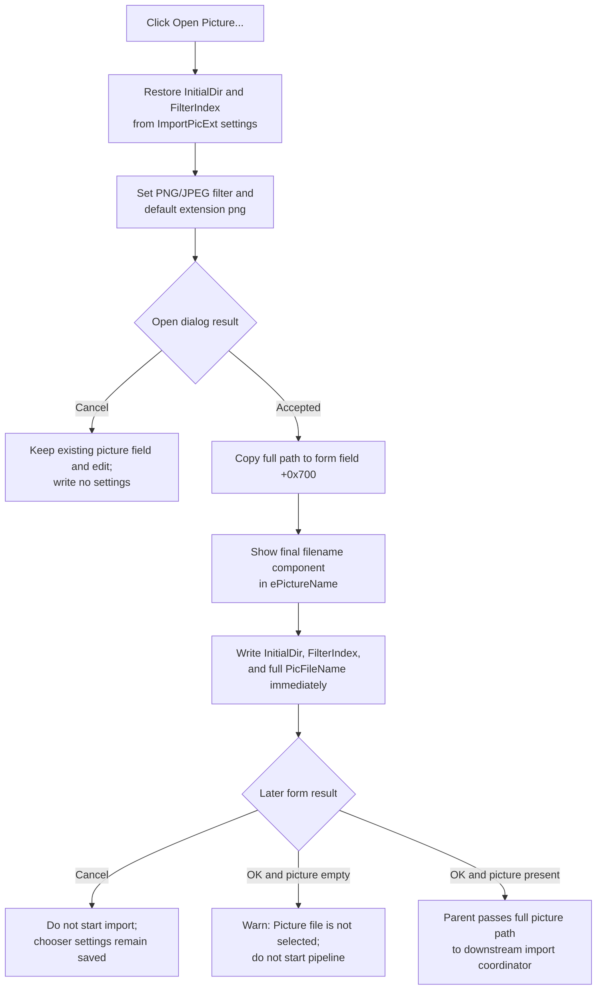

# Open Picture...

> Analysis status: Source reviewed. The file-dialog setup, accepted-path copy, display text, settings writes, form restoration, modal caller, missing-input branches, and error boundaries are supported by recovered code.

## Control

| Property | Recovered value |
| --- | --- |
| Form | ImportPictureExt |
| Component path | ImportPictureExt.bOpenPicture |
| Control class | TButton |
| Caption | Open Picture... |
| Hint | Not present in the recovered resource. |
| Text | Not present in the recovered resource. |
| Handler name | bOpenPictureClick |
| Handler address | 01a2ce30 |
| Graph node | `resource:dfm:ImportPictureExt/ImportPictureExt.bOpenPicture` |
| Handler node | `function:01a2ce30` |
| Graph layer | UI |

## What happens when clicked

`FUN_01a2ce30` prepares the form's shared `TOpenDialog` for an image selection. It reads the `ImportPicExt` setting named `InitialDir` and applies it when present. It reads `FilterIndex` with default value 1, then installs this two-entry filter in this order:

1. `PNG file (png)|*.png`
2. `JPEG file (jpg)|*.jpg`

The handler sets the dialog's default extension to `png`. The filter patterns and default extension do not prove that the application rejects a manually entered file with another extension.

It then executes the open dialog. A Cancel result skips the accepted-selection block. The form's stored picture path and picture edit remain unchanged, and the handler does not write any settings on that branch.

## Accepted selection

When the dialog returns success, the handler performs these operations:

- It copies the selected full filename into the form UnicodeString field at `+0x700`.
- It extracts the final filename component and places that shorter name in `ePictureName` at form control `+0x6e0`.
- It writes the dialog's post-execution `InitialDir` value to the `ImportPicExt` settings section.
- It writes the current filter index to `FilterIndex`.
- It writes the selected full filename to `PicFileName`.

These settings use the application's current-user `DesignSoft` registry branch. Registry-open failure makes the recovered read helpers return “not found” and leaves defaults in use; the write helpers do nothing when they cannot open the branch. They do not report a handler-local error.

The accepted click updates dialog-local state and settings immediately. The user does not need to press the form's **OK** button before `PicFileName`, `InitialDir`, and `FilterIndex` are written. A later form Cancel therefore prevents the import operation, but it does not undo these already written chooser preferences.

The sibling **Open Netlist...** command uses the same `TOpenDialog` and the same `ImportPicExt.InitialDir` setting. It replaces the shared dialog filter with the CIR netlist filter before it executes, so the picture handler must and does restore the PNG/JPEG filter on every click.

## Form restoration and downstream use

`ImportPictureExt.FormCreate` reads `PicFileName` and `CIRFileName` from the same settings section. When `PicFileName` exists, FormCreate copies the full saved path into both form field `+0x700` and `ePictureName`. This differs from the current accepted-click display, which shows only the final filename component. FormCreate selects the edit text, but it does not verify that the saved file still exists.

The form has built-in `bkOK` and `bkCancel` buttons without custom click handlers. The parent command creates the dialog and waits for modal result 1. After OK:

- If field `+0x700` is empty, it shows `Picture file is not selected!` and does not start the external picture-import pipeline.
- If the picture field is present but the netlist field is empty, it shows `Netlist file is not selected!` but still continues into the downstream pipeline. The later model-specific logic can issue a second warning when that model requires a netlist.
- It copies the full picture path into parent state and passes the picture and netlist paths to the import coordinator.

The click handler itself does not open, decode, size, or validate the image. It does not start recognition, change the parent document, set the parent import-running flags, or close the modal dialog. Those effects belong to the later OK caller and downstream coordinator.

## No-op and failure boundaries

Open-dialog Cancel is the normal no-selection path and preserves the existing form path and edit contents. The pre-execution dialog filter, default extension, initial directory, and filter-index properties can still be updated in the reusable `TOpenDialog` object, but no application setting is written on Cancel.

The handler does not have an exception handler or rollback. String-allocation, VCL dialog, control-update, or settings exceptions can propagate. On the accepted branch, the form field and edit are changed before the three settings writes. A later exception or silent registry-open failure can therefore leave the form updated while one or more preferences remain old. There is no transaction across these changes.

The handler has no explicit empty-path, file-existence, extension, image-content, or read-permission check. A stale path restored by FormCreate also passes the parent command's recovered check because that check tests only whether the stored UnicodeString is empty. Any later file or recognition error is outside this click handler.

## Click flow

## Handler evidence

- [Picture-open handler `FUN_01a2ce30`](../../../DecompiledSources/Tina16/functions/0000000001A2CE30__FUN_01a2ce30.c) restores chooser settings, installs the PNG/JPEG filter and the static default extension at `DAT_01a2d11c`, executes the dialog, and applies and persists an accepted filename. The runtime bytes at that static address decode to the UnicodeString `png`.
- [OpenDialog filename getter `FUN_00724270`](../../../DecompiledSources/Tina16/functions/0000000000724270__FUN_00724270.c) returns the dialog's selected full filename.
- [Final-component extractor `FUN_00441920`](../../../DecompiledSources/Tina16/functions/0000000000441920__FUN_00441920.c) returns the portion after the final path separator for display in the edit.
- [Edit text setter `FUN_0064de00`](../../../DecompiledSources/Tina16/functions/000000000064DE00__FUN_0064de00.c) changes the edit only when the new text differs.
- [OpenDialog InitialDir getter `FUN_00724350`](../../../DecompiledSources/Tina16/functions/0000000000724350__FUN_00724350.c) returns the stored InitialDir property after execution.
- [OpenDialog FilterIndex getter `FUN_00724300`](../../../DecompiledSources/Tina16/functions/0000000000724300__FUN_00724300.c) returns the active filter index.
- [String-setting reader `FUN_01b256f0`](../../../DecompiledSources/Tina16/functions/0000000001B256F0__FUN_01b256f0.c) reads named values from the current-user application settings branch and reports whether a value was found.
- [String-setting writer `FUN_01b258f0`](../../../DecompiledSources/Tina16/functions/0000000001B258F0__FUN_01b258f0.c) writes `InitialDir` and `PicFileName` on the accepted branch.
- [Integer-setting reader `FUN_0147d480`](../../../DecompiledSources/Tina16/functions/000000000147D480__FUN_0147d480.c) returns the named integer or the supplied default value 1.
- [Integer-setting writer `FUN_0147d630`](../../../DecompiledSources/Tina16/functions/000000000147D630__FUN_0147d630.c) writes the accepted filter index.
- [FormCreate handler `FUN_01a2d150`](../../../DecompiledSources/Tina16/functions/0000000001A2D150__FUN_01a2d150.c) restores the saved full picture and netlist paths into form fields and edits without checking the files.
- [Modal caller `FUN_01a5bb80`](../../../DecompiledSources/Tina16/functions/0000000001A5BB80__FUN_01a5bb80.c) checks the picture field after OK, copies the full path into parent state, and invokes the downstream coordinator.
- [Downstream import coordinator `FUN_01a5b280`](../../../DecompiledSources/Tina16/functions/0000000001A5B280__FUN_01a5b280.c) stores the accepted picture path and starts the external picture-import workflow after the modal boundary.
- Recovered role: Select and remember the picture file for external circuit import.
- Current graph summary: Handles 1 Delphi UI event: ImportPictureExt.bOpenPicture.OnClick.
- Current graph behavior: Configures and executes the shared open dialog, stages the accepted full picture path, displays its final component, and writes chooser settings without starting the import.
- Current graph evidence: The DFM binds `bOpenPictureClick` to `01a2ce30`; its source installs explicit PNG and JPEG filters, branches on the dialog result, and writes `InitialDir`, `FilterIndex`, and `PicFileName` only after acceptance.
- Complexity: complex
- Distinct outgoing calls: 12

## Direct calls

- `function:01b256f0` — Read the saved InitialDir string.
- `function:00724420` — Apply InitialDir to the open dialog.
- `function:0147d480` — Read FilterIndex with default 1.
- `function:00414ad0` — Assign the filter, default extension, and accepted full path.
- `function:00724270` — Read the selected full filename.
- `function:00441920` — Extract its final filename component.
- `function:0064de00` — Put that display value in `ePictureName`.
- `function:00724350` — Read the dialog's InitialDir property.
- `function:01b258f0` — Write InitialDir and PicFileName.
- `function:00724300` — Read the active FilterIndex.
- `function:0147d630` — Write FilterIndex.
- `function:00414480` — Finalize temporary UnicodeStrings.

## Resource evidence

- Kind: Not present on this control.
- Modal result: Not present on this control. Separate buttons use `bkOK` and `bkCancel`.
- Checked state: Not present in the recovered resource.
- List items: Not present in the recovered resource.
- Image reference: Not present in the recovered resource.
- Extracted glyph: None.

## Nearby label candidates

The `Picture:` label is direct same-form context. The handler confirms that the control selects the picture path rather than the netlist path.

- Rank 1: Picture: at distance 48.
- Rank 2: Netlist: at distance 72.

## Analysis limits

- `TIARA-diz.6.7.686` owns the unique Open Netlist handler annotation. This article uses it only to explain the shared dialog and setting interaction.
- Shared registry, OpenDialog, path, edit, UnicodeString, FormCreate, modal-caller, and import-coordinator functions remain evidence-only. They are not assigned picture-button-specific roles in this fragment.
- The exact product-specific suffix after the recovered current-user `SOFTWARE\\DesignSoft` registry prefix is not named here.
- The open dialog's filter restricts visible choices but is not application-level image validation.
