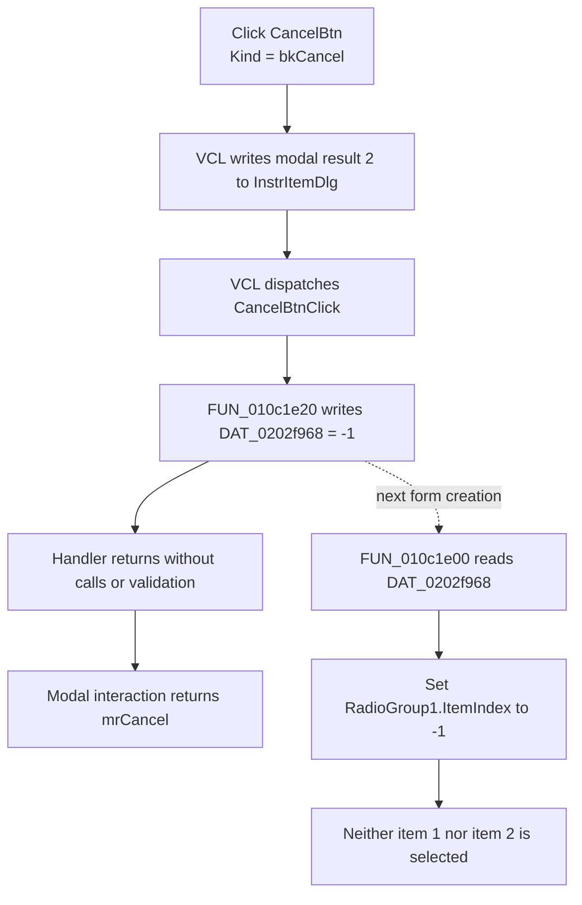

# Cancel

## Control

| Property | Recovered value |
| --- | --- |
| Form | InstrItemDlg |
| Component path | InstrItemDlg.CancelBtn |
| Control class | TBitBtn |
| Button kind | `bkCancel` |
| Handler name | CancelBtnClick |
| Handler address | 010c1e20 |
| Graph node | `resource:dfm:InstrItemDlg/InstrItemDlg.CancelBtn` |
| Handler node | `function:010c1e20` |
| Graph layer | UI |

The DFM does not store a separate caption, hint, image, or glyph. The
`bkCancel` kind supplies the standard Cancel presentation and modal result at
run time. The same form contains `RadioGroup1` with the two displayed choices
`1` and `2`.

## What happens when clicked

The VCL button path first copies the `bkCancel` modal result `2` (`mrCancel`) to
the parent form. It then dispatches `CancelBtnClick`. The recovered handler
contains one statement: it writes `-1` to the process-global value at
`DAT_0202f968`. The handler has no call, branch, validation, or direct form-close
operation.

This write is a real Cancel side effect. `TInstrItemDlg.FormCreate`
(`FUN_010c1e00`) passes the same global value to the `RadioGroup1.ItemIndex`
setter. The setter accepts `-1` as the no-selection value. Therefore, after a
Cancel click, a later creation of this form starts with neither item `1` nor
item `2` selected, unless another path changes the global first.

The sibling OK handler has the inverse state-transfer role: it reads the
current `RadioGroup1.ItemIndex` and stores that index in `DAT_0202f968`. Cancel
does not read the current radio choice. It replaces any earlier remembered
index with `-1`.

## Modal and state boundary

The modal close and the remembered-choice reset are separate effects:

- The inherited `TBitBtn` and `TCustomButton` path sets form modal result `2`
  before it invokes the custom handler. When this form is shown modally, the
  modal loop can return `mrCancel` after the handler returns.
- `FUN_010c1e20` only resets `DAT_0202f968`. It does not set the form modal
  result, call `Close`, free the form, or run a close query.
- The recovered DFM has no `OnCloseQuery` event for `InstrItemDlg`, and the
  custom handler contains no veto path.
- The global value survives the current form interaction and affects a later
  `FormCreate`. It is process state, not a form-local staged value.

No recovered caller is statically connected to this form or handler. The trace
therefore does not prove which command opens the dialog, how a caller interprets
the selected number, or whether a caller destroys or reuses the form after
`ShowModal`. It does prove that the Cancel handler does not receive or update a
caller object.

## Persistence, no-op, and error behavior

The handler does not write a file, registry value, database row, application
model, or hardware state. Its process-global `-1` value can affect later form
creation, but no recovered persistence writer consumes it. The change is not
proven to survive application shutdown.

Repeated Cancel clicks write the same `-1` value and have no additional state
effect. The handler cannot reject the click and has no recovered error-reporting
path. Because it performs one fixed memory write, it cannot leave a partly
updated multi-field state. Failures in the inherited VCL click or modal loop
are outside this handler and are not recovered here.

## Cancel flow

## Evidence

- [Cancel handler](../../../DecompiledSources/Tina16/functions/00000000010C1E20__FUN_010c1e20.c): writes `0xffffffff`, the 32-bit value `-1`, to `DAT_0202f968` and returns.
- [FormCreate handler](../../../DecompiledSources/Tina16/functions/00000000010C1E00__FUN_010c1e00.c): passes `DAT_0202f968` to the control at form field `+0x6c0`, which the DFM component order and the OK path identify as `RadioGroup1`.
- [Radio-group ItemIndex setter](../../../DecompiledSources/Tina16/functions/000000000074B490__FUN_0074b490.c): clamps values below `-1` to `-1`, stores the index at control field `+0x4a8`, and activates no item for `-1`.
- [OK handler](../../../DecompiledSources/Tina16/functions/00000000010C1DE0__FUN_010c1de0.c): copies field `+0x4a8` from the same form control to `DAT_0202f968`.
- [TBitBtn kind setter](../../../DecompiledSources/Tina16/functions/000000000082BC30__FUN_0082bc30.c), [TBitBtn click dispatcher](../../../DecompiledSources/Tina16/functions/000000000082B0E0__FUN_0082b0e0.c), and [inherited button click](../../../DecompiledSources/Tina16/functions/0000000000687F30__FUN_00687f30.c): configure the predefined button kind, route `bkCancel` through the inherited path, and copy the button modal result to the parent form before event dispatch.
- [Common VCL click dispatcher](../../../DecompiledSources/Tina16/functions/0000000000650840__FUN_00650840.c): invokes the assigned `OnClick` event after the modal-result write.
- [Recovered DFM evidence](../../../DecompiledSources/Tina16/resources/dfm/ui-evidence.json): identifies `TInstrItemDlg`, `CancelBtn.Kind = bkCancel`, `CancelBtnClick`, `RadioGroup1`, its items `1` and `2`, and the sibling `bkOK` button.

## Analysis limits

- No direct call edge enters `FUN_010c1e20`; the graph connects it through the
  recovered DFM `OnClick` trigger.
- The recovered source does not name `DAT_0202f968`. Its meaning as the
  remembered radio index follows from the FormCreate and OK data flow.
- No statically recovered caller establishes the business meaning of choices
  `1` and `2`. This article does not assign names or instrument behavior to
  those values.
- The DFM does not store an explicit `ModalResult` property on the button.
  `bkCancel` supplies it through the recovered VCL button-kind path.
