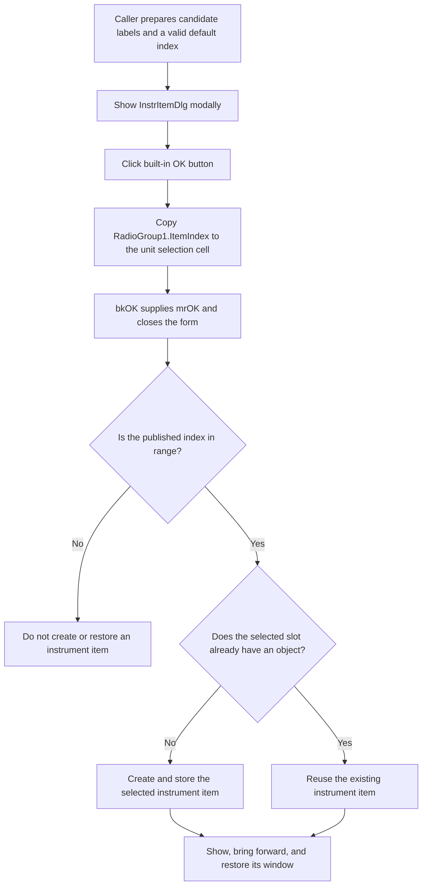

# Accept the selected instrument item

> Analysis status: Complete. OK publishes the selected radio-item index. The modal caller validates that index and creates or restores the selected instrument item.

## Control

| Property | Recovered value |
| --- | --- |
| Form | InstrItemDlg |
| Form caption in DFM | Dialog |
| Component path | InstrItemDlg.OKBtn |
| Control class | TBitBtn |
| Built-in kind | bkOK |
| Handler name | OKBtnClick |
| Handler address | 010c1de0 |
| Graph node | `resource:dfm:InstrItemDlg/InstrItemDlg.OKBtn` |
| Handler node | `function:010c1de0` |
| Graph layer | UI |

## What happens when clicked

`FUN_010c1de0` performs one operation. It reads `RadioGroup1.ItemIndex` from
the `TRadioGroup` at form offset `+0x6C0` and writes the signed 32-bit value to
the InstrItemDlg unit selection cell at `DAT_0202f968`.

The handler does not validate the index, create an instrument item, update a
caption, or write a file. It has no direct call edge because the operation is
a field read followed by a global write.

The DFM gives the button `Kind = bkOK`. The recovered `TBitBtn.SetKind` path
maps `bkOK` to modal result `1` and the standard default-button state. After
the handler returns, this built-in behavior supplies the accepted modal result
and closes the modal form. InstrItemDlg has no recovered `OnCloseQuery` event,
so there is no application close veto in this dialog.

## Dialog preparation

The caller `FUN_01c8f600` uses InstrItemDlg only when more than one candidate
instrument item is available. Before it shows the form, the caller:

1. Calculates the candidate count and candidate-label text.
2. Selects an initial zero-based index. It prefers the first candidate slot
   that does not already have an instrument object, or the last valid slot if
   all earlier slots are occupied.
3. Creates InstrItemDlg and replaces its generic caption with the applicable
   instrument caption.
4. Builds the radio-item label list, refreshes `RadioGroup1`, and selects the
   calculated index.

`FormCreate`, recovered as `FUN_010c1e00`, also copies the unit selection cell
to `RadioGroup1.ItemIndex`. The shared VCL setter clamps an index below `-1` to
`-1` and an index at or above the item count to the last item. The caller sets
the calculated index again after it prepares the radio group. Thus a normal OK
click reads a valid preselected candidate even if the user does not change the
selection.

The DFM contains the initial radio labels **1** and **2**. The caller prepares
the runtime candidate labels before `ShowModal`; these labels, not proximity or
the generic form caption, establish the item-choice role.

## Accepted result and caller ownership

The caller ignores the numeric return value from `ShowModal`. Instead, it
destroys the dialog and reads the unit selection cell through its exported
address. It accepts only an index in the range `0 <= index < candidate count`.

- If the chosen slot has no instrument object, the caller creates the
  instrument-class instance selected by its mode arguments and stores the new
  pointer in that slot.
- If the slot already has an object, it does not create a duplicate.
- In both cases, the valid selected object is made visible, brought forward,
  and restored through the later VCL and window path.

When there is exactly one candidate, `FUN_01c8f600` does not show
InstrItemDlg. It uses index `0` directly. When there are no candidates, it does
nothing.

## Cancel, invalid state, and repeated use

The sibling Cancel handler `FUN_010c1e20` writes `-1` to the same selection
cell. The built-in `bkCancel` action then closes the form. The caller's range
guard rejects `-1`, so Cancel creates, selects, and restores no instrument
item. This sentinel is the effective rollback signal because the caller does
not branch on `ShowModal`'s returned modal result.

`ItemIndex` can also be `-1` if no radio button is selected. OK copies that
value without an error message, and the caller rejects it through the same
range guard. An index above the candidate count is also rejected. The handler
does not show a validation message or keep the dialog open for either case.

The caller resets the selection cell and calculates a new default at the start
of each invocation. An accepted index is therefore transient dialog-to-caller
state, not a saved user preference. If the handler is invoked again before the
form closes, it only overwrites the cell with the current `ItemIndex`.

## Mutation, persistence, and errors

- The OK handler changes only the unit selection cell. It does not mutate an
  existing instrument object.
- Object allocation and insertion occur after the dialog closes and only for a
  valid, empty selected slot. That state is owned by the caller.
- The handler does not write the registry, an INI file, or another file.
- It does not create an undo record or mark a document modified.
- It has no local error branch, exception handler, cleanup, or rollback. A
  simple field read and global write are the only recovered instructions.
- The caller has no rollback around later object creation and window restore.
  If a later operation raises an exception, the recovered path does not prove
  that an already stored new object is removed.

## Click flow

## Evidence

- [OK handler `FUN_010c1de0`](../../../DecompiledSources/Tina16/functions/00000000010C1DE0__FUN_010c1de0.c) copies the `TRadioGroup.ItemIndex` field at `+0x4A8` to the unit selection cell.
- [FormCreate `FUN_010c1e00`](../../../DecompiledSources/Tina16/functions/00000000010C1E00__FUN_010c1e00.c) initializes the same radio group from that cell.
- [Cancel handler `FUN_010c1e20`](../../../DecompiledSources/Tina16/functions/00000000010C1E20__FUN_010c1e20.c) writes the rejected sentinel `-1`.
- [Instrument-item coordinator `FUN_01c8f600`](../../../DecompiledSources/Tina16/functions/0000000001C8F600__FUN_01c8f600.c) prepares the candidates, shows and destroys the dialog, validates the published index, creates a missing selected object, and restores the valid selected window.
- [Radio-group ItemIndex setter `FUN_0074b490`](../../../DecompiledSources/Tina16/functions/000000000074B490__FUN_0074b490.c) clamps the requested index and updates the selected radio button.
- [Recovered `TBitBtn.SetKind` path `FUN_0082bc30`](../../../DecompiledSources/Tina16/functions/000000000082BC30__FUN_0082bc30.c) maps `bkOK` to modal result `1`, the standard caption and glyph, and default-button state.
- [Selected-window visibility path `FUN_008059a0`](../../../DecompiledSources/Tina16/functions/00000000008059A0__FUN_008059a0.c) makes the chosen object visible and invokes the later foreground operation.

## Direct calls and graph context

- The handler has no direct call edge.
- The DFM `triggers` edge is
  `resource:dfm:InstrItemDlg/InstrItemDlg.OKBtn -> function:010c1de0`.
- The graph classifies the handler as a simple UI-layer function.
- The modal caller reaches the handler through VCL event dispatch, so there is
  no direct function-call edge from `FUN_01c8f600` to `FUN_010c1de0`.

## Resource evidence and limits

- `OKBtn` is a 77 by 27 `TBitBtn` with tab order `0` and built-in kind `bkOK`.
  The standard kind supplies its caption and glyph; no separate caption,
  image, or embedded glyph is present in the DFM evidence.
- `CancelBtn` has built-in kind `bkCancel` and a separate handler.
- `RadioGroup1` is a `TRadioGroup` with DFM items **1** and **2** and tab order
  `2`.
- The original Delphi name of the unit selection variable is not recovered.
  The form handlers access it as `DAT_0202f968`, while the external caller
  accesses the exported cell through `PTR_DAT_02002400`.
- The original business names of the candidate modes are not recovered in
  this function. This article describes them as instrument items because the
  caller creates one of several instrument-window classes in the selected
  slot; it does not assign a more specific domain name from numeric mode alone.
