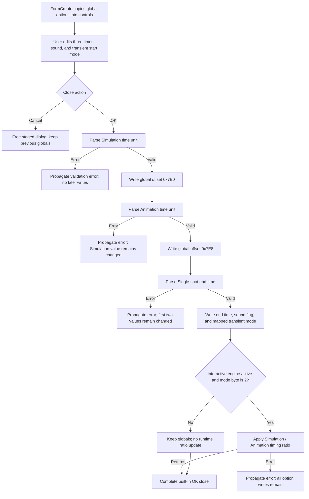

# Apply Interactive Mode options

> Analysis status: Source reviewed through dialog initialization, numeric
> validation, direct global commit, runtime ratio refresh, cancellation, and
> persistence boundaries.

## Control

| Property | Recovered value |
| --- | --- |
| Form | InteractiveModeOptionDlg |
| Component path | InteractiveModeOptionDlg.OKBtn |
| Control class | TBitBtn |
| Caption | Supplied by `bkOK`; no explicit caption is stored in the resource. |
| Hint | Not present in the recovered resource. |
| Text | Not present in the recovered resource. |
| Handler name | OKBtnClick |
| Handler address | 01b7cec0 |
| Graph node | `resource:dfm:InteractiveModeOptionDlg/InteractiveModeOptionDlg.OKBtn` |
| Handler node | `function:01b7cec0` |
| Graph layer | UI |

## What happens when clicked

The button commits all five Interactive Mode option groups directly to shared
application state:

- **Simulation time unit (s)** from `FESimTimeUnit` to offset `0x7E0` of the
  global options object;
- **Animation time unit (s)** from `FEAnimTimeUnit` to offset `0x7E8`;
- **End time (Single-shot) (s)** from `FESSEndTime` to offset `0x7F0`;
- **Sound effects enabled** from `CBSoundEnabled` to the global Boolean at
  `02002198`; and
- **Transient initial values** from `rgTRControls` to the options byte at
  offset `0x2AD`.

The transient radio group has three resource-defined entries. The handler
maps their zero-based item indexes to the stored value with `(ItemIndex + 1) %
3`:

| Radio item | Item index | Stored value |
| --- | ---: | ---: |
| Calculate operating point | 0 | 1 |
| Use initial conditions | 1 | 2 |
| Zero initial values | 2 | 0 |

The form's `OnCreate` handler performs the inverse mapping. It fills the three
numeric controls and sound check box from the current globals, then sets the
radio index to `(StoredValue + 2) % 3`. The controls are therefore staged
copies until OK is clicked.

## Validation and commit order

`FUN_01b7cec0` reads each `TFloatEdit` with the shared parser
`FUN_00b90090`. That parser accepts the application's recovered numeric and
engineering-suffix formats. It rejects conversion errors, values below
`-1e50`, values above `1e50`, and values rejected by an installed control
validation callback. The resource and dialog-specific source do not establish
a stricter positive or nonzero limit.

The handler does not validate all fields before it changes shared state. Its
order is:

1. parse and store Simulation time unit;
2. parse and store Animation time unit;
3. parse and store Single-shot end time;
4. store the sound check state;
5. map and store the transient initial-value selection; and
6. request an interactive runtime ratio refresh.

An error in the second or third numeric field can therefore leave the earlier
time fields changed. An error in the final refresh occurs after every option
has been committed. There is no recovered transaction, saved old-value set,
or rollback. A radio index of `-1` maps to stored value `0`; the handler does
not reject a missing selection. Repeating the handler writes the values again
and requests the same refresh.

## Runtime effect

After the writes, `FUN_01c88850` checks two runtime conditions. It updates the
active interactive engine only when the main object flag at `0x27C1` is set
and the global mode byte at `0x813` equals `2`. In that case, it sends
`SimulationTimeUnit / AnimationTimeUnit` to the active engine timing update.
When either condition is false, the refresh is a no-op, but the five option
writes remain committed.

The handler has no explicit zero-denominator guard before this division. The
recovered generic FloatEdit validation also does not prove that zero is
rejected. This analysis therefore does not claim that every accepted pair
produces a finite runtime ratio.

The Single-shot end time is stored for later mode-specific use. The OK handler
does not start, stop, or restart an analysis and does not immediately consume
that value itself.

## Modal and persistence boundaries

The Schematic Editor menu and popup commands both call `FUN_01c89910`. That
function creates this dialog, calls `ShowModal`, ignores its returned modal
result, and frees the form. The `bkOK` button supplies the normal OK modal
behavior, but the application handler does not wait for caller-side copy-back:
its writes are the commit.

The `bkCancel` button has no application handler. Cancel closes the staged
dialog without calling `FUN_01b7cec0`, so the pre-dialog global values remain.
The OK handler calls no INI, registry, file, or settings serializer. The values
become live global options for the current application state; any later disk
persistence is outside this recovered click path.

## Click flow

## Handler evidence

- Source: [DecompiledSources/Tina16/functions/0000000001B7CEC0__FUN_01b7cec0.c](../../../DecompiledSources/Tina16/functions/0000000001B7CEC0__FUN_01b7cec0.c)
- Recovered role: Commit Interactive Mode time, sound, and transient-start
  options.
- Input evidence: The form resource identifies the three `TFloatEdit`
  controls, sound check box, three radio items, and `bkOK` binding.
- State evidence: The handler writes the five recovered globals before it calls
  the runtime ratio refresher.
- Cancellation evidence: The modal caller has no result branch, and Cancel has
  no application handler. Only OK performs copy-back.
- Error evidence: Each numeric value is stored immediately after its parser
  returns. No handler-local exception or rollback path surrounds the sequence.
- Complexity: moderate.
- Distinct outgoing calls: 2.

## Relevant calls

- [`FUN_01b7ce00`](../../../DecompiledSources/Tina16/functions/0000000001B7CE00__FUN_01b7ce00.c)
  initializes all five staged control groups from the current global options.
- [`FUN_00b90090`](../../../DecompiledSources/Tina16/functions/0000000000B90090__FUN_00b90090.c)
  is the shared FloatEdit parser and range or callback validator.
- [`FUN_01c88850`](../../../DecompiledSources/Tina16/functions/0000000001C88850__FUN_01c88850.c)
  conditionally sends the time-unit ratio to the active interactive engine.
- [`FUN_01c89910`](../../../DecompiledSources/Tina16/functions/0000000001C89910__FUN_01c89910.c)
  owns dialog construction, modal display, result-independent cleanup, and the
  two Schematic Editor Options entry points.

## Resource evidence

- The form caption is **Interactive Mode - Options**.
- The OK control is a `TBitBtn` with `Kind=bkOK`, two built-in glyph states,
  and no separate recovered picture resource.
- `CancelBtn` uses `bkCancel`; it has no recovered event handler.
- The labels name all three time controls and show seconds as their unit.
- `CBSoundEnabled` is captioned **Sound effects enabled**.
- `rgTRControls` is captioned **Transient initial values** and supplies the
  three radio items listed above.

## Analysis limits

- The recovered global fields have offsets but no Delphi declaration names.
  Their meanings come from the DFM labels, symmetric FormCreate and OK data
  flow, and downstream consumers.
- The value `2` test in the runtime refresher is proven, but its Delphi enum
  name is not recovered. This article does not invent one.
- No dialog-specific source proves positive-only time validation or durable
  settings serialization.
