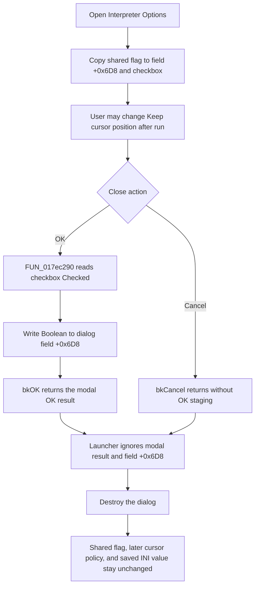

# OK

> Analysis status: Source reviewed through dialog initialization, OK staging,
> modal return, runtime use, and settings persistence.

## Control

| Property | Recovered value |
| --- | --- |
| Form | InterpreterOptions |
| Component path | InterpreterOptions.bOK |
| Control class | TBitBtn |
| Caption | Supplied by the built-in `bkOK` kind. |
| Hint | Not present in the recovered resource. |
| Text | Not present in the recovered resource. |
| Handler name | bOKClick |
| Handler address | 017ec290 |
| Graph node | `resource:dfm:InterpreterOptions/InterpreterOptions.bOK` |
| Handler node | `function:017ec290` |
| Graph layer | UI |

The form contains one option: **Keep cursor position after run**. The OK button
has VCL kind `bkOK`; the Cancel button has kind `bkCancel` and no custom click
handler. The form's recovered `OnCreate` handler is a no-op.

## What happens when clicked

`bOKClick` reads `cbKeepCursorPosition.Checked` from the control at form offset
`+0x6C8`. It copies that one-byte Boolean to the dialog field at offset
`+0x6D8`. The handler has no other read, write, call, branch, validation, or
message.

This write is dialog-local staging. The button's `bkOK` kind supplies the
standard modal OK result and closes the modal dialog after the click sequence.
The custom handler does not set the modal result itself and does not write the
shared application setting.

Before the dialog opens, `.651`-owned `FUN_017ec230` initializes the same field
from shared byte `PTR_DAT_02004808` and sets the checkbox to that value. The OK
handler therefore replaces the staged byte with the user's current checkbox
choice. Cancel does not run this handler, so it does not perform that final
copy.

## Why OK has no downstream effect

The `.651`-owned launcher `FUN_017ef930` creates the form, initializes it,
calls `ShowModal`, and destroys the form. After `ShowModal` returns, the
launcher does not do any of these required commit steps:

- test the modal result;
- read dialog field `+0x6D8`;
- call a result-extraction helper; or
- write shared byte `PTR_DAT_02004808`.

Consequently, normal OK and Cancel returns have the same application-level
result: the shared keep-cursor setting stays unchanged. Destruction of the
form discards the Boolean that OK staged at `+0x6D8`.

This is not a delayed commit. The settings loader reads `TINA.INI`, section
`designtool`, key `Keep cursor pos after run`, into the shared byte. The later
settings writer writes that shared byte back under `DesignTool` and the same
key. Neither function reads the destroyed dialog. Because this OK path does not
change the shared byte, a later settings save preserves the old value.

The shared byte controls later Interpreter cursor cleanup. A set value selects
the saved-line restoration path; a clear value selects the final-line path.
This OK click does not run either path and cannot change which branch a later
run uses. A separate Design Tool Options path has an extraction and copy-back
sequence for the same shared setting, but the Interpreter Options launcher
does not.

## Reopen, errors, and no-op boundaries

Reopening Interpreter Options creates a new form and seeds it from the still
unchanged shared byte. A checkbox choice accepted in the previous instance is
therefore not restored unless another application path changed the shared
setting.

There is no invalid Boolean input and no empty-state branch. Clicking OK with
the checkbox already equal to its initial value writes that same value to the
dialog field, then the launcher still discards it.

The OK handler has no exception handler or rollback. An exception from the
virtual checked-state getter propagates and can prevent the field update. The
launcher also has no recovered `try/finally` around `ShowModal`; if modal
processing raises, its normal post-modal destruction call is not guaranteed.
No file, editor, cursor, runtime, or INI call occurs in the OK handler.

## Click and discarded-stage flow

## Evidence

- [OK handler](../../../DecompiledSources/Tina16/functions/00000000017EC290__FUN_017ec290.c): reads the checked state through the control at `+0x6C8` and writes its low byte to form field `+0x6D8`.
- [Dialog initializer](../../../DecompiledSources/Tina16/functions/00000000017EC230__FUN_017ec230.c): seeds field `+0x6D8` and `cbKeepCursorPosition.Checked` from the supplied shared flag. Bead `.651` owns its annotation.
- [Interpreter Options launcher](../../../DecompiledSources/Tina16/functions/00000000017EF930__FUN_017ef930.c): constructs, initializes, shows, and destroys the dialog without inspecting its modal result or staged field. Bead `.651` owns its annotation.
- [Settings loader](../../../DecompiledSources/Tina16/functions/00000000017E1500__FUN_017e1500.c): reads `TINA.INI` `designtool/Keep cursor pos after run` into `PTR_DAT_02004808` with a false default.
- [Settings writer](../../../DecompiledSources/Tina16/functions/0000000001C85F70__FUN_01c85f70.c): writes `PTR_DAT_02004808` under `DesignTool/Keep cursor pos after run`.
- [Saved-line restoration](../../../DecompiledSources/Tina16/functions/00000000017F2B70__FUN_017f2b70.c) and [final-line cursor path](../../../DecompiledSources/Tina16/functions/00000000017EFD70__FUN_017efd70.c): establish the later runtime effect of the unchanged shared flag.
- [Recovered UI evidence](../../../DecompiledSources/Tina16/resources/dfm/ui-evidence.json): maps `+0x6C8` to the checkbox captioned **Keep cursor position after run**, binds `bOKClick` to `017EC290`, and records `bkOK`, `bkCancel`, and `bkHelp` button kinds.

## Limits

- The original Delphi name of field `+0x6D8` and the shared byte is not
  recovered. Their staging and keep-cursor roles come from the initializer,
  OK handler, launcher, settings functions, and runtime consumers.
- The source proves the missing copy-back. It does not establish whether this
  behavior was intentional or a defect.
- The handler does not call a close method. Modal closure comes from the
  recovered `bkOK` button kind and standard VCL button behavior.
