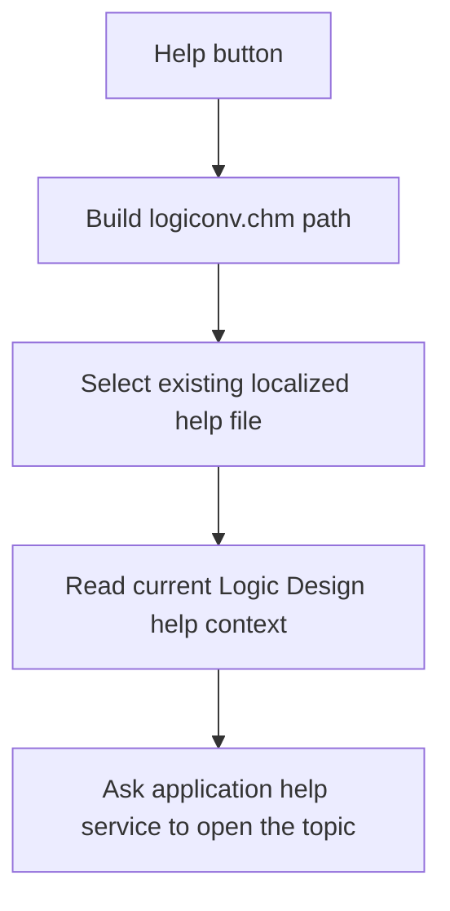

# &Help

> Analysis status: Reviewed from recovered source, UI resources, glyph evidence, and the graph call path.

## Control

| Property | Recovered value |
| --- | --- |
| Form | introduction_form |
| Component path | introduction_form.BitBtn1 |
| Control class | TBitBtn |
| Caption | &Help |
| Hint | Not present in the recovered resource. |
| Text | Not present in the recovered resource. |
| Handler name | BitBtn1Click |
| Handler address | 01b36460 |
| Graph node | `resource:dfm:introduction_form/introduction_form.BitBtn1` |
| Handler node | `function:01b36460` |
| Graph layer | UI |

## What happens when clicked

The handler builds the path to `logiconv.chm` in the application help directory. It calls the shared help-file resolver, which uses an existing language-specific file when one is available and otherwise keeps the original file. It then asks the application help service to open the file at the current Logic Design help context. The selected operation changes this context before a help request. The handler has no local error message or fallback after the help service call.

## Click flow

## Handler evidence

- Source: [DecompiledSources/Tina16/functions/0000000001B36460__FUN_01b36460.c](../../../DecompiledSources/Tina16/functions/0000000001B36460__FUN_01b36460.c)
- Recovered role: Opens the localized Logic Design help file at the current help context.
- Current graph summary: Handles 1 Delphi UI event: introduction_form.BitBtn1.OnClick.
- Current graph behavior: The click resolves `logiconv.chm` and dispatches it through the application help service with the current context value.
- Current graph evidence: `FUN_01b36460` constructs the help path, calls `FUN_01b1def0`, and passes the result plus `PTR_DAT_02004708` to the application help service. The question-mark glyph agrees with the recovered help path.
- Complexity: complex
- Distinct outgoing calls: 3

## Direct calls

- `function:00414560` — Delphi UnicodeString array finalization helper
- `function:00416cd0` — FUN_00416cd0
- `function:01b1def0` — FUN_01b1def0

## Resource evidence

- Kind: Not present in the recovered resource.
- Modal result: Not present in the recovered resource.
- Checked state: Not present in the recovered resource.
- List items: Not present in the recovered resource.
- Image reference: Not present in the recovered resource.
- Extracted glyph: [`0228_introduction_form_introduction_form_BitBtn1_Glyph_Data.png`](../../../glyph/0228_introduction_form_introduction_form_BitBtn1_Glyph_Data.png)

## Nearby label candidates

Nearby labels are layout candidates only. They are not proof of behavior.

- No same-parent label candidate is available.

## Analysis limits

- The help service is an indirect application call. The recovered handler does not show the viewer, failure message, or operating-system action that follows this call.
