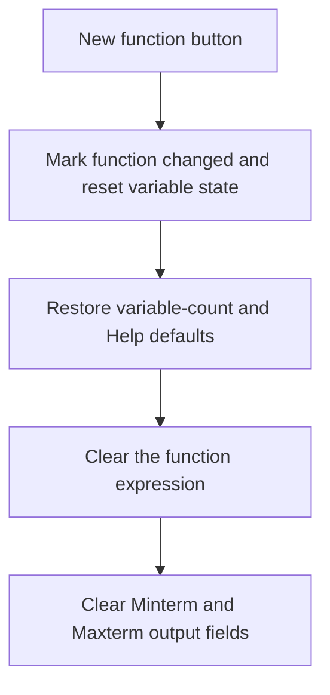

# New function

> Analysis status: Reviewed from recovered source, UI resources, and the graph call path.

## Control

| Property | Recovered value |
| --- | --- |
| Form | introduction_form |
| Component path | introduction_form.End_b |
| Control class | TButton |
| Caption | New function |
| Hint | Not present in the recovered resource. |
| Text | Not present in the recovered resource. |
| Handler name | End_bClick |
| Handler address | 01b34cf0 |
| Graph node | `resource:dfm:introduction_form/introduction_form.End_b` |
| Handler node | `function:01b34cf0` |
| Graph layer | UI |

## What happens when clicked

The handler starts a new Logic Design function in the current form. It marks the function as changed, clears a secondary state flag, resets the stored variable count to zero, and restores the default variable-count text. It restores the Help field to the operator symbols and the first three variable names. It also clears the function expression and the text fields of the Minterm/Maxterm output form. A localized string resource is stored in an internal form field, but the recovered handler does not show where that string is displayed.

## Click flow

## Handler evidence

- Source: [DecompiledSources/Tina16/functions/0000000001B34CF0__FUN_01b34cf0.c](../../../DecompiledSources/Tina16/functions/0000000001B34CF0__FUN_01b34cf0.c)
- Recovered role: Resets the current Logic Design function and its derived output.
- Current graph summary: Handles 1 Delphi UI event: introduction_form.End_b.OnClick.
- Current graph behavior: The click restores initial input state and removes the current expression and Minterm/Maxterm results.
- Current graph evidence: `FUN_01b34cf0` writes the reset flags and count, sends default text to `VarNum` and `Help`, and sends empty text to the expression edit and two `Function_wind_form` fields.
- Complexity: complex
- Distinct outgoing calls: 5

## Direct calls

- `function:00414480` — Delphi UnicodeString clear and finalization helper
- `function:00414ad0` — Delphi UnicodeString assignment helper
- `function:0064de00` — VCL control text setter with change suppression
- `function:00b89270` — FUN_00b89270
- `function:00b8e520` — FUN_00b8e520

## Resource evidence

- Kind: Not present in the recovered resource.
- Modal result: Not present in the recovered resource.
- Checked state: Not present in the recovered resource.
- List items: Not present in the recovered resource.
- Image reference: Not present in the recovered resource.
- Extracted glyph: None.

## Nearby label candidates

Nearby labels are layout candidates only. They are not proof of behavior.

- No same-parent label candidate is available.

## Analysis limits

- The text of localized resource `0x88e` and the later use of form field `+0x5fd8` are not recovered in this click path.
