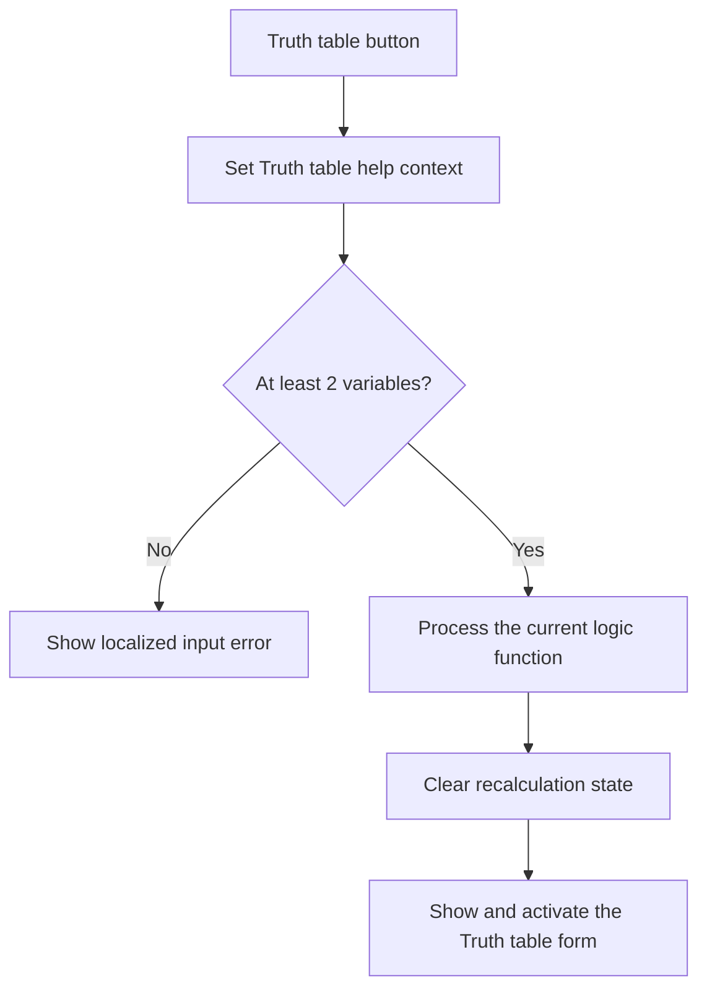

# Truth table

> Analysis status: Reviewed from recovered source, UI resources, and the graph call path.

## Control

| Property | Recovered value |
| --- | --- |
| Form | introduction_form |
| Component path | introduction_form.gbMethod.Igazsagtabla |
| Control class | TButton |
| Caption | Truth table |
| Hint | Not present in the recovered resource. |
| Text | Not present in the recovered resource. |
| Handler name | IgazsagtablaClick |
| Handler address | 01b35d30 |
| Graph node | `resource:dfm:introduction_form/introduction_form.gbMethod.Igazsagtabla` |
| Handler node | `function:01b35d30` |
| Graph layer | UI |

## What happens when clicked

The handler selects the Truth table help context. If the current variable count is less than two, it loads localized error text and a title and shows a message. It does not calculate or open the result form in that branch. For two or more variables, it sets the shared operation flag, brackets the calculation with a framework callback, and processes the current function through the shared Logic Design calculation routine. It then clears the recalculation flag, clears the operation flag, and calls the VCL show-and-activate helper twice for the truth-table form.

## Click flow

## Handler evidence

- Source: [DecompiledSources/Tina16/functions/0000000001B35D30__FUN_01b35d30.c](../../../DecompiledSources/Tina16/functions/0000000001B35D30__FUN_01b35d30.c)
- Recovered role: Calculates and shows the truth table for the current logic function.
- Current graph summary: Handles 1 Delphi UI event: introduction_form.gbMethod.Igazsagtabla.OnClick.
- Current graph behavior: The click rejects fewer than two variables. Otherwise, it calculates the current function and shows the truth-table output form.
- Current graph evidence: `FUN_01b35d30` tests form field `+0x764`, calls `FUN_01b2d120` only in the accepted branch, clears flag `+0x7c0`, and passes `PTR_DAT_020048c8` to the annotated VCL form show-and-activate helper.
- Complexity: complex
- Distinct outgoing calls: 7

## Direct calls

- `function:00414560` — Delphi UnicodeString array finalization helper
- `function:00416740` — FUN_00416740
- `function:008059a0` — FUN_008059a0
- `function:0080d2f0` — FUN_0080d2f0
- `function:00b89270` — FUN_00b89270
- `function:00b8e520` — FUN_00b8e520
- `function:01b2d120` — FUN_01b2d120

## Resource evidence

- Kind: Not present in the recovered resource.
- Modal result: Not present in the recovered resource.
- Checked state: Not present in the recovered resource.
- List items: Not present in the recovered resource.
- Image reference: Not present in the recovered resource.
- Extracted glyph: None.

## Nearby label candidates

Nearby labels are layout candidates only. They are not proof of behavior.

- No same-parent label candidate is available.

## Analysis limits

- The recovered source does not resolve the localized error text. The indirect framework callback that receives `3` and then `0` also has no recovered responsibility.
