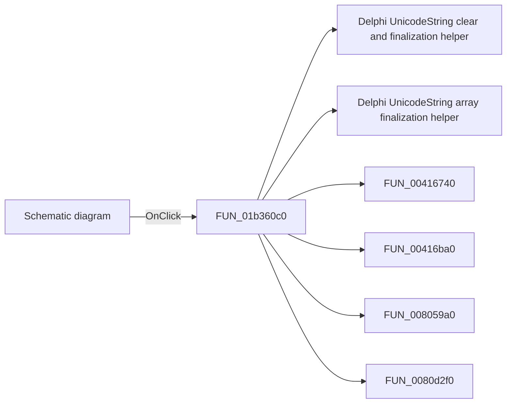

# Schematic diagram

> Analysis status: Pending individual source review.

## Control

| Property | Recovered value |
| --- | --- |
| Form | introduction_form |
| Component path | introduction_form.gbMethod.Netw_d |
| Control class | TButton |
| Caption | Schematic diagram |
| Hint | Not present in the recovered resource. |
| Text | Not present in the recovered resource. |
| Handler name | Netw_dClick |
| Handler address | 01b360c0 |
| Graph node | `resource:dfm:introduction_form/introduction_form.gbMethod.Netw_d` |
| Handler node | `function:01b360c0` |
| Graph layer | UI |

## What happens when clicked

Pending individual analysis. An agent must read the recovered handler source and its relevant callees before it replaces this text.

## Click flow

## Handler evidence

- Source: [DecompiledSources/Tina16/functions/0000000001B360C0__FUN_01b360c0.c](../../../DecompiledSources/Tina16/functions/0000000001B360C0__FUN_01b360c0.c)
- Recovered role: Not present in the recovered resource.
- Current graph summary: Handles 1 Delphi UI event: introduction_form.gbMethod.Netw_d.OnClick.
- Current graph behavior: Not present in the recovered resource.
- Current graph evidence: Not present in the recovered resource.
- Complexity: complex
- Distinct outgoing calls: 9

## Direct calls

- `function:00414480` — Delphi UnicodeString clear and finalization helper
- `function:00414560` — Delphi UnicodeString array finalization helper
- `function:00416740` — FUN_00416740
- `function:00416ba0` — FUN_00416ba0
- `function:008059a0` — FUN_008059a0
- `function:0080d2f0` — FUN_0080d2f0
- `function:00b89270` — FUN_00b89270
- `function:00b8e520` — FUN_00b8e520
- `function:01b2d120` — FUN_01b2d120

## Resource evidence

- Kind: Not present in the recovered resource.
- Modal result: Not present in the recovered resource.
- Checked state: Not present in the recovered resource.
- List items: Not present in the recovered resource.
- Image reference: Not present in the recovered resource.
- Extracted glyph: None.

## Nearby label candidates

Nearby labels are layout candidates only. They are not proof of behavior.

- No same-parent label candidate is available.

## Analysis limits

- Do not infer behavior from the control class, caption, hint, glyph, or nearby label alone.
- Do not replace the pending status until the handler source and relevant call path provide enough evidence.
