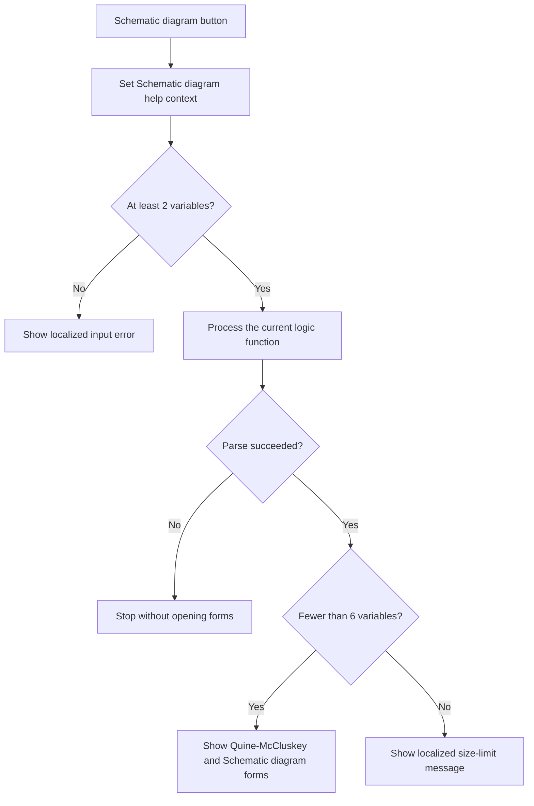

# Schematic diagram

> Analysis status: Reviewed from recovered source, UI resources, and the graph call path.

## Control

| Property | Recovered value |
| --- | --- |
| Form | introduction_form |
| Component path | introduction_form.gbMethod.Netw_d |
| Control class | TButton |
| Caption | Schematic diagram |
| Hint | Not present in the recovered resource. |
| Text | Not present in the recovered resource. |
| Handler name | Netw_dClick |
| Handler address | 01b360c0 |
| Graph node | `resource:dfm:introduction_form/introduction_form.gbMethod.Netw_d` |
| Handler node | `function:01b360c0` |
| Graph layer | UI |

## What happens when clicked

The handler selects the Schematic diagram help context. If the variable count is less than two, it shows a localized input error and stops. Otherwise, it processes the current logic function. A shared parse-error flag stops the remaining work without another local message. When processing succeeds, the handler clears the recalculation flag. For fewer than six variables, it shows and activates the Quine-McCluskey form and the Schematic diagram form. For six or more variables, it combines two localized strings and shows a limit message instead of opening these forms.

## Click flow

## Handler evidence

- Source: [DecompiledSources/Tina16/functions/0000000001B360C0__FUN_01b360c0.c](../../../DecompiledSources/Tina16/functions/0000000001B360C0__FUN_01b360c0.c)
- Recovered role: Calculates and shows a schematic for a supported logic function.
- Current graph summary: Handles 1 Delphi UI event: introduction_form.gbMethod.Netw_d.OnClick.
- Current graph behavior: The click validates the minimum count, processes the function, and opens the minimization and schematic forms only after a successful parse and for fewer than six variables.
- Current graph evidence: `FUN_01b360c0` tests count field `+0x764`, calls `FUN_01b2d120`, tests parse flag `DAT_02110d19`, and passes `PTR_DAT_02004ae8` and `PTR_DAT_02001a00` to the VCL form show-and-activate helper only when the count is less than six.
- Complexity: complex
- Distinct outgoing calls: 9

## Direct calls

- `function:00414480` — Delphi UnicodeString clear and finalization helper
- `function:00414560` — Delphi UnicodeString array finalization helper
- `function:00416740` — FUN_00416740
- `function:00416ba0` — FUN_00416ba0
- `function:008059a0` — FUN_008059a0
- `function:0080d2f0` — FUN_0080d2f0
- `function:00b89270` — FUN_00b89270
- `function:00b8e520` — FUN_00b8e520
- `function:01b2d120` — FUN_01b2d120

## Resource evidence

- Kind: Not present in the recovered resource.
- Modal result: Not present in the recovered resource.
- Checked state: Not present in the recovered resource.
- List items: Not present in the recovered resource.
- Image reference: Not present in the recovered resource.
- Extracted glyph: None.

## Nearby label candidates

Nearby labels are layout candidates only. They are not proof of behavior.

- No same-parent label candidate is available.

## Analysis limits

- The recovered source does not resolve the localized error text. It does not identify the indirect framework callback that receives `3` and then `0`.
