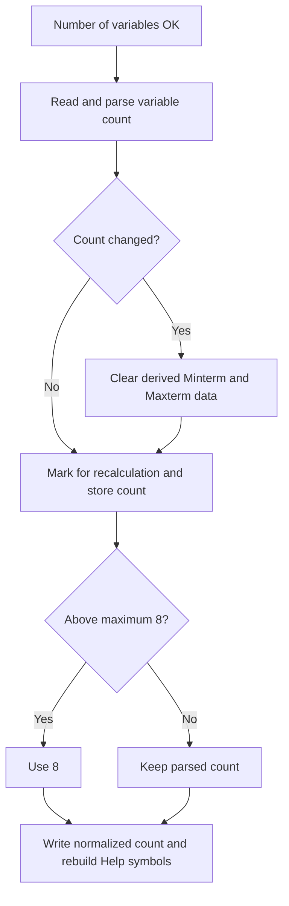

# Number of variables OK

> Analysis status: Reviewed from recovered source, UI resources, and the graph call path.

## Control

| Property | Recovered value |
| --- | --- |
| Form | introduction_form |
| Component path | introduction_form.Number |
| Control class | TButton |
| Caption | Number of variables OK |
| Hint | Not present in the recovered resource. |
| Text | Not present in the recovered resource. |
| Handler name | NumberClick |
| Handler address | 01b34a90 |
| Graph node | `resource:dfm:introduction_form/introduction_form.Number` |
| Handler node | `function:01b34a90` |
| Graph layer | UI |

## What happens when clicked

The handler reads the variable-count edit and converts its text to an integer. If the count changed, it clears the stored Minterm/Maxterm results and related derived strings. It marks the function for recalculation, stores the new count, and limits values above the form maximum to that maximum. Form creation sets the maximum to eight. The handler writes the normalized count back to the edit and rebuilds the Help field with the operator symbols and the variable letters that are valid for this count. It has no local minimum check. Invalid integer text follows the shared conversion error path.

## Click flow

## Handler evidence

- Source: [DecompiledSources/Tina16/functions/0000000001B34A90__FUN_01b34a90.c](../../../DecompiledSources/Tina16/functions/0000000001B34A90__FUN_01b34a90.c)
- Recovered role: Applies the variable count and resets count-dependent results.
- Current graph summary: Handles 1 Delphi UI event: introduction_form.Number.OnClick.
- Current graph behavior: The click parses and limits the variable count, clears stale derived data after a change, and updates the valid-variable Help text.
- Current graph evidence: `FUN_01b34a90` reads `VarNum`, calls the integer conversion helper, compares and stores form field `+0x764`, clamps it to `+0x760`, clears `Function_wind_form` data on change, and rebuilds the text written to the Help control.
- Complexity: complex
- Distinct outgoing calls: 8

## Direct calls

- `function:00414480` — Delphi UnicodeString clear and finalization helper
- `function:00414560` — Delphi UnicodeString array finalization helper
- `function:00416ba0` — FUN_00416ba0
- `function:00416cd0` — FUN_00416cd0
- `function:0043f750` — FUN_0043f750
- `function:0043fc00` — FUN_0043fc00
- `function:0064dd90` — VCL control Unicode text reader
- `function:0064de00` — VCL control text setter with change suppression

## Resource evidence

- Kind: Not present in the recovered resource.
- Modal result: Not present in the recovered resource.
- Checked state: Not present in the recovered resource.
- List items: Not present in the recovered resource.
- Image reference: Not present in the recovered resource.
- Extracted glyph: None.

## Nearby label candidates

Nearby labels are layout candidates only. They are not proof of behavior.

- No same-parent label candidate is available.

## Analysis limits

- The shared integer conversion routine is recovered, but this click handler has no local catch block. The exact message for invalid text is not established here.
