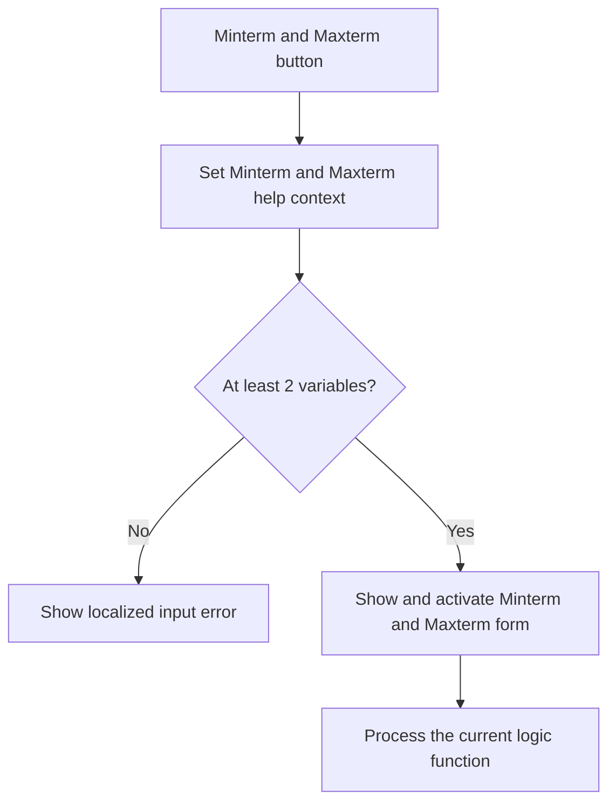

# Minterm/Maxterm

> Analysis status: Reviewed from recovered source, UI resources, and the graph call path.

## Control

| Property | Recovered value |
| --- | --- |
| Form | introduction_form |
| Component path | introduction_form.gbMethod.OK_btn |
| Control class | TButton |
| Caption | Minterm/Maxterm |
| Hint | Not present in the recovered resource. |
| Text | Not present in the recovered resource. |
| Handler name | OK_btnClick |
| Handler address | 01b34e50 |
| Graph node | `resource:dfm:introduction_form/introduction_form.gbMethod.OK_btn` |
| Handler node | `function:01b34e50` |
| Graph layer | UI |

## What happens when clicked

The handler selects the Minterm/Maxterm help context. If the variable count is less than two, it loads localized error text and a title and shows a message. It does not open the output form in that branch. For two or more variables, it first shows and activates the Minterm/Maxterm form. It then brackets the shared Logic Design calculation with an indirect framework callback and processes the current function. The handler has no local parse-result test after the calculation.

## Click flow

## Handler evidence

- Source: [DecompiledSources/Tina16/functions/0000000001B34E50__FUN_01b34e50.c](../../../DecompiledSources/Tina16/functions/0000000001B34E50__FUN_01b34e50.c)
- Recovered role: Opens and updates the Minterm/Maxterm output for the current logic function.
- Current graph summary: Handles 1 Delphi UI event: introduction_form.gbMethod.OK_btn.OnClick.
- Current graph behavior: The click rejects fewer than two variables. Otherwise, it shows the Minterm/Maxterm form and runs the common function calculation.
- Current graph evidence: `FUN_01b34e50` tests field `+0x764`, passes `PTR_DAT_02001d60` to the annotated VCL form show-and-activate helper, and then calls `FUN_01b2d120` with the form and recalculation flag.
- Complexity: complex
- Distinct outgoing calls: 7

## Direct calls

- `function:00414560` — Delphi UnicodeString array finalization helper
- `function:00416740` — FUN_00416740
- `function:008059a0` — FUN_008059a0
- `function:0080d2f0` — FUN_0080d2f0
- `function:00b89270` — FUN_00b89270
- `function:00b8e520` — FUN_00b8e520
- `function:01b2d120` — FUN_01b2d120

## Resource evidence

- Kind: Not present in the recovered resource.
- Modal result: Not present in the recovered resource.
- Checked state: Not present in the recovered resource.
- List items: Not present in the recovered resource.
- Image reference: Not present in the recovered resource.
- Extracted glyph: None.

## Nearby label candidates

Nearby labels are layout candidates only. They are not proof of behavior.

- No same-parent label candidate is available.

## Analysis limits

- The recovered source does not resolve the localized error text. The handler has no local branch that says how the already visible form responds to a calculation error.
