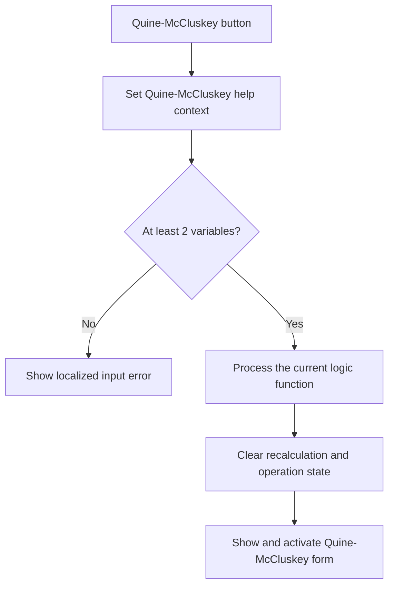

# Quine-McCluskey method

> Analysis status: Reviewed from recovered source, UI resources, and the graph call path.

## Control

| Property | Recovered value |
| --- | --- |
| Form | introduction_form |
| Component path | introduction_form.gbMethod.QM_m |
| Control class | TButton |
| Caption | Quine-McCluskey method |
| Hint | Not present in the recovered resource. |
| Text | Not present in the recovered resource. |
| Handler name | QM_mClick |
| Handler address | 01b35fa0 |
| Graph node | `resource:dfm:introduction_form/introduction_form.gbMethod.QM_m` |
| Handler node | `function:01b35fa0` |
| Graph layer | UI |

## What happens when clicked

The handler selects the Quine-McCluskey help context. If the variable count is less than two, it shows a localized error and stops. Otherwise, it sets the shared operation flag and brackets the common Logic Design calculation with an indirect framework callback. It processes the current function, clears the recalculation flag, clears the operation flag, and shows and activates the Quine-McCluskey form. The handler has no local parse-result test before it opens the form.

## Click flow

## Handler evidence

- Source: [DecompiledSources/Tina16/functions/0000000001B35FA0__FUN_01b35fa0.c](../../../DecompiledSources/Tina16/functions/0000000001B35FA0__FUN_01b35fa0.c)
- Recovered role: Calculates and shows Quine-McCluskey results for the current logic function.
- Current graph summary: Handles 1 Delphi UI event: introduction_form.gbMethod.QM_m.OnClick.
- Current graph behavior: The click rejects fewer than two variables. Otherwise, it calculates the function and opens the Quine-McCluskey result form.
- Current graph evidence: `FUN_01b35fa0` tests field `+0x764`, calls `FUN_01b2d120`, clears field `+0x7c0`, and passes `PTR_DAT_02004ae8` to the annotated VCL form show-and-activate helper.
- Complexity: complex
- Distinct outgoing calls: 7

## Direct calls

- `function:00414560` — Delphi UnicodeString array finalization helper
- `function:00416740` — FUN_00416740
- `function:008059a0` — FUN_008059a0
- `function:0080d2f0` — FUN_0080d2f0
- `function:00b89270` — FUN_00b89270
- `function:00b8e520` — FUN_00b8e520
- `function:01b2d120` — FUN_01b2d120

## Resource evidence

- Kind: Not present in the recovered resource.
- Modal result: Not present in the recovered resource.
- Checked state: Not present in the recovered resource.
- List items: Not present in the recovered resource.
- Image reference: Not present in the recovered resource.
- Extracted glyph: None.

## Nearby label candidates

Nearby labels are layout candidates only. They are not proof of behavior.

- No same-parent label candidate is available.

## Analysis limits

- The recovered source does not resolve the localized error text. The click handler does not test the shared parse-error flag before it opens the result form.
