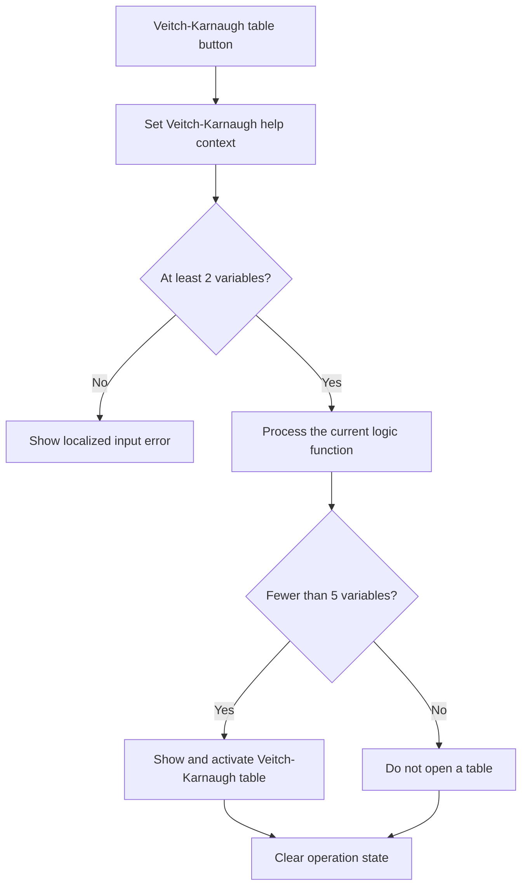

# Veitch-Karnaugh table

> Analysis status: Reviewed from recovered source, UI resources, and the graph call path.

## Control

| Property | Recovered value |
| --- | --- |
| Form | introduction_form |
| Component path | introduction_form.gbMethod.VK_t |
| Control class | TButton |
| Caption | Veitch-Karnaugh table |
| Hint | Not present in the recovered resource. |
| Text | Not present in the recovered resource. |
| Handler name | VK_tClick |
| Handler address | 01b35e60 |
| Graph node | `resource:dfm:introduction_form/introduction_form.gbMethod.VK_t` |
| Handler node | `function:01b35e60` |
| Graph layer | UI |

## What happens when clicked

The handler selects the Veitch-Karnaugh help context. If the variable count is less than two, it shows a localized error and stops. Otherwise, it sets the shared operation flag, processes the current function, and clears the recalculation flag. It shows and activates the Veitch-Karnaugh table form only when the count is less than five. For five or more variables, this handler completes the calculation but does not open the table and does not show a local limit message. It clears the operation flag in both accepted-count branches.

## Click flow

## Handler evidence

- Source: [DecompiledSources/Tina16/functions/0000000001B35E60__FUN_01b35e60.c](../../../DecompiledSources/Tina16/functions/0000000001B35E60__FUN_01b35e60.c)
- Recovered role: Calculates and shows a Veitch-Karnaugh table for a supported variable count.
- Current graph summary: Handles 1 Delphi UI event: introduction_form.gbMethod.VK_t.OnClick.
- Current graph behavior: The click rejects fewer than two variables, calculates accepted input, and opens the Veitch-Karnaugh table only for fewer than five variables.
- Current graph evidence: `FUN_01b35e60` tests field `+0x764` before calculation, calls `FUN_01b2d120`, clears field `+0x7c0`, and calls the VCL form show-and-activate helper with `PTR_DAT_02001d58` only when the count is below five.
- Complexity: complex
- Distinct outgoing calls: 7

## Direct calls

- `function:00414560` — Delphi UnicodeString array finalization helper
- `function:00416740` — FUN_00416740
- `function:008059a0` — FUN_008059a0
- `function:0080d2f0` — FUN_0080d2f0
- `function:00b89270` — FUN_00b89270
- `function:00b8e520` — FUN_00b8e520
- `function:01b2d120` — FUN_01b2d120

## Resource evidence

- Kind: Not present in the recovered resource.
- Modal result: Not present in the recovered resource.
- Checked state: Not present in the recovered resource.
- List items: Not present in the recovered resource.
- Image reference: Not present in the recovered resource.
- Extracted glyph: None.

## Nearby label candidates

Nearby labels are layout candidates only. They are not proof of behavior.

- No same-parent label candidate is available.

## Analysis limits

- The recovered source does not resolve the localized error text. It also does not show a message in the five-or-more branch.
