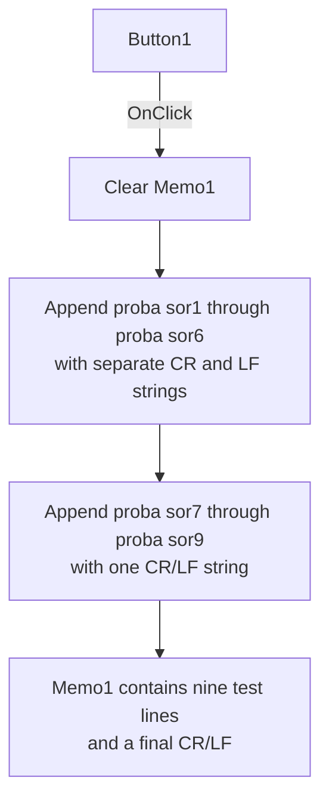

# Button1

> Analysis status: Source reviewed. The Memo1 line-ending test is documented.

## Control

| Property | Recovered value |
| --- | --- |
| Form | kiiro_form |
| Component path | kiiro_form.Button1 |
| Control class | TButton |
| Caption | Button1 |
| Hint | Not present in the recovered resource. |
| Text | Not present in the recovered resource. |
| Handler name | Button1Click |
| Handler address | 01197770 |
| Graph node | `resource:dfm:kiiro_form/kiiro_form.Button1` |
| Handler node | `function:01197770` |
| Graph layer | UI |

## What happens when clicked

The handler clears `Memo1`. It then builds nine fixed test lines:
`proba sor1` through `proba sor9`.

For lines 1 through 6, it appends the current memo text, the next test literal,
a one-character carriage-return string, and a one-character line-feed string.
For lines 7 through 9, it appends the current text, the test literal, and one
two-character CR/LF string. Runtime-image string evidence confirms these three
separator constants.

Each step reads the full current memo text, concatenates the next line, and
writes the result back. The completed memo has nine lines and a final CR/LF.
Existing `Memo1` text is not preserved because the handler clears the memo
first. It does not change `Memo2`, `TextArea1`, or the drawing-step state.

There is no decision or validation branch. The handler has no local exception
handler or rollback for a failed string allocation or control-text operation.

## Click flow

## Handler evidence

- Source: [DecompiledSources/Tina16/functions/0000000001197770__FUN_01197770.c](../../../DecompiledSources/Tina16/functions/0000000001197770__FUN_01197770.c)
- Concatenation helper: [DecompiledSources/Tina16/functions/0000000000416CD0__FUN_00416cd0.c](../../../DecompiledSources/Tina16/functions/0000000000416CD0__FUN_00416cd0.c)
- Recovered role: Builds nine fixed line-ending test lines in `Memo1`.
- Input: None. The previous memo text is cleared.
- State change: Replaces `Memo1.Text` with nine fixed lines.
- Output: `proba sor1` through `proba sor9`, each terminated by CR/LF.
- Complexity: complex
- Distinct outgoing calls: 4

## Direct calls

- `function:00414560` - finalizes temporary UnicodeString values.
- `function:00416cd0` - concatenates the requested UnicodeString sequence.
- `function:0064dd90` - reads the current memo text.
- `function:0064de00` - writes changed control text.

## Resource evidence

- Target control: `Memo1`, a `TMemo` at `(480, 56)` with size `97 x 153`.
- Kind, modal result, checked state, and list items: Not present.
- Image reference and extracted glyph: None.
- Nearby same-parent label: None.

## Analysis limits

- The fixed `proba sor` strings are test data. Their application meaning is
  not established, so this article does not translate or reinterpret them.
- The static CR, LF, and CR/LF strings were read from their referenced
  addresses in the rebuilt runtime image. The recovered C shows the addresses
  but does not render these control characters.
