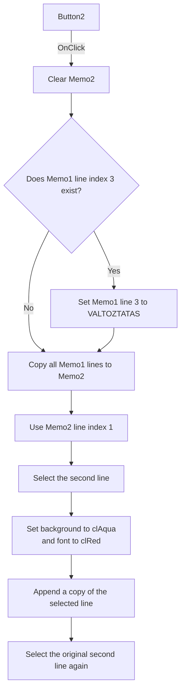

# Button2

> Analysis status: Source reviewed. The Memo1-to-Memo2 test is documented.

## Control

| Property | Recovered value |
| --- | --- |
| Form | kiiro_form |
| Component path | kiiro_form.Button2 |
| Control class | TButton |
| Caption | Button2 |
| Hint | Not present in the recovered resource. |
| Text | Not present in the recovered resource. |
| Handler name | Button2Click |
| Handler address | 01197d10 |
| Graph node | `resource:dfm:kiiro_form/kiiro_form.Button2` |
| Handler node | `function:01197d10` |
| Graph layer | UI |

## What happens when clicked

The handler clears `Memo2`, reads `Memo1.Lines.Count`, and copies the `Memo1`
lines to `Memo2` in index order. When the loop reaches zero-based index `3`, it
first replaces that `Memo1` line with the fixed text `VALTOZTATAS`. The copied
fourth line therefore has this new value, and `Memo1` also keeps the change.

After the copy, the handler uses the text of zero-based line `1` to select the
second line in `Memo2`. It gets that selected text, changes the `Memo2`
background to Delphi `clAqua` (`0x00ffff00`), changes the font color to
`clRed` (`0x000000ff`), and appends the selected second-line text as one more
line. It then finds and selects the original second line again.

A repeated click clears and rebuilds `Memo2`; it does not accumulate more than
one added copy of the second line. The fixed fourth-line assignment is repeated
when that line exists. The handler does not change `TextArea1` or the drawing
state.

The source has no local guard before it reads line index `1`. If `Memo1` has
fewer than two lines, the recovered handler does not establish a successful
result. The underlying line-list method controls that error path. If there are
two or three lines, the copy and selection path can run, but there is no fourth
line to replace.

## Click flow

## Handler evidence

- Source: [DecompiledSources/Tina16/functions/0000000001197D10__FUN_01197d10.c](../../../DecompiledSources/Tina16/functions/0000000001197D10__FUN_01197d10.c)
- String search: [DecompiledSources/Tina16/functions/00000000004170C0__FUN_004170c0.c](../../../DecompiledSources/Tina16/functions/00000000004170C0__FUN_004170c0.c)
- Recovered role: Copies and formats memo test lines.
- Input: Current `Memo1.Lines`.
- State changes: Can replace `Memo1` line index `3`; rebuilds, colors, and
  selects text in `Memo2`.
- Output: A colored `Memo2` copy with one added copy of the second line.
- Complexity: complex
- Distinct outgoing calls: 6

## Direct calls

- `function:00414480` and `function:00414560` - finalize temporary strings.
- `function:004170c0` - finds a line string in the complete memo text from a
  one-based start position.
- `function:005fc860` - changes the memo font color when it differs.
- `function:0064dd90` - reads the complete memo text.
- `function:0064e030` - changes the memo background color when it differs.

## Resource evidence

- Source control: `Memo1`, a `TMemo` at `(480, 56)`, size `97 x 153`.
- Target control: `Memo2`, a `TMemo` at `(592, 56)`, size `97 x 153`.
- Kind, modal result, checked state, and list items: Not present.
- Image reference and extracted glyph: None.
- Nearby same-parent label: None.

## Analysis limits

- The source proves zero-based line indexes through the loop and the direct
  `TStrings` accesses. It does not name the button purpose beyond this test.
- The exact exception or partial state for a missing second line is not
  recovered. This article does not invent that result.
