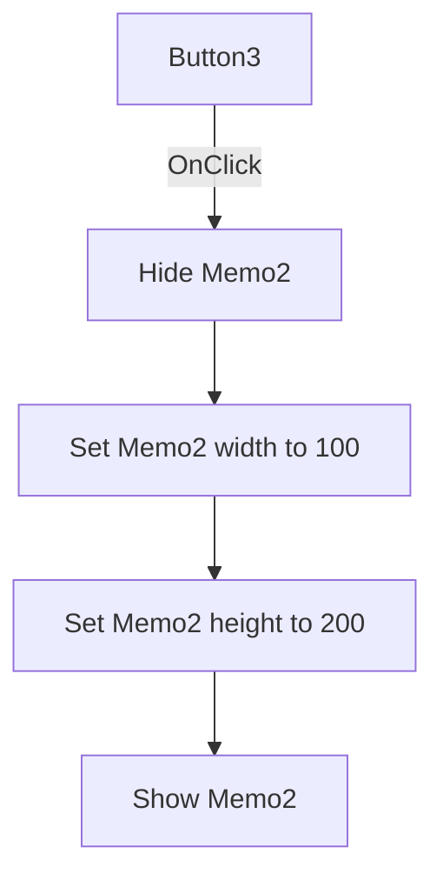

# Button3

> Analysis status: Source reviewed. The Memo2 resize behavior is documented.

## Control

| Property | Recovered value |
| --- | --- |
| Form | kiiro_form |
| Component path | kiiro_form.Button3 |
| Control class | TButton |
| Caption | Button3 |
| Hint | Not present in the recovered resource. |
| Text | Not present in the recovered resource. |
| Handler name | Button3Click |
| Handler address | 011980e0 |
| Graph node | `resource:dfm:kiiro_form/kiiro_form.Button3` |
| Handler node | `function:011980e0` |
| Graph layer | UI |

## What happens when clicked

The handler hides `Memo2`, sets its width to `100` pixels, sets its height to
`200` pixels, and shows it again. The DFM size is `97 x 153`, so the first
completed click makes the memo three pixels wider and 47 pixels taller than
its design-time size.

The final visible state is always true. If `Memo2` is already hidden, the first
visibility request is a no-op. If it is visible, the handler hides it before
the size changes. A repeated click requests the same size and visible state.

The click does not change memo text, colors, selection, drawing records, or
form size. There is no decision, validation, or local error branch.

## Click flow

## Handler evidence

- Source: [DecompiledSources/Tina16/functions/00000000011980E0__FUN_011980e0.c](../../../DecompiledSources/Tina16/functions/00000000011980E0__FUN_011980e0.c)
- Recovered role: Resizes `Memo2` through a hide-change-show sequence.
- Input: None.
- State change: `Memo2.Width = 100`, `Memo2.Height = 200`, and
  `Memo2.Visible = true`.
- Output: A visible `100 x 200` memo.
- Complexity: complex
- Distinct outgoing calls: 3

## Direct calls

- `function:0064cbf0` - applies a new control width through the bounds path.
- `function:0064cc50` - applies a new control height through the bounds path.
- `function:0064dbe0` - changes `TControl.Visible` only when needed.

## Resource evidence

- Target control: `Memo2`, a `TMemo` at `(592, 56)` with design-time size
  `97 x 153`.
- Kind, modal result, checked state, and list items: Not present.
- Image reference and extracted glyph: None.
- Nearby same-parent label: None.

## Analysis limits

- The generic caption `Button3` does not identify a product command. The
  recovered body proves only the `Memo2` layout test described here.
