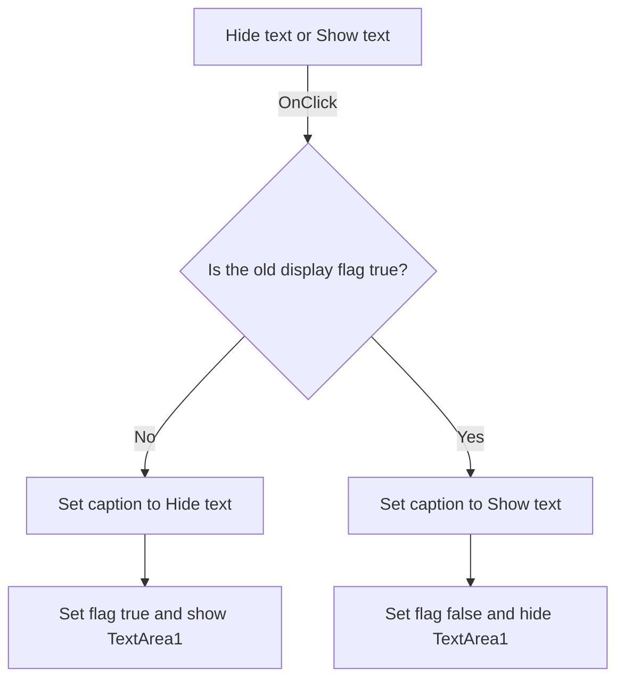

# Hide text

> Analysis status: Source reviewed. The TextArea1 visibility toggle is documented.

## Control

| Property | Recovered value |
| --- | --- |
| Form | kiiro_form |
| Component path | kiiro_form.gomb |
| Control class | TButton |
| Caption | Hide text |
| Hint | Not present in the recovered resource. |
| Text | Not present in the recovered resource. |
| Handler name | gombClick |
| Handler address | 011976a0 |
| Graph node | `resource:dfm:kiiro_form/kiiro_form.gomb` |
| Handler node | `function:011976a0` |
| Graph layer | UI |

## What happens when clicked

The handler reads a global Boolean that controls text display. It sets the
button caption for the next action, toggles the Boolean, and applies the new
value to `TextArea1.Visible`.

- When the old value is false, it keeps or sets the caption to `Hide text`,
  changes the value to true, and shows `TextArea1`.
- When the old value is true, it sets the caption to `Show text`, changes the
  value to false, and hides `TextArea1`.

The recovered initial resource has a `Hide text` caption and a hidden
`TextArea1`. The zero-initialized flag makes the first click show the memo and
keep `Hide text` as the next-action caption. Later clicks alternate the two
states.

The text setter and visibility setter do not repeat their internal update when
the requested value is already active. The click does not clear or edit the
memo text and does not change the stored drawing steps.

## Click flow

## Handler evidence

- Source: [DecompiledSources/Tina16/functions/00000000011976A0__FUN_011976a0.c](../../../DecompiledSources/Tina16/functions/00000000011976A0__FUN_011976a0.c)
- Recovered role: Toggles `TextArea1` visibility and the next-action caption.
- Input: Global display flag `DAT_01f29ce0`.
- State changes: Inverts the flag, changes `TextArea1.Visible`, and changes the
  `gomb` caption when required.
- Output: A shown or hidden text memo with the opposite action in the button
  caption.
- Complexity: moderate
- Distinct outgoing calls: 2

## Direct calls

- `function:0064dbe0` - changes `TControl.Visible` when the value differs.
- `function:0064de00` - changes VCL control text when the value differs.

## Resource evidence

- Target control: `TextArea1`, a hidden `TMemo` at `(16, 24)` with size
  `233 x 201` in the DFM. Form creation changes its runtime size to `320 x 320`.
- Initial button caption: `Hide text`.
- Kind, modal result, checked state, and list items: Not present.
- Image reference and extracted glyph: None.
- Nearby same-parent label: None.

## Analysis limits

- The form stores the visibility state in a process-global byte, not in the
  button or memo. This article does not assign a missing Delphi field name.
