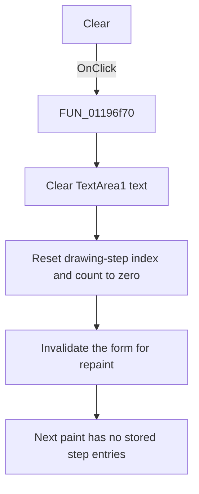

# Clear

> Analysis status: Source reviewed. The text and drawing-step reset is documented.

## Control

| Property | Recovered value |
| --- | --- |
| Form | kiiro_form |
| Component path | kiiro_form.torolj |
| Control class | TButton |
| Caption | Clear |
| Hint | Not present in the recovered resource. |
| Text | Not present in the recovered resource. |
| Handler name | toroljClick |
| Handler address | 01197690 |
| Graph node | `resource:dfm:kiiro_form/kiiro_form.torolj` |
| Handler node | `function:01197690` |
| Graph layer | UI |

## What happens when clicked

The click handler delegates to `FUN_01196f70` with the current form. That
helper clears `TextArea1.Text`, resets the current drawing-step index and the
stored drawing-step count to zero, and invalidates the form so that it paints
again.

The paint handler reads these counters and stored step arrays. After the reset,
its step-rendering loop has no stored entries to draw. The separate fixed test
graphics in the paint handler are outside this Clear command and can still be
painted.

The click does not change the global text-visibility flag, the `gomb` caption,
or `TextArea1.Visible`. It does not change `Memo1` or `Memo2`. Repeated clicks
keep the text and counters empty and request another repaint. There is no
decision, validation, or local error branch.

## Click flow

## Handler evidence

- Handler source: [DecompiledSources/Tina16/functions/0000000001197690__FUN_01197690.c](../../../DecompiledSources/Tina16/functions/0000000001197690__FUN_01197690.c)
- Reset helper: [DecompiledSources/Tina16/functions/0000000001196F70__FUN_01196f70.c](../../../DecompiledSources/Tina16/functions/0000000001196F70__FUN_01196f70.c)
- Paint consumer: [DecompiledSources/Tina16/functions/0000000001196FB0__FUN_01196fb0.c](../../../DecompiledSources/Tina16/functions/0000000001196FB0__FUN_01196fb0.c)
- Recovered role: Clears the text and stored drawing-step state.
- Input: Current form instance.
- State changes: Empty `TextArea1.Text`; set `DAT_01f29ce4` and
  `DAT_01f29ce8` to zero; request repaint.
- Output: No stored step entries on the next paint.
- Complexity: simple
- Distinct outgoing calls: 1

## Direct call

- `function:01196f70` - performs the text, counter, and repaint reset.

## Resource evidence

- Cleared control: `TextArea1`, a `TMemo` that is initially hidden in the DFM.
- Related control: `gomb`, caption `Hide text`, controls only visibility.
- Kind, modal result, checked state, and list items: Not present.
- Image reference and extracted glyph: None.
- Nearby same-parent label: None.

## Analysis limits

- Ghidra omits the unchanged form argument at the wrapper call site. The helper
  reads form field `+0x6c0`, which the DFM and form-create routine establish as
  `TextArea1`.
- The stored arrays do not have recovered Delphi field names. Their writer and
  paint consumer establish their text, color, size, and count roles.
