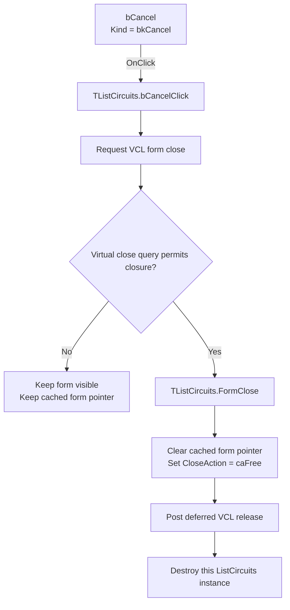

# Close the circuit list with Cancel

> Analysis status: Recovered control, handler, modeless opener, form close handler, and VCL close path reviewed.

## Control

| Property | Recovered value |
| --- | --- |
| Form | ListCircuits (`List Circuits`) |
| Component path | ListCircuits.bCancel |
| Control class | TBitBtn |
| Button kind | bkCancel |
| Explicit DFM caption | Not present |
| Explicit DFM `ModalResult` | Not present |
| Handler name | bCancelClick |
| Handler address | `019d7830` |
| Graph node | `resource:dfm:ListCircuits/ListCircuits.bCancel` |
| Handler node | `function:019d7830` |
| Handler graph layer | UI |

## What happens when clicked

`TListCircuits.bCancelClick` contains one direct call. It requests closure of
the current `ListCircuits` form through the common VCL form-close routine. The
decompiler omits the implicit form argument at this call site, but the event
binding and the callee signature establish the form as the receiver.

The recovered opener creates one cached `ListCircuits` instance, fills its
ListBox from the supplied string list, and calls the modeless VCL `Show`
wrapper. If the form already exists, the opener refreshes the list and brings
the same form forward. The opener does not call `ShowModal` and does not wait
for a button result.

For this modeless form, the common close routine first calls the form's virtual
close query. If the query permits closure, VCL dispatches
`TListCircuits.FormClose`. This handler clears the cached global form pointer
and sets `CloseAction` to value `2`, recovered as `caFree`. The common close
routine then posts the deferred VCL release message. A later request can create
a new `ListCircuits` instance because the cached pointer is already clear.

## Cancel does not roll back a circuit action

The Cancel handler does not read the ListBox, its current index, or the string
list stored by the opener. It does not open a circuit, restore an earlier
circuit, change the supplied list, or return a value to the opener. The
separate ListBox double-click handler reads the selected row and passes its
text to the circuit-opening path. Cancel does not call that handler or its
circuit-opening callee.

The sibling OK handler has the same one-call implementation and reaches the
same close path. The recovered application code therefore shows no OK-versus-
Cancel transaction branch. The DFM `bkCancel` kind identifies the control's
built-in VCL presentation and purpose, but it is not evidence of an
application rollback.

## No-op and error boundaries

- If the virtual close query rejects closure, `FormClose` does not run. The
  form remains visible, and the cached global pointer remains set.
- If closure is accepted, `FormClose` clears the global pointer before the
  deferred release message destroys the form.
- The handler has no local condition, validation, retry, repeated-click guard,
  error message, or exception handler.
- If the close routine raises an exception, the handler has no local recovery.
- Clicking Cancel does not produce a selection output, even when a ListBox row
  is selected.

## Click flow

## Handler and lifecycle evidence

- Cancel handler: [FUN_019d7830](../../../DecompiledSources/Tina16/functions/00000000019D7830__FUN_019d7830.c)
- Common VCL form-close routine: [FUN_00805200](../../../DecompiledSources/Tina16/functions/0000000000805200__FUN_00805200.c)
- Form `OnClose`: [FUN_019d7850](../../../DecompiledSources/Tina16/functions/00000000019D7850__FUN_019d7850.c)
- List population and retained source list: [FUN_019d7940](../../../DecompiledSources/Tina16/functions/00000000019D7940__FUN_019d7940.c)
- Modeless singleton opener: [FUN_01a56130](../../../DecompiledSources/Tina16/functions/0000000001A56130__FUN_01a56130.c)
- VCL modeless `Show` wrapper: [FUN_008059a0](../../../DecompiledSources/Tina16/functions/00000000008059A0__FUN_008059a0.c)
- Deferred VCL release helper: [FUN_00805ad0](../../../DecompiledSources/Tina16/functions/0000000000805AD0__FUN_00805ad0.c)
- Separate ListBox double-click handler: [FUN_019d7890](../../../DecompiledSources/Tina16/functions/00000000019D7890__FUN_019d7890.c)
- Recovered form evidence: [ui-evidence.json](../../../DecompiledSources/Tina16/resources/dfm/ui-evidence.json)

## Direct calls

- `FUN_00805200` - Runs the VCL close-query and close-action pipeline.

## Resource evidence and limits

- `ListCircuits` has the caption `List Circuits` and binds `OnCreate` and
  `OnClose` handlers.
- `bCancel` is a `TBitBtn` with `Kind = bkCancel`, `NumGlyphs = 2`, and
  `TabOrder = 2`.
- The control has no explicit DFM caption, hint, text, action, `ModalResult`,
  image reference, or extracted custom glyph.
- No same-parent label candidate is available.
- The DFM has no `OnCloseQuery` binding. The exact virtual close-query
  implementation is unresolved, so this article does not invent a veto rule.

## Annotation scope

This Bead annotates only the control-specific handler `FUN_019d7830`. The
shared VCL close routine and the form lifecycle functions remain evidence only.
