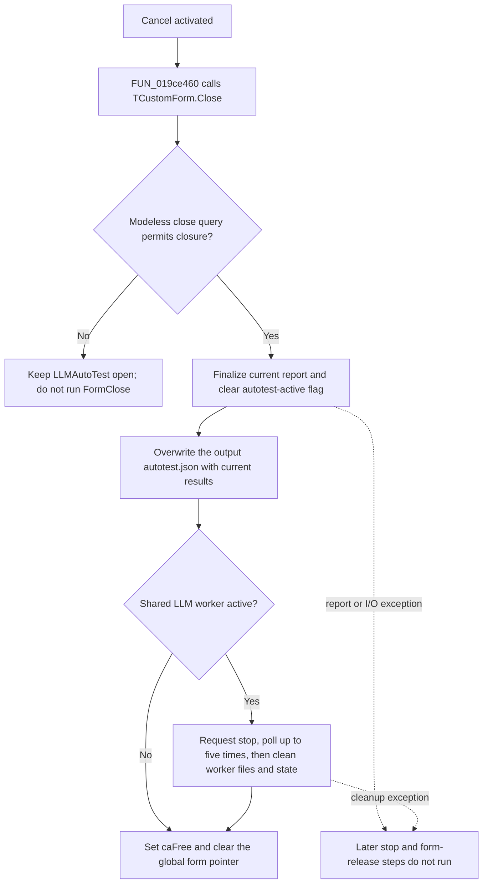

# Cancel

> Analysis status: Evidence-backed source review complete.

## Control

| Property | Recovered value |
| --- | --- |
| Form | LLMAutoTest |
| Component path | LLMAutoTest.bCancel |
| Control class | TBitBtn |
| Button kind | `bkCancel` |
| Runtime caption and glyph | Supplied by the standard VCL Cancel kind; no component-local caption or glyph bytes were recovered. |
| Handler name | bCancelClick |
| Handler address | 019ce460 |
| Graph node | `resource:dfm:LLMAutoTest/LLMAutoTest.bCancel` |
| Handler node | `function:019ce460` |
| Graph layer | UI |

## What happens when clicked

`FUN_019ce460` contains one operation: it delegates to the recovered `TCustomForm.Close` implementation, `FUN_00805200`. The form opener creates `TLLMAutoTest` and uses the modeless Show path, not ShowModal. The VCL close pipeline therefore runs the form close query and then dispatches the recovered `OnClose` handler `FUN_019ce500`. No `OnCloseQuery` event is present in the recovered form resource.

The `OnClose` handler performs the actual cancellation work in this order:

1. It calls `FUN_01a59250` to finalize the current autotest report. The finalizer adds one JSON object with `ReportCount` when the report is not already finalized, clears the shared autotest-active byte at manager offset `+0x2B48`, serializes the current report array, and writes it to the manager's output path ending in `autotest.json`.
2. It calls the shared Local LLM stop path. When an LLM worker is active, that path requests a stop, polls its process status for at most five 800 ms waits, clears related runtime state, and removes `answer_done.txt` and `errors.txt` after cleanup. This bounded wait can make the Cancel click take several seconds.
3. It assigns close action value `2`, the VCL `caFree` action used by the recovered close dispatcher, and clears the global `TLLMAutoTest` form pointer.

Clearing the autotest-active byte stops the asynchronous response path from comparing the next answer or calling the autotest progression routine again. This flag is cleared before the shared LLM stop and before form release. The control does not merely hide the window and it does not leave the autotest marked active.

## Click flow

## Test lifecycle and persistence

- **Start** builds a four-bit case mask from the check boxes, creates the autotest state, sets the active byte, and begins question processing. Later Local LLM response handling calls the progression routine only while that byte remains set. Cancel clears it through the report finalizer.
- Cancel preserves collected results. `FUN_01a59250` writes the current report array, including the current `ReportCount`, instead of deleting it. The recovered finalizer does not add a separate cancellation marker.
- Normal completion uses the same finalizer before it shows the completion message and closes the form. `FormClose` then calls the finalizer again. Its finalized flag prevents a second `ReportCount` object, although the same `autotest.json` file is written again.
- The report is written directly through the recovered string-list save operation. The caller does not use a temporary file, atomic rename, overwrite prompt, or explicit encoding argument.
- Cancel does not save the four check-box selections. The recovered path only changes the shared test and LLM runtime state, writes the report, and releases the form.

## Failure and repeated-action boundaries

- The click handler has no confirmation prompt, active-test guard, exception handler, or rollback.
- The close-query path can reject closure before `FormClose`; in that case the report, worker, active byte, and global form pointer are unchanged.
- `FormClose` writes the report before it stops the Local LLM worker. A report-construction or file-write exception occurs after the active byte is cleared but before the worker stop, `caFree`, and global-pointer clear. This can leave the window and worker in a partial state.
- An exception in the shared stop cleanup occurs after the report write but before form release and global-pointer clear. No handler-local recovery is visible.
- After successful `caFree`, the form is released and its global pointer is zeroed, so the same button instance cannot receive a normal second click.
- The worker wait is bounded. The recovered source does not prove that an unresponsive external worker has terminated when the wait limit expires.

## Handler evidence

- Cancel wrapper: [FUN_019ce460](../../../DecompiledSources/Tina16/functions/00000000019CE460__FUN_019ce460.c)
- VCL close pipeline: [FUN_00805200](../../../DecompiledSources/Tina16/functions/0000000000805200__FUN_00805200.c)
- LLMAutoTest close handler: [FUN_019ce500](../../../DecompiledSources/Tina16/functions/00000000019CE500__FUN_019ce500.c)
- Autotest report finalizer: [FUN_01a59250](../../../DecompiledSources/Tina16/functions/0000000001A59250__FUN_01a59250.c)
- Report summary guard: [FUN_019cdfd0](../../../DecompiledSources/Tina16/functions/00000000019CDFD0__FUN_019cdfd0.c)
- Shared LLM stop path: [FUN_01a42e10](../../../DecompiledSources/Tina16/functions/0000000001A42E10__FUN_01a42e10.c)
- Worker-status wait: [FUN_01b25c70](../../../DecompiledSources/Tina16/functions/0000000001B25C70__FUN_01b25c70.c)
- Modeless form opener: [FUN_01a58f90](../../../DecompiledSources/Tina16/functions/0000000001A58F90__FUN_01a58f90.c)
- Autotest progression: [FUN_01a59b20](../../../DecompiledSources/Tina16/functions/0000000001A59B20__FUN_01a59b20.c)
- Asynchronous response gate: [FUN_01a45e10](../../../DecompiledSources/Tina16/functions/0000000001A45E10__FUN_01a45e10.c)

## Resource evidence

- The recovered DFM binds `LLMAutoTest.bCancel.OnClick` to `bCancelClick` at `019ce460`.
- `Kind=bkCancel` and `NumGlyphs=2` select the stock VCL Cancel presentation. No component-local caption, hint, image reference, or embedded glyph data was recovered.
- The nearby `lErrors`, `lQuestions`, and `lConfigs` labels are runtime progress fields. Their proximity is not needed to identify the cancel behavior because the handler, form close event, report finalizer, and active-state consumers provide direct evidence.

## Analysis limits

- The recovered intermediate directory constant in the `autotest.json` path has no source-level name. This article does not invent the complete directory string.
- The shared Local LLM stop path is also used outside this dialog. This article describes only the state and cleanup reached from `TLLMAutoTest.FormClose`.
- The bounded worker poll and state clear do not prove operating-system-level process termination after the retry limit.
