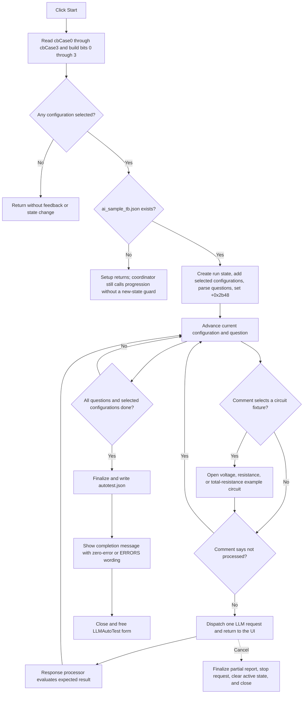

# Start

## Control

| Property | Recovered value |
| --- | --- |
| Form | LLMAutoTest |
| Component path | LLMAutoTest.bStart |
| Control class | TBitBtn |
| Caption | Start |
| Hint | Not present in the recovered resource. |
| Text | Not present in the recovered resource. |
| Handler name | bStartClick |
| Handler address | 019ce470 |
| Graph node | `resource:dfm:LLMAutoTest/LLMAutoTest.bStart` |
| Handler node | `function:019ce470` |
| Graph layer | UI |

The button has no hint, action, image, or glyph. The four check-box captions and the handler's bit-mask construction identify the selectable test configurations.

## Selected test configurations

The handler reads the runtime `Checked` state of four check boxes in a fixed order and builds one mask. It then passes the mask and the global LLM owner object to the auto-test coordinator.

| Mask bit | Check box | Recovered caption | Configuration constructed by setup |
| --- | --- | --- | --- |
| `0x01` | `cbCase0` | `DefTinaModel, F_EXTR_INSTR_TINA_LLM` | `Local: <DefTinaModel>` with setup mode 0 |
| `0x02` | `cbCase1` | `DefMetaLlamaModel, F_EXTR_INSTR_LLM_SELECTED` | `Local: <DefMetaLlamaModel>` with setup mode 1 |
| `0x04` | `cbCase2` | `OpenAI: gpt-4o, F_EXTR_INSTR_LLM_SELECTED` | `OpenAI: gpt-4o` with setup mode 1 |
| `0x08` | `cbCase3` | `DefMetaLlamaModel, F_EXTR_INSTR_SIMPLE` | `Local: <DefMetaLlamaModel>` with setup mode 2 |

When several boxes are checked, setup adds configurations in this table order. The original symbolic mode values are visible in the check-box captions, while the setup routine passes numeric values 0, 1, 1, and 2 to the configuration constructor.

If no box is checked, the mask is zero. `FUN_01a593b0` does not initialize, load, start, update progress, or display a message in that case. The click is a direct no-op apart from reading the four states.

## Test setup

For a nonzero mask, `FUN_01a59570` prepares a new run:

1. It builds `<TINA path>\Vhdl\aiprompts\ai_sample_tb.json` and tests whether the file exists.
2. It creates a new auto-test state object at owner field `+0x2978`.
3. It creates one configuration object for each selected mask bit and appends it to the state's configuration list at `+0x40`.
4. It resets the configuration index, applies configuration zero to the owner's active property object at `+0x2968`, and updates the modeless form's **Config** and **Prop** labels when the form exists.
5. It reads and parses the complete JSON test file.
6. It stores the parsed JSON in the state, sets the question count from the parsed array, sets the first question index to zero, and sets owner byte `+0x2b48` to 1. This byte is the active-auto-test flag used by the LLM response path.

The Start control remains enabled in the recovered code. Neither the handler nor these setup functions disable Start, the check boxes, or Cancel.

## Asynchronous question lifecycle

After setup, `FUN_01a593b0` calls `FUN_01a59b20` once. That routine advances through configurations and questions until it either dispatches an LLM request or completes the run.

For each JSON question, progression reads `item_id`, `question`, `comment`, and another string field whose key is not recovered at the call site. The response path reads the same question's `expected` expression later. Progression updates the **Question** and **Errors** labels. Some comment text also selects a circuit fixture before dispatch:

- `calculate voltage` opens `Examples\AI\CalcACDC\g-grid1-ok.TSC`.
- `calculate resistance` opens `Examples\AI\CalcACDC\ohm-1.TSC`.
- `calculate total resistance` opens `Examples\AI\CalcACDC\g-ser-par1-ok.TSC`.
- A comment containing `not processed` skips the LLM request and lets the progression loop advance synchronously.

For a normal question, the progression routine calls the LLM request dispatcher with the question text and returns. The main response-processing function `FUN_01a45e10` later checks owner flag `+0x2b48`, evaluates the current test's `expected` expression, stores the match result in the auto-test state, and calls `FUN_01a59b20` again. This later incoming call, and the request launch in `FUN_01a58950`, prove that Start begins an asynchronous lifecycle rather than waiting for all answers inside the click handler.

Before it moves past a prior question, progression records `Failed (by no match)` when neither the initial-run flag nor the response-match flag is set. The error recorder adds one structured report entry for the current `item_id` and question and increments the state error count. It guards against adding the same failure twice. The **Errors** label receives the current count.

After the last question in one configuration, the routine applies the next selected configuration, resets the question index, and repeats the same JSON set. After the last selected configuration, it invokes the report finalizer owned by TIARA-diz.6.7.692. That finalizer adds `ReportCount`, clears `+0x2b48`, and writes the report JSON to `<LLM work directory>\autotest.json`.

Completion displays one of these messages:

- `Autotest successfully completed` when the error count is zero.
- `Autotest successfully completed with ERRORS` when the error count is nonzero.

It then closes the modeless LLMAutoTest form when that form still exists. The close path finalizes and writes the report again, but the report finalizer has a guard that prevents a second `ReportCount` entry.

## Cancel, errors, and repeated Start

The sibling **Cancel** button remains available during a request. Its `.692`-owned handler closes the form. `OnClose` finalizes the partial report, stops and cleans the active chat/request path, clears the active-auto-test state through the owner cleanup, selects the free close action, and clears the global form reference. A later response callback does not call progression after `+0x2b48` is clear.

Other boundary cases are visible in the Start path:

- If `ai_sample_tb.json` is absent, setup returns without creating a new state or setting the active flag. The coordinator still calls progression and has no missing-file message or new-state guard. The recovered source therefore does not prove a safe first-run result; it can use stale state from an earlier run or dereference a missing state.
- If the file exists but JSON parsing returns nil, setup raises a Delphi exception with `Failed to load: <path>`. The handler has no local catch, status message, or rollback.
- Request or response errors leave the response-match flag clear. While the auto-test flag remains active, the response path re-enters progression, which can record the prior question as `Failed (by no match)` and continue.
- The handler has no active-run or re-entry check. Clicking Start again while a request is pending can assign a new state object at `+0x2978`, replace the selected configuration sequence, reset the active run, and reuse the same work files. The visible code does not cancel or dispose the earlier state before this replacement.
- The run writes `autotest.json` on completion and on Cancel/close. It can also open one of the three example circuit files and uses the LLM owner's existing chat work directory. The click does not change registry or INI settings.

## Click flow

## Evidence

- [Start handler](../../../DecompiledSources/Tina16/functions/00000000019CE470__FUN_019ce470.c): reads the four checked states, maps them to mask bits 0 through 3, and calls the global LLM owner's auto-test coordinator.
- [Auto-test coordinator](../../../DecompiledSources/Tina16/functions/0000000001A593B0__FUN_01a593b0.c): proves the zero-mask no-op and the setup-then-progression sequence.
- [Selection and test-data setup](../../../DecompiledSources/Tina16/functions/0000000001A59570__FUN_01a59570.c): creates configurations in mask order, loads `ai_sample_tb.json`, initializes indices, updates the configuration display, and sets the active flag.
- [Configuration and question progression](../../../DecompiledSources/Tina16/functions/0000000001A59B20__FUN_01a59b20.c): records no-match errors, updates progress, reads question fields, selects fixture circuits, dispatches requests, advances configurations, and completes the run.
- [LLM request dispatcher](../../../DecompiledSources/Tina16/functions/0000000001A58950__FUN_01a58950.c): prepares the chat process and starts one request before progression returns.
- [LLM response processor](../../../DecompiledSources/Tina16/functions/0000000001A45E10__FUN_01a45e10.c): evaluates a completed response and re-enters progression only while owner flag `+0x2b48` is set.
- [Expected-result evaluator](../../../DecompiledSources/Tina16/functions/00000000019CE1A0__FUN_019ce1a0.c): reads and evaluates the current JSON `expected` field for the response path.
- [Error recorder](../../../DecompiledSources/Tina16/functions/00000000019CDC10__FUN_019cdc10.c): writes structured failure data and increments the error count once per current test.
- [.692-owned report finalizer](../../../DecompiledSources/Tina16/functions/0000000001A59250__FUN_01a59250.c), [Cancel handler](../../../DecompiledSources/Tina16/functions/00000000019CE460__FUN_019ce460.c), and [OnClose handler](../../../DecompiledSources/Tina16/functions/00000000019CE500__FUN_019ce500.c): establish report persistence, request cleanup, active-state clearing, and form disposal on Cancel or completion.
- [Modeless form launcher](../../../DecompiledSources/Tina16/functions/0000000001A58F90__FUN_01a58f90.c): creates the global LLMAutoTest form and shows it without a modal wait.

## Limits

- The recovered source does not provide original Delphi field names for owner fields `+0x2968`, `+0x2978`, `+0x2b48`, or the auto-test state fields. Their roles come from repeated writers and consumers.
- The fourth per-question string key is missing from the recovered call to `FUN_019ce3c0`; the article does not assign it a name.
- The `expected` evaluator's expression language and comparison rules are inside shared runtime helpers and are not recovered here.
- Generic JSON, LLM, circuit-open, form-close, and label-update helpers remain evidence only. This fragment assigns roles only to the Start handler, coordinator, selected-configuration setup, and progression routine.
