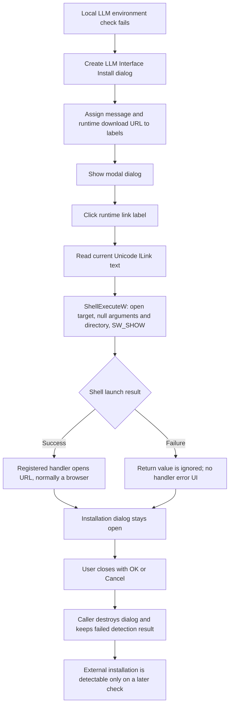

# LLM installation link

> Analysis status: Source reviewed through runtime link assignment, Windows
> Shell launch, modal-dialog lifecycle, and later installation detection.

## Control

| Property | Recovered value |
| --- | --- |
| Form | LLMInterfaceInstall |
| Component path | LLMInterfaceInstall.lLink |
| Control class | TLabel |
| Caption | Assigned at runtime; no caption is stored in the form resource. |
| Hint | Not present in the recovered resource. |
| Text | Not present in the recovered resource. |
| Handler name | lLinkClick |
| Handler address | 01a2e3f0 |
| Graph node | `resource:dfm:LLMInterfaceInstall/LLMInterfaceInstall.lLink` |
| Handler node | `function:01a2e3f0` |
| Graph layer | UI |

The form resource contains an empty message label, this empty link label, and
standard OK, Cancel, and Help buttons. The caller supplies the message and link
before it shows the form. The click therefore opens the current label text; it
does not use one hard-coded target inside the handler.

## What happens when clicked

`lLinkClick` gets the form's native window handle and reads the full Unicode
text of `lLink` from form field `+0x6B8`. It passes that text to the recovered
Windows Shell execution thunk with these arguments:

- owner: the `TLLMInterfaceInstall` window handle;
- operation: `open`;
- file or target: the current `lLink` text;
- parameters: null;
- working directory: null; and
- show command: `5`, the Windows `SW_SHOW` value.

This is the six-argument `ShellExecuteW` operation used elsewhere in the
recovered application. For an HTTPS target, Windows opens the registered URL
handler, normally the user's default browser. The handler does not select a
specific browser.

The function discards the ShellExecute return value. It does not report a
value at or below the ShellExecute failure boundary, retry the operation, or
show an error. An empty or invalid label, a missing URL association, a blocked
launch, or another Shell failure therefore produces no handler-owned status.

## Runtime targets and dialog lifecycle

`FUN_01a58510` creates this dialog when a required local LLM environment is not
available. It writes the explanatory text to label field `+0x6B0` and the
launch target to `lLink` at `+0x6B8`, calls `ShowModal`, and destroys the form
after the modal call returns normally.

Two target sources are proven:

- On the recovered Windows Ollama path, the caller writes
  `https://ollama.com/download/windows`.
- On the missing llamafile path, form initialization builds a versioned
  `https://github.com/Mozilla-Ocho/llamafile/releases/download/...` executable
  URL and the caller writes that runtime string to the link label.

The click launches only the supplied page or file target. It does not download
a package, choose a destination, execute an installer, start Ollama or
llamafile, change the configured LLM interface, or write a setting. It also
does not close the dialog. The user must close it with a modal button.

After the dialog returns, the environment checker still returns its failed
installation result. It does not assume that opening the link completed an
installation and does not run a second detection pass in the same modal flow.
The higher form-initialization path continues through its missing-framework
branch. A later user action or form initialization must detect software that
was installed outside TINA.

## Repeated clicks, closure, and errors

Each click reads `lLink` again. Repeated clicks can therefore submit the same
target to the Windows Shell more than once and can open multiple browser tabs
or windows according to the registered handler. There is no busy flag,
one-launch guard, or change to label enabled state.

The label has no modal result. Clicking it leaves the installation dialog open.
The standard OK or Cancel buttons can close the dialog; this click does not
distinguish which button is later used.

The handler has no local exception handler or cleanup guard around the control
text and handle operations. An escaping VCL or string exception propagates.
The temporary UnicodeString is cleared on the normal path after ShellExecute,
but that clear is not protected by a recovered `finally` block. ShellExecute
failures normally return a status instead of raising, and this handler ignores
that status.

## Click and external-install flow

## Evidence

- [Link click handler](../../../DecompiledSources/Tina16/functions/0000000001A2E3F0__FUN_01a2e3f0.c): reads the control at `+0x6B8` and sends its Unicode text to the shell `open` thunk with an owner handle, null parameters and directory, and show value `5`.
- [Window-handle getter](../../../DecompiledSources/Tina16/functions/000000000065B870__FUN_0065b870.c) and [handle initializer](../../../DecompiledSources/Tina16/functions/000000000065B830__FUN_0065b830.c): establish that the first shell argument is the form's native handle.
- [VCL Unicode text reader](../../../DecompiledSources/Tina16/functions/000000000064DD90__FUN_0064dd90.c): copies the current label text into the temporary Delphi UnicodeString.
- [Shell execution thunk](../../../DecompiledSources/Tina16/functions/0000000000636960__thunk_FUN_0419adcc.c): is the shared indirect Windows Shell call used with the recovered `ShellExecuteW` argument layout.
- [Environment and installation checker](../../../DecompiledSources/Tina16/functions/0000000001A58510__FUN_01a58510.c): creates this form, assigns its message and link labels, shows it modally, destroys it, and retains a false installation result. Its Ollama branch supplies the Windows download URL.
- [Parent form initialization](../../../DecompiledSources/Tina16/functions/0000000001A40C10__FUN_01a40c10.c): builds the versioned Mozilla llamafile release URL, invokes the environment checker, and follows the missing-framework path when it returns false.
- [llamafile message builder](../../../DecompiledSources/Tina16/functions/0000000001A52510__FUN_01a52510.c): creates the companion message that tells the user to download llamafile and save it to the configured location.
- [Recovered UI evidence](../../../DecompiledSources/Tina16/resources/dfm/ui-evidence.json): identifies `lLink` as a `TLabel` with no stored caption, binds its click to `01A2E3F0`, and records the form caption and three standard button kinds.

## Limits

- The indirect shell thunk is not named in the recovered function index. Its
  six arguments, Unicode target, `open` verb, callers, and show value establish
  the `ShellExecuteW` contract.
- Windows decides which registered application handles an HTTPS target. This
  article does not claim one specific browser.
- The click proves only an external launch request. It provides no evidence
  that the page opened, a download completed, or an installation succeeded.
