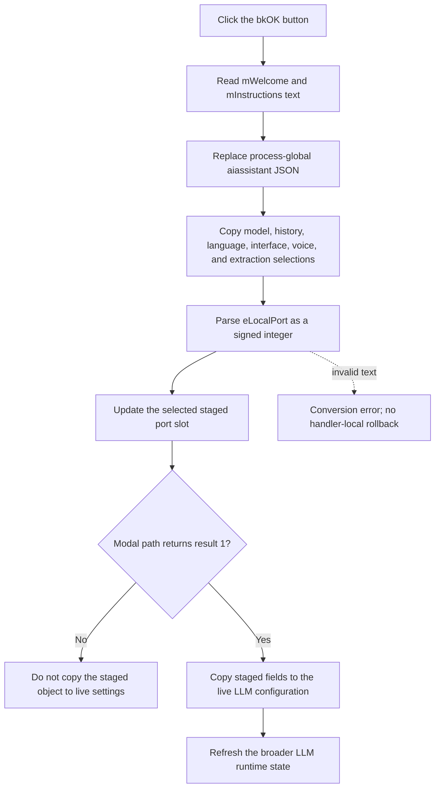

# Apply the LLM options

> Analysis status: Evidence-backed source review complete.

## Control

| Property | Recovered value |
| --- | --- |
| Form | LLMOptions |
| Component path | LLMOptions.bOK |
| Control class | TBitBtn |
| Kind | bkOK |
| Handler name | bOKClick |
| Handler address | 019d9dd0 |
| Graph node | `resource:dfm:LLMOptions/LLMOptions.bOK` |
| Handler node | `function:019d9dd0` |
| Graph layer | UI |

The resource does not contain a separate caption, hint, image, or modal-result value. The recovered `bkOK` kind supplies the OK-button presentation. The handler source proves the data work that occurs before the modal caller accepts the dialog.

## What happens when clicked

[FUN_019d9dd0](../../../DecompiledSources/Tina16/functions/00000000019D9DD0__FUN_019d9dd0.c) reads the complete text from `mWelcome` and `mInstructions`. It stores both strings in form-owned fields and passes them to [FUN_013b7dc0](../../../DecompiledSources/Tina16/functions/00000000013B7DC0__FUN_013b7dc0.c).

The serializer builds this recovered structure and replaces the process-global assistant configuration string:

- `aiassistant.welcome` receives the welcome text.
- `aiassistant.instructions` receives the instruction text.
- `aiassistant.options.model` receives the empty Delphi UnicodeString that this handler supplies as its third argument.

This step changes the process-global serialized assistant data before the remaining option fields are parsed. The click path does not write a file or registry value at this point.

The handler then calls [FUN_019d9a50](../../../DecompiledSources/Tina16/functions/00000000019D9A50__FUN_019d9a50.c), which copies the other visible values into the dialog's staged configuration object:

| Dialog input | Staged value |
| --- | --- |
| Selected `cbModel` item text | Main model string at `+0x08` |
| `seHistorySize` value | History size at `+0x48` |
| `cbLanguage.ItemIndex` | Language index at `+0x54` |
| Parsed `eLocalPort.Text` | Port slot selected by `cbInterfacePort.ItemIndex` at `+0x68`, `+0x6C`, or `+0x70` |
| `cbInterface.ItemIndex` | Active local interface at `+0x5C` |
| `cbVoices.ItemIndex` | Voice index at `+0x60` |
| `rgExtrInstructions.ItemIndex` | Extract-instruction mode at `+0xA0` |
| Selected `cbTinaLLM` item text | Tina LLM version string at `+0x80` |

The copy helper updates only the currently selected port slot. The other two staged port values remain unchanged.

After the inherited OK-button path returns modal result `1`, [FUN_01a42840](../../../DecompiledSources/Tina16/functions/0000000001A42840__FUN_01a42840.c) copies the staged object into the live LLM configuration through [FUN_01a421f0](../../../DecompiledSources/Tina16/functions/0000000001A421F0__FUN_01a421f0.c). It then refreshes the broader LLM runtime state. The click handler does not copy the staged object to the live configuration itself.

## Validation and error boundaries

- The handler does not check that `eLocalPort` is present, numeric, positive, or in the TCP port range. The shared signed-integer conversion reports malformed text during the OK path. Negative values are not rejected here.
- The model, language, interface, voice, extraction-mode, and Tina-version indexes have no handler-local range check. Normal VCL controls and their recovered item lists provide the expected values.
- The assistant JSON update occurs before the local-port conversion. If the conversion raises an exception, the live configuration has not passed the modal-result guard, but the process-global assistant string and part of the staged object can already contain new values. The handler has no rollback.
- The serializer and staged copy have no local error message or retry. An allocation, control-access, or JSON error propagates through the normal VCL event path.
- A successful repeated click replaces the same staged fields and the same process-global assistant string. It does not keep a prior-value history.

## Click flow

## Evidence

- [OK click handler](../../../DecompiledSources/Tina16/functions/00000000019D9DD0__FUN_019d9dd0.c): reads both memo texts, updates the assistant JSON, and invokes the staged copy helper.
- [Assistant JSON serializer](../../../DecompiledSources/Tina16/functions/00000000013B7DC0__FUN_013b7dc0.c): builds `welcome`, `instructions`, and `options.model`, serializes the object, and replaces the process-global string.
- [Assistant JSON reader](../../../DecompiledSources/Tina16/functions/00000000013B7990__FUN_013b7990.c): reads the same recovered fields when the form is shown.
- [Staged option copy](../../../DecompiledSources/Tina16/functions/00000000019D9A50__FUN_019d9a50.c): maps each control to its staged configuration field and parses the selected port edit.
- [Options modal coordinator](../../../DecompiledSources/Tina16/functions/0000000001A42840__FUN_01a42840.c): applies the staged object only when `ShowModal` returns `1`.
- [Live configuration copy](../../../DecompiledSources/Tina16/functions/0000000001A421F0__FUN_01a421f0.c): copies the staged values, including all three port slots, to the live LLM configuration.
- [Recovered UI evidence](../../../DecompiledSources/Tina16/resources/dfm/ui-evidence.json): binds `bOKClick`, identifies the `bkOK` kind, and identifies the related controls.

## Analysis limits

- The resource does not contain an explicit modal-result value for this button. The article distinguishes the source-backed handler work from the modal caller's recovered result check.
- The source proves a process-global serialized configuration update. It does not prove the time or mechanism of a later disk write.
- The exact user-facing text for a propagated conversion or allocation exception is outside this handler.
