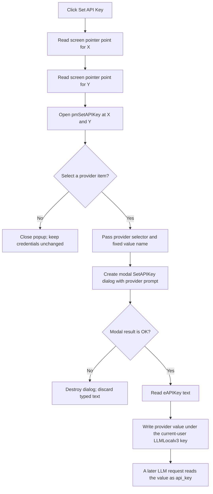

# Set API Key

## Control

| Property | Recovered value |
| --- | --- |
| Form | LLMOptions |
| Component path | LLMOptions.bSetAPIKey |
| Control class | TButton |
| Caption | Set API Key |
| Handler name | bSetAPIKeyClick |
| Handler address | 019db210 |
| Graph node | `resource:dfm:LLMOptions/LLMOptions.bSetAPIKey` |
| Handler node | `function:019db210` |
| Graph layer | UI |

The recovered resource has no hint, action, image, or glyph for this button. Its caption identifies the general operation. The recovered handler proves that the first click opens a provider menu and does not open the key-entry dialog directly.

## What happens when clicked

[FUN_019db210](../../../DecompiledSources/Tina16/functions/00000000019DB210__FUN_019db210.c) gets the current screen pointer position twice. It uses the low 32 bits from the first point as the horizontal coordinate and the high 32 bits from the second point as the vertical coordinate. It then invokes the `Popup(X, Y)` method on the form field that the DFM identifies as `pmSetAPIKey`.

This handler has no provider test and does not read, stage, validate, or store a credential. The DFM supplies four static popup items:

| Menu item | Provider selector | Registry value name |
| --- | ---: | --- |
| Set OpenAI API Key... | 0 | `OPENAI_API_KEY` |
| Set GROQ API Key | 1 | `GROQ_API_KEY` |
| Set OpenRouter API Key... | 2 | `OPENROUTER_API_KEY` |
| Set Ollama API Key... | 3 | `OLLAMA_API_KEY` |

The menu-item handlers at `019db3e0`, `019db340`, `019db430`, and `019db390` provide these selector and value-name pairs to the shared credential coordinator. Those provider-specific handlers are owned by `.704` through `.707`; this article uses them only to explain the route opened by this button.

If the user dismisses the popup without selecting an item, the button click has no credential or options-state effect.

## Credential dialog and staging boundary

After the user selects a provider, [FUN_019db260](../../../DecompiledSources/Tina16/functions/00000000019DB260__FUN_019db260.c) creates a new modal `SetAPIKey` form. [FUN_019d8070](../../../DecompiledSources/Tina16/functions/00000000019D8070__FUN_019d8070.c) stores the provider selector and changes the label to one of these prompts:

- `Enter your OpenAI API Key:`
- `Enter your GROQ API Key:`
- `Enter your OpenRouter API Key:`
- `Enter your Ollama API Key:`

The dialog contains one `TEdit`, an OK button, a Cancel button, and a Help button. The recovered DFM does not set `PasswordChar`, and the form-create and provider-setup handlers do not add masking. The key is therefore entered in a normal visible edit control in the recovered implementation.

The coordinator does not load the existing stored value into the edit. Each new dialog starts with the DFM's empty edit value. The typed text remains local to the modal dialog until the result is known:

- Modal result `1` reads the edit text through [FUN_019d8220](../../../DecompiledSources/Tina16/functions/00000000019D8220__FUN_019d8220.c) and passes it to the registry writer.
- Cancel, window close, or another modal result destroys the dialog without reading or storing the text.

There is no non-empty check, format check, provider connection test, or confirmation prompt. Accepting an empty edit therefore requests an empty stored value.

## Persistence and later use

[FUN_01a513b0](../../../DecompiledSources/Tina16/functions/0000000001A513B0__FUN_01a513b0.c) opens an application-specific key below `HKEY_CURRENT_USER\SOFTWARE\DesignSoft\...\LLMLocalv3` and writes the provider's fixed value name as a registry string. The runtime product-name segment remains a global data value in the decompilation, so this article does not invent its exact text.

This write is immediate. It does not wait for the main LLM Options OK button. If the user accepts a key and then cancels the main Options form, that Cancel does not restore the previous key. The direct Set API Key button handler also does not update the selected model, the visible options edits, or an in-memory API client.

The registry writer uses the supplied text directly. The recovered path shows no encryption, credential-vault API, or other protection before the registry string write. If the registry key cannot be opened, the writer skips the value write and returns without a user message. A lower registry-write exception has no local catch in the provider coordinator.

[FUN_01a50fe0](../../../DecompiledSources/Tina16/functions/0000000001A50FE0__FUN_01a50fe0.c) is the matching registry-string reader. A later LLM request builder selects the value name for the active provider, reads that value, and places it in the request configuration as `api_key`. For a non-local provider with no recovered value, that later path reports that the API key must be set. This is later consumption; it is not part of the button click.

## Pointer and error boundaries

[FUN_00664d10](../../../DecompiledSources/Tina16/functions/0000000000664D10__FUN_00664d10.c) returns a packed screen point. If its lower point-retrieval call fails, it returns zero for that complete point. Because the button handler calls it separately for the horizontal and vertical values, a failure can supply zero for the corresponding coordinate. The handler still calls `Popup` and has no local error message or retry.

The recovered source also reads the screen point twice rather than reusing one snapshot. If the pointer moves between these reads, the horizontal and vertical coordinates can come from different snapshots. No credential state changes before a provider menu item runs.

## Click flow

## Evidence

- [Button click handler](../../../DecompiledSources/Tina16/functions/00000000019DB210__FUN_019db210.c): reads two packed screen points and invokes VMT slot `0xA8` on the `pmSetAPIKey` field with the recovered coordinates.
- [Screen-point helper](../../../DecompiledSources/Tina16/functions/0000000000664D10__FUN_00664d10.c): returns a packed point and returns zero when its lower retrieval call fails.
- [Parallel popup call site](../../../DecompiledSources/Tina16/functions/000000000104E8D0__FUN_0104e8d0.c): uses the same point-helper and VMT-slot pattern for a recovered context-popup path.
- [GROQ](../../../DecompiledSources/Tina16/functions/00000000019DB340__FUN_019db340.c), [Ollama](../../../DecompiledSources/Tina16/functions/00000000019DB390__FUN_019db390.c), [OpenAI](../../../DecompiledSources/Tina16/functions/00000000019DB3E0__FUN_019db3e0.c), and [OpenRouter](../../../DecompiledSources/Tina16/functions/00000000019DB430__FUN_019db430.c) menu handlers: prove the provider selector and registry-value-name mappings.
- [Shared provider coordinator](../../../DecompiledSources/Tina16/functions/00000000019DB260__FUN_019db260.c): creates the modal dialog and writes only after modal result `1`.
- [Provider prompt setter](../../../DecompiledSources/Tina16/functions/00000000019D8070__FUN_019d8070.c) and [edit reader](../../../DecompiledSources/Tina16/functions/00000000019D8220__FUN_019d8220.c): prove the prompt mapping and copy of the accepted edit text.
- [Registry writer](../../../DecompiledSources/Tina16/functions/0000000001A513B0__FUN_01a513b0.c) and [registry reader](../../../DecompiledSources/Tina16/functions/0000000001A50FE0__FUN_01a50fe0.c): prove current-user persistence and later retrieval by value name.
- [Later LLM request builder](../../../DecompiledSources/Tina16/functions/0000000001A43260__FUN_01a43260.c): maps the active provider to the same value names and copies the recovered value into `api_key`.
- [Recovered UI evidence](../../../DecompiledSources/Tina16/resources/dfm/ui-evidence.json): binds the button and four popup items, supplies their captions, and proves the `SetAPIKey` dialog controls and absent DFM password masking.

## Limits

- The delayed lower function used by the screen-point helper is unresolved. The popup call pattern and coordinate data flow prove a screen point, but this article does not claim a direct recovered Win32 import name.
- The DFM contains no per-item enabled or visible conditions. The button handler does not modify menu-item state, but another application path could do so before the click.
- This article does not claim that registry storage is secure. It records only the recovered plain registry-string path and the absence of encryption in that path.
