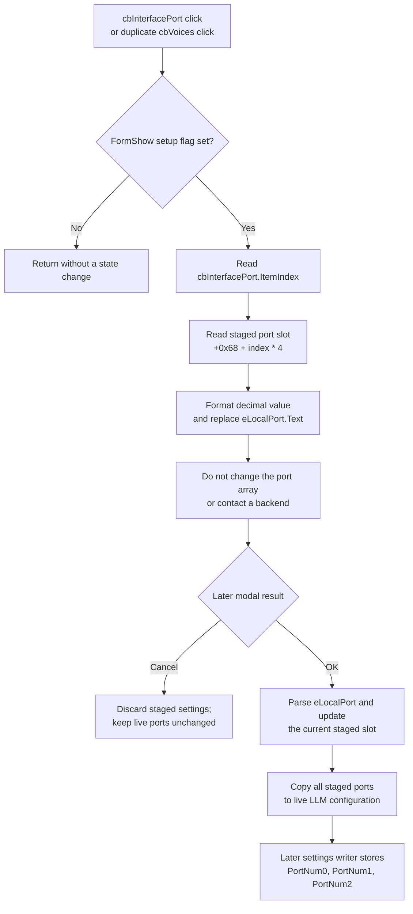

# Select the local interface port to edit

## Control

| Property | Recovered value |
| --- | --- |
| Form | LLMOptions |
| Component path | LLMOptions.cbInterfacePort |
| Control class | TComboBox |
| Text | Ollama port |
| Items | Ollama port; LM Studio port; llamafile port |
| Style | csDropDownList |
| Handler name | cbInterfacePortClick |
| Handler address | 019db480 |
| Graph node | `resource:dfm:LLMOptions/LLMOptions.cbInterfacePort` |
| Handler node | `function:019db480` |
| Graph layer | UI |

This combo box selects which stored local-interface port is shown in `eLocalPort`. It does not select the active LLM interface. The separate `cbInterface` control has the items **Ollama**, **LM Studio**, and **llamafile** and owns that choice.

The resource has no hint, action, image, or glyph. Its ordered item text agrees with the handler's three-entry array access, while the constructor and OK copy-back prove the control and field mappings.

## Selection behavior

After form setup is active, a click reads `cbInterfacePort.ItemIndex` and uses it as an index into three 32-bit values in the dialog's staged configuration object:

| Item index | Resource text | Staged field |
| ---: | --- | --- |
| 0 | Ollama port | `+0x68` |
| 1 | LM Studio port | `+0x6C` |
| 2 | llamafile port | `+0x70` |

The handler formats the selected integer as decimal text and replaces `eLocalPort.Text`. It does not change the selected port value in the staged object. It also does not change the active-interface field, contact a local service, restart a framework, or write settings.

The configuration object initializes all three port entries to decimal `11434` before application settings are loaded. Existing `PortNum0`, `PortNum1`, and `PortNum2` settings can replace those defaults before this dialog is opened.

## Staging and OK or Cancel

The dialog constructor initially performs the same port lookup and fills `eLocalPort` for the current selector index. The click handler repeats that display refresh after a selection.

An edit in `eLocalPort` is not saved when the user changes `cbInterfacePort`. The handler reads the newly selected array entry and replaces the edit text without first copying the old text back. Thus, changing from one port item to another can discard an uncommitted edit for the previous item.

The port is copied back only on **OK**:

1. The OK handler reads `eLocalPort.Text` and converts it to a signed integer.
2. It writes that integer to the staged port slot selected by the current `cbInterfacePort.ItemIndex`.
3. The modal caller copies all three staged port slots to the live LLM configuration only when the dialog result is OK.

The selector index itself is not copied to the configuration or stored as a preference. It is an editor choice, not the active-interface setting. **Cancel** discards the staged configuration object, so it leaves all live port values unchanged.

There is no explicit port-range check. Malformed integer text raises the shared Delphi conversion error during OK processing, before normal copy-back finishes. Negative and other signed integer values are not rejected by this recovered path. The click itself does not parse the text and cannot report a value error.

## Shared `cbVoices` binding

The DFM also binds `cbVoices.OnClick` to this exact function with the handler name `cbInterfacePortClick`. The function does not inspect `Sender` and does not read `cbVoices`. Therefore, selecting a voice still changes the combo box's own selection, but the attached handler additionally refreshes `eLocalPort` from the current `cbInterfacePort` slot. This can overwrite an uncommitted port edit even though the user clicked **Voices**.

The later OK handler reads `cbVoices.ItemIndex` separately and stores the voice index. The shared click handler neither applies nor rejects the voice selection.

## Runtime and persistence boundary

After accepted copy-back, runtime consumers choose a port with the live active-interface index, not with `cbInterfacePort.ItemIndex`. Recovered local-framework checks use the selected port to contact the relevant local endpoint, including the Ollama check at `127.0.0.1:<port>`. No such work occurs during this click.

The accepted port array is written to the current-user TINA registry as `PortNum0`, `PortNum1`, and `PortNum2` by the broader Local LLM settings writer during later application teardown. The click and the LLM Options modal caller do not write these registry values directly. A failure or exit before that later writer runs can therefore leave the accepted values only in live process state.

## Guards and failure limits

- `FormCreate` clears byte `+0x810`, and `FormShow` sets it. When the byte is clear, the shared handler returns without reading a selector or changing `eLocalPort`. This prevents setup-time events from applying the refresh.
- The handler has no explicit index-range guard. The recovered drop-down list supplies exactly three normal indexes, 0 through 2. Behavior for a programmatically forced index outside that range is not safe to infer.
- The text update has no local catch or rollback. A VCL or allocation exception propagates after the selected array value has only been read; the staged and live port arrays remain unchanged.
- Repeating the click for the same item writes the same formatted staged value to `eLocalPort` again. It can still erase a manual edit that has not reached OK.

## Click flow

## Source evidence

- [Shared click handler `FUN_019db480`](../../../DecompiledSources/Tina16/functions/00000000019DB480__FUN_019db480.c) proves the setup guard, fixed `cbInterfacePort` read, three-entry staged-array lookup, decimal formatting, and `eLocalPort` update.
- [Dialog constructor `FUN_019d9750`](../../../DecompiledSources/Tina16/functions/00000000019D9750__FUN_019d9750.c) maps the controls and staged object and performs the initial port display.
- [Form creation `FUN_019d9c60`](../../../DecompiledSources/Tina16/functions/00000000019D9C60__FUN_019d9c60.c) and [form show `FUN_019d9c90`](../../../DecompiledSources/Tina16/functions/00000000019D9C90__FUN_019d9c90.c) prove the setup guard lifecycle.
- [OK copy-back `FUN_019d9a50`](../../../DecompiledSources/Tina16/functions/00000000019D9A50__FUN_019d9a50.c) proves integer conversion and the selected staged-slot write.
- [Options launcher `FUN_01a42840`](../../../DecompiledSources/Tina16/functions/0000000001A42840__FUN_01a42840.c) and [accepted configuration copy `FUN_01a421f0`](../../../DecompiledSources/Tina16/functions/0000000001A421F0__FUN_01a421f0.c) prove the modal-result guard and all-three-port live copy.
- [Configuration constructor `FUN_0147b0e0`](../../../DecompiledSources/Tina16/functions/000000000147B0E0__FUN_0147b0e0.c), [settings loader `FUN_01a50090`](../../../DecompiledSources/Tina16/functions/0000000001A50090__FUN_01a50090.c), and [settings writer `FUN_01a50ac0`](../../../DecompiledSources/Tina16/functions/0000000001A50AC0__FUN_01a50ac0.c) prove the defaults and registry persistence boundary.
- [Active-port getter `FUN_01a5a510`](../../../DecompiledSources/Tina16/functions/0000000001A5A510__FUN_01a5a510.c) and [local-framework check `FUN_01a58510`](../../../DecompiledSources/Tina16/functions/0000000001A58510__FUN_01a58510.c) prove that runtime use selects a port through the separate active-interface field.
- [Recovered Delphi resource evidence](../../../DecompiledSources/Tina16/resources/dfm/ui-evidence.json) proves the two event bindings, ordered item text, combo-box styles, and separate interface, port, voice, and edit controls.

## Annotation ownership and limits

- `.700` owns the canonical annotation for shared handler `FUN_019db480`. `.703` duplicates the complete entry because `cbVoices` uses the same function.
- Constructors, form lifecycle handlers, OK and modal coordinators, settings functions, runtime consumers, formatting, and VCL helpers have wider ownership and remain evidence-only.
- The original Delphi name of the staged configuration class is not recovered. Field roles come from initialization, UI copy-in and copy-back, persistence keys, and runtime consumers.
