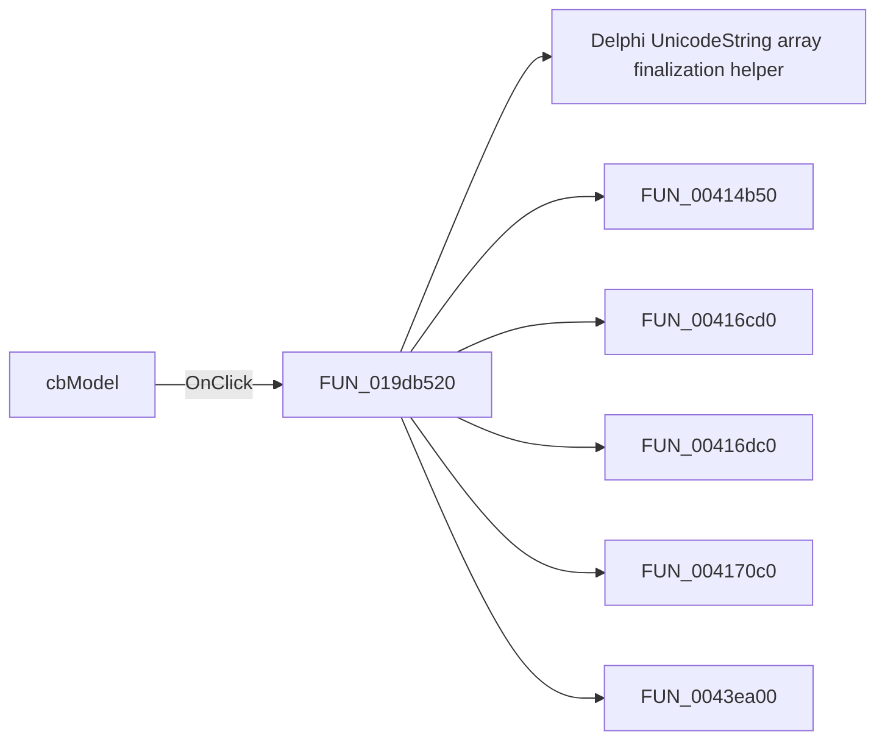

# cbModel

> Analysis status: Pending individual source review.

## Control

| Property | Recovered value |
| --- | --- |
| Form | LLMOptions |
| Component path | LLMOptions.cbModel |
| Control class | TComboBox |
| Caption | Not present in the recovered resource. |
| Hint | Not present in the recovered resource. |
| Text | Not present in the recovered resource. |
| Handler name | cbModelClick |
| Handler address | 019db520 |
| Graph node | `resource:dfm:LLMOptions/LLMOptions.cbModel` |
| Handler node | `function:019db520` |
| Graph layer | UI |

## What happens when clicked

Pending individual analysis. An agent must read the recovered handler source and its relevant callees before it replaces this text.

## Click flow

## Handler evidence

- Source: [DecompiledSources/Tina16/functions/00000000019DB520__FUN_019db520.c](../../../DecompiledSources/Tina16/functions/00000000019DB520__FUN_019db520.c)
- Recovered role: Not present in the recovered resource.
- Current graph summary: Handles 1 Delphi UI event: LLMOptions.cbModel.OnClick.
- Current graph behavior: Not present in the recovered resource.
- Current graph evidence: Not present in the recovered resource.
- Complexity: complex
- Distinct outgoing calls: 7

## Direct calls

- `function:00414560` — Delphi UnicodeString array finalization helper
- `function:00414b50` — FUN_00414b50
- `function:00416cd0` — FUN_00416cd0
- `function:00416dc0` — FUN_00416dc0
- `function:004170c0` — FUN_004170c0
- `function:0043ea00` — FUN_0043ea00
- `function:019db970` — FUN_019db970

## Resource evidence

- Kind: Not present in the recovered resource.
- Modal result: Not present in the recovered resource.
- Checked state: Not present in the recovered resource.
- List items: Not present in the recovered resource.
- Image reference: Not present in the recovered resource.
- Extracted glyph: None.

## Nearby label candidates

Nearby labels are layout candidates only. They are not proof of behavior.

- Rank 1: Model:  at distance 67.
- Rank 2: Welcome message:  at distance 99.
- Rank 3: Instructions:  at distance 227.

## Analysis limits

- Do not infer behavior from the control class, caption, hint, glyph, or nearby label alone.
- Do not replace the pending status until the handler source and relevant call path provide enough evidence.
