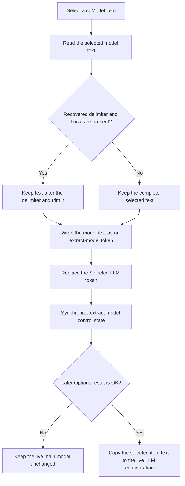

# Select the main LLM model

> Analysis status: Evidence-backed source review complete.

## Control

| Property | Recovered value |
| --- | --- |
| Form | LLMOptions |
| Component path | LLMOptions.cbModel |
| Control class | TComboBox |
| Style | csDropDownList |
| Handler name | cbModelClick |
| Handler address | 019db520 |
| Graph node | `resource:dfm:LLMOptions/LLMOptions.cbModel` |
| Handler node | `function:019db520` |
| Graph layer | UI |

The model list is added at run time, so the recovered DFM has no static item text. The constructor fills the combo box from the staged configuration's model list and selects the staged main model.

## What happens when clicked

The VCL combo box changes its selected item before [FUN_019db520](../../../DecompiledSources/Tina16/functions/00000000019DB520__FUN_019db520.c) runs. The handler reads the selected item text twice from `cbModel`.

It prepares a model token for the extract-instruction paths:

1. It searches the selected text for one recovered static delimiter.
2. If that delimiter exists and the selected text also contains `Local`, it keeps at most 255 characters after the delimiter and trims leading and trailing characters below or equal to U+0020.
3. It wraps the resulting text with the same recovered angle-bracket form that [FUN_01a42710](../../../DecompiledSources/Tina16/functions/0000000001A42710__FUN_01a42710.c) uses for the three extract-model tokens.
4. It always replaces the staged **Selected LLM** token at form offset `+0x870`.
5. If `rgExtrInstructions.ItemIndex` is `1` (**Selected LLM**), it also replaces the token at form offset `+0x868` with the same value.

The handler then calls [FUN_019db970](../../../DecompiledSources/Tina16/functions/00000000019DB970__FUN_019db970.c). That helper uses the current extraction-mode selection to synchronize the extract-model controls. It shows and enables `eIntentModel`, `cbTinaLLM`, and their labels only for item `0` (**Fast LLM**). In that mode, it also refreshes `eIntentModel.Text` from the token at `+0x868`. For item `1` or `2`, it hides and disables those controls.

This click does not copy the selected model to the staged configuration object. The later OK handler reads `cbModel.ItemIndex`, copies the selected item text to staged field `+0x08`, and the modal caller copies that field to live settings only after result `1`. Cancel leaves the live model unchanged.

## State and error boundaries

- The handler does not start, stop, or contact an LLM provider. It does not change a port, API key, voice, language, history size, or durable setting.
- The handler has no setup-ready guard of its own. Unlike the extraction-mode helper, it reads the combo selection even before `FormShow` sets the ready byte. The shared presentation helper returns without UI work while that byte is clear.
- If the delimiter is absent, or the selected text does not contain `Local`, the handler keeps the complete selected item text for the angle-bracket token.
- The recovered source does not contain an explicit invalid-index branch. The normal drop-down list supplies a selected item. A forced invalid index can fail in the VCL item read before any live setting changes.
- String allocation and control-state errors have no local catch or rollback. The model selection remains a dialog-local VCL state until OK commits it.
- Repeating the click for the same item rebuilds the same derived tokens and presentation state.

## Click flow

## Evidence

- [Model click handler](../../../DecompiledSources/Tina16/functions/00000000019DB520__FUN_019db520.c): reads the selected item, performs the Local-only substring and trim path, rebuilds the derived tokens, and calls the shared presentation helper.
- [Substring search](../../../DecompiledSources/Tina16/functions/00000000004170C0__FUN_004170c0.c), [substring copy](../../../DecompiledSources/Tina16/functions/0000000000416DC0__FUN_00416dc0.c), and [trim helper](../../../DecompiledSources/Tina16/functions/000000000043EA00__FUN_0043ea00.c): prove the search, maximum copied length, and whitespace trimming.
- [Initial token builder](../../../DecompiledSources/Tina16/functions/0000000001A42710__FUN_01a42710.c): creates angle-bracket tokens for Fast LLM, Selected LLM, and Without LLM before the dialog opens.
- [Extraction-mode presentation helper](../../../DecompiledSources/Tina16/functions/00000000019DB970__FUN_019db970.c): proves the item-index test, text refresh, enabled state, and visibility changes.
- [Dialog constructor](../../../DecompiledSources/Tina16/functions/00000000019D9750__FUN_019d9750.c): loads the run-time model list and selects the staged main model.
- [OK staged copy](../../../DecompiledSources/Tina16/functions/00000000019D9A50__FUN_019d9a50.c) and [modal coordinator](../../../DecompiledSources/Tina16/functions/0000000001A42840__FUN_01a42840.c): prove the later OK-only live copy.
- [Recovered UI evidence](../../../DecompiledSources/Tina16/resources/dfm/ui-evidence.json): binds `cbModel.OnClick` to this handler and records the drop-down-list style.

## Analysis limits

- The decompiler does not name the static delimiter used by the Local-only normalization test. This article records the proven search and data flow without inventing its character.
- The run-time list contents depend on the staged model list. They are not present in the DFM evidence.
- The handler updates two form-owned token fields in the Selected LLM branch. The recovered source does not show a separate consumer for every intermediate assignment.
