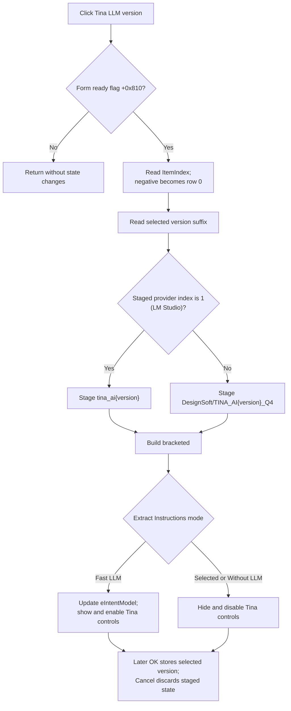

# Tina LLM version

> Analysis status: Source reviewed. The initialization guard, version lookup, provider-specific model names, extraction-model display, visibility rules, provider and port separation, OK commit, caller apply, and failure boundaries are supported by recovered code.

## Control

| Property | Recovered value |
| --- | --- |
| Form | LLMOptions |
| Component path | LLMOptions.cbTinaLLM |
| Control class | TComboBox |
| Caption | Not present on the combo box. |
| Nearby label | Tina LLM version: |
| Style | `csDropDownList` |
| Handler name | cbTinaLLMClick |
| Handler address | 019db8f0 |
| Graph node | `resource:dfm:LLMOptions/LLMOptions.cbTinaLLM` |
| Handler node | `function:019db8f0` |
| Graph layer | UI |

## What happens when clicked

`FUN_019db8f0` first tests the form-ready flag at `+0x810`. `LLMOptions.FormCreate` clears this flag, and `FormShow` sets it. A click notification before FormShow is therefore a no-op. This guard prevents setup-time combo population and selection changes from running the user-click path.

After the form is ready, the handler delegates to `FUN_019db720`. That helper reads `cbTinaLLM.ItemIndex`. A negative index falls back to row 0. It reads the selected row text as a Tina model-version suffix and builds both possible model identifiers:

- `DesignSoft/TINA_AI{version}_Q4`
- `tina_ai{version}`

The settings clone at form `+0x860` contains the provider index at `+0x5c`. The provider combo order is **Ollama**, **LM Studio**, and **llamafile**. For provider index 1, the helper selects the shorter `tina_ai{version}` identifier. For index 0 or any other index, it selects `DesignSoft/TINA_AI{version}_Q4`. The selected identifier is staged in form field `+0x800`.

The click then builds `<{identifier}>` in form field `+0x868`. The static strings around the identifier are the recovered UnicodeStrings `<` and `>`. This bracketed value is the read-only **Extract instruction model** display used by the **Fast LLM** extraction mode.

## Visibility and extraction mode

The click finishes by invoking the shared LLMOptions visibility refresh. That helper reads `rgExtrInstructions.ItemIndex`:

- Row 0, **Fast LLM**: it writes the bracketed Tina identifier to `eIntentModel`, shows the **Extract instruction model** and **Tina LLM version** labels, and enables and shows `eIntentModel` and `cbTinaLLM`.
- Row 1, **Selected LLM**, or row 2, **Without LLM**: it disables and hides the two input controls and hides their labels.

The visibility refresh is also used by FormShow, `cbModel`, and `rgExtrInstructions`. The version click does not change the radio-group selection. It only reapplies the visibility state that the current extraction mode requires.

## Provider, port, and model state

The click does not change the provider index. It reads provider index `+0x5c` from the staged settings clone; it does not read the current `cbInterface.ItemIndex`. The provider combo is initialized from the same clone, and the OK handler copies the provider combo back to `+0x5c` only later. Therefore, if the provider combo is changed but not yet committed, a Tina-version click still uses the provider value that was in the clone when the dialog opened.

The click does not read or write `eLocalPort`, the interface-port selector, or the three port values at settings offsets `+0x68` through `+0x70`. It does not change the voice selection. It does not launch, stop, or restart Ollama, LM Studio, or llamafile.

The main `cbModel` selection is also unchanged. This handler updates the dedicated Tina model identifier at `+0x800` and the bracketed fast-extraction display at `+0x868`; it does not select a row in `cbModel`.

## Initialization, OK, Cancel, and persistence

The dialog setup receives a clone of the current LLM settings. It populates `cbTinaLLM.Items` from the clone's comma-separated version list at `+0x88`, selects the row that matches the stored version string at `+0x80`, and calls the same identifier builder. FormShow then enables click handling and applies the extraction-mode visibility.

The version click changes form-local derived strings only. It does not write the selected row back to the settings clone. The custom **OK** handler later reads the selected `cbTinaLLM` row and stores its text at clone offset `+0x80` together with the other dialog fields. After modal result OK, the parent command copies that cloned version, provider, port, voice, extraction-mode, and other settings into the live application settings. It then rebuilds the live model identifiers and can restart the provider framework when the provider changed.

The built-in Cancel result skips the parent apply path and destroys the clone and dialog. It discards this click's staged identifier and selected version. The recovered OK/caller path proves an in-memory live-settings commit. It does not contain a file, registry, or other durable-settings write, so the later durable persistence timing is not proven here.

## No-op and error paths

Before FormShow, the ready flag is false and the handler returns without reading the combo or changing any field. Clicking the same selected row after FormShow recomputes the same strings. The shared text setter avoids changing `eIntentModel` when the text is already equal.

If `ItemIndex` is negative, the identifier builder uses row 0. It does not check whether the Items collection is empty before it reads that row. Setup normally populates the collection from the configured version list, but an empty or malformed list can make the row-0 read fail. The handler has no local exception handler, fallback message, or rollback. String allocation, list access, or control-update failures can propagate after one derived field was already changed.

The handler does not validate that the selected suffix names an installed or available model. Provider preparation and model availability checks occur outside this click, after an accepted dialog or during later backend use.

## Click flow

## Handler evidence

- [Version-click handler `FUN_019db8f0`](../../../DecompiledSources/Tina16/functions/00000000019DB8F0__FUN_019db8f0.c) enforces the ready guard, rebuilds the Tina identifier and bracketed display, and invokes the shared visibility refresh.
- [Tina identifier builder `FUN_019db720`](../../../DecompiledSources/Tina16/functions/00000000019DB720__FUN_019db720.c) clamps a negative row to 0, reads the selected suffix, constructs both provider forms, and selects the LM Studio form only when staged provider index `+0x5c` equals 1.
- [Shared visibility refresh `FUN_019db970`](../../../DecompiledSources/Tina16/functions/00000000019DB970__FUN_019db970.c) updates the read-only intent-model text and the visible and enabled state of the Tina controls from `rgExtrInstructions.ItemIndex`.
- [FormCreate `FUN_019d9c60`](../../../DecompiledSources/Tina16/functions/00000000019D9C60__FUN_019d9c60.c) clears the ready flag.
- [Dialog setup `FUN_019d9750`](../../../DecompiledSources/Tina16/functions/00000000019D9750__FUN_019d9750.c) attaches the settings clone, populates and selects the Tina version list, initializes provider and ports, and calls the identifier builder.
- [FormShow `FUN_019d9c90`](../../../DecompiledSources/Tina16/functions/00000000019D9C90__FUN_019d9c90.c) sets the ready flag and applies the shared visibility state.
- [Port-selection handler `FUN_019db480`](../../../DecompiledSources/Tina16/functions/00000000019DB480__FUN_019db480.c) reads a staged provider-port value into `eLocalPort`; it is not called by this version click.
- [OK handler `FUN_019d9dd0`](../../../DecompiledSources/Tina16/functions/00000000019D9DD0__FUN_019d9dd0.c) delegates the dialog field commit to the settings clone.
- [Dialog-to-clone commit `FUN_019d9a50`](../../../DecompiledSources/Tina16/functions/00000000019D9A50__FUN_019d9a50.c) stores the selected Tina version text at clone `+0x80` and separately stores provider, selected port, voice, and extraction-mode values.
- [Modal parent `FUN_01a42840`](../../../DecompiledSources/Tina16/functions/0000000001A42840__FUN_01a42840.c) applies the clone only after modal result 1 and performs provider-change handling.
- [Live-settings apply `FUN_01a421f0`](../../../DecompiledSources/Tina16/functions/0000000001A421F0__FUN_01a421f0.c) copies the accepted clone fields, including the Tina version, into the live settings and rebuilds runtime model state.
- Recovered role: Rebuild the staged Tina LLM identifiers for the selected version.
- Current graph summary: Handles 1 Delphi UI event: LLMOptions.cbTinaLLM.OnClick.
- Current graph behavior: Uses the selected version and staged provider to rebuild the dedicated Tina model and fast-extraction display, then reapplies extraction-mode visibility without changing provider or port state.
- Current graph evidence: The DFM binds `cbTinaLLMClick` to `019db8f0`; its source is guarded by the FormShow flag and calls the proven identifier builder before it brackets the result and invokes the shared visibility helper.
- Complexity: complex
- Distinct outgoing calls: 3

## Direct calls

- `function:019db720` — Build and stage the provider-specific Tina model identifier.
- `function:00416cd0` — Concatenate `<`, the identifier, and `>`.
- `function:019db970` — Reapply extraction-mode text, visibility, and enabled state.

## Resource evidence

- Kind: Not present on this control.
- Modal result: Not present on this control. Separate controls use `bkOK` and `bkCancel`.
- Checked state: Not present in the recovered resource.
- List items: Not present in the DFM. Setup populates them from the staged settings version list.
- Image reference: Not present in the recovered resource.
- Extracted glyph: None.

## Nearby label candidates

The closest label directly names this drop-down. The source confirms that its rows are Tina model-version suffixes.

- Rank 1: Tina LLM version: at distance 133.
- Rank 2: Extract instruction model: at distance 179.
- Rank 3: Voices: at distance 539.

## Analysis limits

- `TIARA-diz.6.7.708` owns the shared visibility and enabled-state helper `FUN_019db970`. This article cites it but does not duplicate its annotation.
- `TIARA-diz.6.7.700` and `.703` own the shared port/voice click handler. This article uses that source only to prove that port state is separate.
- `.698` owns the OK handler. Dialog setup, commit, modal caller, and live-settings apply functions remain evidence-only in this fragment.
- The exact version suffix strings are supplied by the runtime settings object and are not present in the DFM.
- Durable settings serialization after the accepted in-memory apply is not present in the recovered call path and remains unknown.
