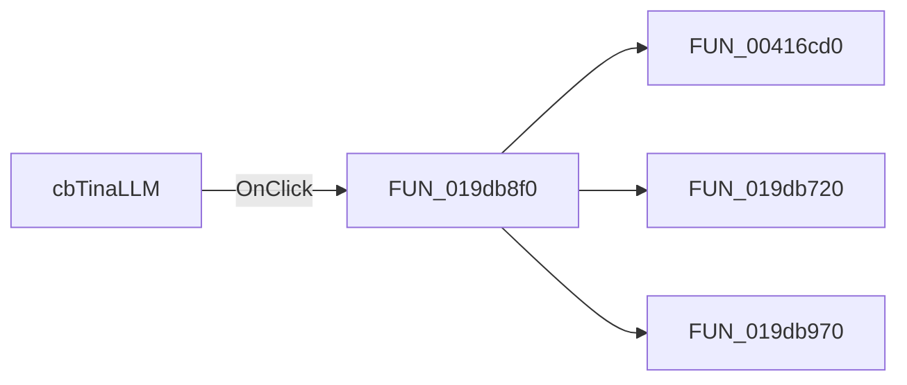

# cbTinaLLM

> Analysis status: Pending individual source review.

## Control

| Property | Recovered value |
| --- | --- |
| Form | LLMOptions |
| Component path | LLMOptions.cbTinaLLM |
| Control class | TComboBox |
| Caption | Not present in the recovered resource. |
| Hint | Not present in the recovered resource. |
| Text | Not present in the recovered resource. |
| Handler name | cbTinaLLMClick |
| Handler address | 019db8f0 |
| Graph node | `resource:dfm:LLMOptions/LLMOptions.cbTinaLLM` |
| Handler node | `function:019db8f0` |
| Graph layer | UI |

## What happens when clicked

Pending individual analysis. An agent must read the recovered handler source and its relevant callees before it replaces this text.

## Click flow

## Handler evidence

- Source: [DecompiledSources/Tina16/functions/00000000019DB8F0__FUN_019db8f0.c](../../../DecompiledSources/Tina16/functions/00000000019DB8F0__FUN_019db8f0.c)
- Recovered role: Not present in the recovered resource.
- Current graph summary: Handles 1 Delphi UI event: LLMOptions.cbTinaLLM.OnClick.
- Current graph behavior: Not present in the recovered resource.
- Current graph evidence: Not present in the recovered resource.
- Complexity: complex
- Distinct outgoing calls: 3

## Direct calls

- `function:00416cd0` — FUN_00416cd0
- `function:019db720` — FUN_019db720
- `function:019db970` — FUN_019db970

## Resource evidence

- Kind: Not present in the recovered resource.
- Modal result: Not present in the recovered resource.
- Checked state: Not present in the recovered resource.
- List items: Not present in the recovered resource.
- Image reference: Not present in the recovered resource.
- Extracted glyph: None.

## Nearby label candidates

Nearby labels are layout candidates only. They are not proof of behavior.

- Rank 1: Tina LLM version:   at distance 133.
- Rank 2: Extract instruction model: at distance 179.
- Rank 3: Voices: at distance 539.

## Analysis limits

- Do not infer behavior from the control class, caption, hint, glyph, or nearby label alone.
- Do not replace the pending status until the handler source and relevant call path provide enough evidence.
