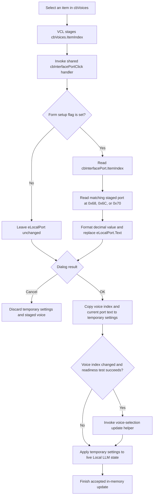

# Select a voice and refresh the interface port edit

> Analysis status: Source reviewed through the duplicate event binding, staged
> voice selection, port-edit overwrite, OK and Cancel ownership, live copy-back,
> and error boundaries.

## Control

| Property | Recovered value |
| --- | --- |
| Form | LLMOptions |
| Component path | LLMOptions.cbVoices |
| Control class | TComboBox |
| Caption | Not present in the recovered resource. |
| Hint | Not present in the recovered resource. |
| Text | `<none>` in the form resource. |
| Handler name | cbInterfacePortClick |
| Handler address | 019db480 |
| Graph node | `resource:dfm:LLMOptions/LLMOptions.cbVoices` |
| Handler node | `function:019db480` |
| Graph layer | UI |

## What happens when clicked

The combo box is the staged voice selector, but its assigned application
handler does not process a voice. The DFM binds both `cbVoices.OnClick` and
`cbInterfacePort.OnClick` to the same `cbInterfacePortClick` method at
`019db480`. The recovered function ignores `Sender` and never reads the
`cbVoices` control.

Normal VCL combo-box processing still changes `cbVoices.ItemIndex` when the
user selects a voice. That selection remains in the dialog control for the OK
path. The duplicate click handler independently performs this port refresh:

1. If the form setup flag at `0x810` is clear, return without changing the port
   edit.
2. Read `cbInterfacePort.ItemIndex` from form field `0x7A8`.
3. Use that index to select one 32-bit port from the staged configuration
   fields at `0x68`, `0x6C`, or `0x70`.
4. Format the integer as decimal text.
5. Replace `eLocalPort.Text` through form field `0x780`.

The handler does not change the selected interface, update the three staged
port fields, validate the port, contact an LLM service, preview speech, or
activate the selected voice.

## Port-edit overwrite

This duplicate binding has a visible side effect. If the user manually edits
`eLocalPort` and then selects a voice, the handler replaces that uncommitted
text with the stored port for the current `cbInterfacePort` item. A later OK
then reads the replacement text and writes it back to that staged port slot.
Thus the voice click can discard a pending port edit even though the handler
does not read the voice selection.

The handler has no changed-value test. Every invocation after setup repeats
the port lookup and text replacement. The normal `csDropDownList` control
limits interactive interface-port choices to its three resource items, but
the source does not check for an invalid or negative item index before it
indexes the port fields.

## Voice list, OK, and Cancel

The resource contains only the fallback voice item `<none>`. The dialog
initializer copies the runtime voice-name list from the staged configuration
into `cbVoices` and restores its selected index from configuration offset
`0x60`. This runtime list can therefore contain more entries than the DFM.

`bOKClick` calls the shared dialog copy-back function. That function reads
`cbVoices.ItemIndex` from form field `0x7B8` and stores it at offset `0x60` of
the temporary configuration object. The outer Local LLM Options command then
checks modal result `1`. If the voice index changed and its recovered readiness
test succeeds, it calls the voice-update helper with the new index. It then
copies the accepted temporary configuration into the live settings.

Cancel does not call the copy-back function. The outer command frees the
temporary configuration and form without applying either the staged voice
index or the port edit. The voice click itself calls no settings serializer;
the recovered path proves an in-memory apply after OK, not direct disk
persistence.

## Errors and no-op paths

The setup guard suppresses this shared handler while the dialog is being
initialized. In the normal shown state, a conversion, table access, allocation,
or edit-text assignment error can propagate because the handler has no local
exception path. The VCL can already have changed `cbVoices.ItemIndex` before
such an error occurs. The handler does not restore either that staged voice
selection or a port edit that it already replaced.

An empty or invalid voice selection does not change the handler path because
the function never reads it. Validation of the voice index is not present in
this click function. Its later consumers determine whether the selected index
can be applied. The OK copy-back parses `eLocalPort` before it copies the voice
index. A port conversion error can therefore prevent the voice selection from
reaching the temporary configuration and stop the accepted live apply.

## Click flow

## Handler evidence

- Source: [DecompiledSources/Tina16/functions/00000000019DB480__FUN_019db480.c](../../../DecompiledSources/Tina16/functions/00000000019DB480__FUN_019db480.c)
- Recovered role: Refresh the LLM Options local-port edit from the selected
  interface port slot.
- Binding evidence: Both combo boxes resolve to the same handler name and
  address. The function has no `Sender` branch.
- Input evidence: It reads only form field `0x7A8`, mapped to
  `cbInterfacePort`, and the staged port array at `0x860 + 0x68`.
- Output evidence: It writes only form field `0x780`, mapped to `eLocalPort`.
- No-op evidence: The setup flag gates all port-refresh work. The selected
  voice does not affect the handler.
- Complexity: complex.
- Distinct outgoing calls: 3.

## Relevant calls

- [`FUN_019db480`](../../../DecompiledSources/Tina16/functions/00000000019DB480__FUN_019db480.c)
  is the shared sender-independent port-refresh handler described above.
- [`FUN_019d9750`](../../../DecompiledSources/Tina16/functions/00000000019D9750__FUN_019d9750.c)
  populates runtime voice items, restores the voice and interface selections,
  and maps the interface port fields used by the shared handler.
- [`FUN_019d9a50`](../../../DecompiledSources/Tina16/functions/00000000019D9A50__FUN_019d9a50.c)
  copies the current voice index and local-port text into the temporary
  configuration when OK is accepted.
- [`FUN_01a42840`](../../../DecompiledSources/Tina16/functions/0000000001A42840__FUN_01a42840.c)
  owns the temporary settings object, branches on the modal result, applies
  accepted settings, and conditionally requests the voice update.

## Resource evidence

- The nearest same-parent label is **Voices:**, and the constructor and OK
  copy-back confirm that relation.
- `cbVoices` and `cbInterfacePort` are both `csDropDownList` controls.
- The form resource gives `cbVoices` the fallback text and item `<none>`.
- The Interface port control has the items **Ollama port**, **LM Studio port**,
  and **llamafile port**.
- The control has no hint, action, image reference, or extracted glyph.

## Analysis limits

- The duplicate binding is source-proven. This article does not decide whether
  it was intentional or a Delphi form-design mistake.
- The runtime voice list and readiness predicate have no recovered Delphi
  declaration names. Their roles come from the Voices control data flow and
  the accepted settings caller.
- The recovered click and apply path does not show a direct disk-settings write.
