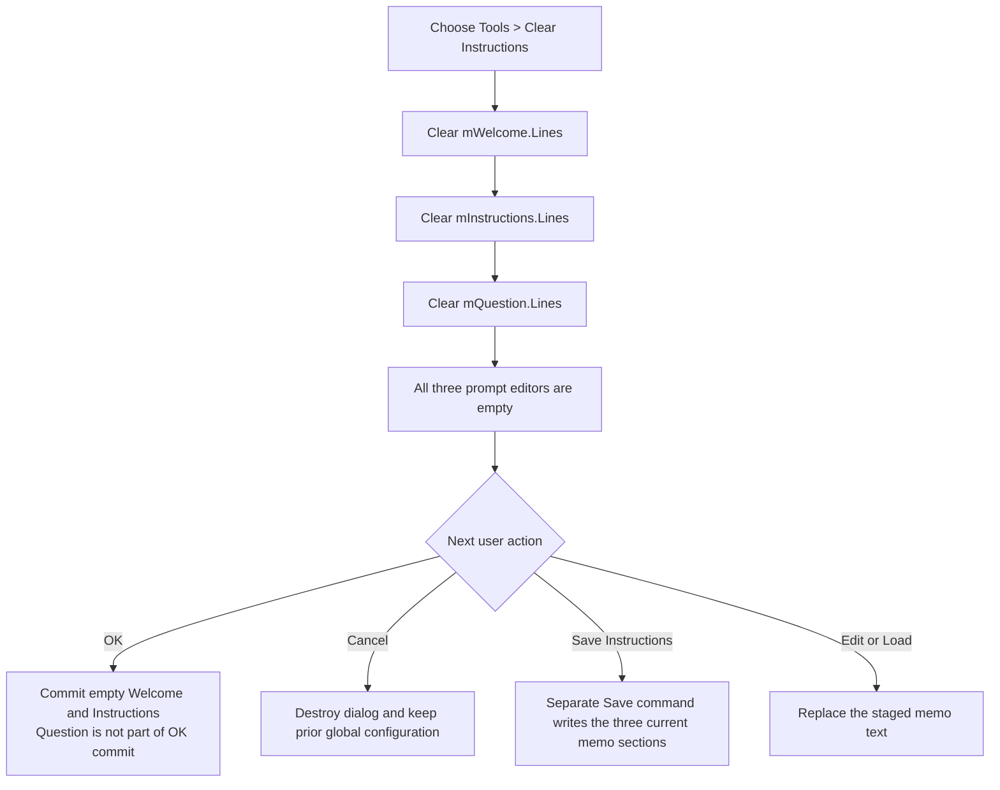

# Clear all three staged LLM prompt editors

> Analysis status: Complete. Despite its caption, this command clears the Welcome message, Instructions, and Question memos. The change stays in the open Options dialog until a later OK or Save Instructions action consumes it.

## Control

| Property | Recovered value |
| --- | --- |
| Form | LLMOptions |
| Component path | LLMOptions.MainMenu1.Tools1.mnClearInstructions |
| Control class | TMenuItem |
| Parent menu | Tools |
| Caption | Clear Instructions |
| Hint | Not present in the recovered resource. |
| Handler name | mnClearInstructionsClick |
| Handler address | 019da1f0 |
| Graph node | `resource:dfm:LLMOptions/LLMOptions.MainMenu1.Tools1.mnClearInstructions` |
| Handler node | `function:019da1f0` |
| Graph layer | UI |

## What happens when clicked

`FUN_019da1f0` performs three operations in a fixed order:

1. It obtains `mWelcome.Lines` from the `TMemo` at form offset `+0x6D8`
   and calls `TStrings.Clear`.
2. It obtains `mInstructions.Lines` from the `TMemo` at `+0x6D0` and calls
   the same clear operation.
3. It obtains `mQuestion.Lines` from the `TMemo` at `+0x710` and clears it.

The labels **Welcome message:**, **Instructions:**, and **Question:** identify
the three visible editors. The recovered Load and Save paths confirm the field
mapping because they read and write the matching `welcome`, `instructions`,
and `question` sections through these same offsets.

The menu caption is therefore narrower than the implementation. The command
does not clear only the Instructions memo. It clears the complete three-part
prompt set that the dialog can load from or save to an instructions file.

## Staged state and OK or Cancel

The clear is immediate in the three visible memos, but it is initially a
dialog-local change.

When the form is shown, `FUN_019d9c90` reads the current assistant
configuration and assigns its `welcome` and `instructions` values to
`mWelcome` and `mInstructions`. It does not initialize `mQuestion` from that
configuration. The Question memo is used by the instructions-file Load and
Save paths.

If the user later clicks the built-in **OK** button:

1. `FUN_019d9dd0` reads the current `mWelcome` and `mInstructions` text.
2. It serializes those two values into the global assistant configuration.
3. The modal caller accepts result `1` and applies the other staged LLM
   settings.

Thus, Clear followed by OK commits empty welcome and instructions strings to
the active application configuration. The OK path does not read
`mQuestion`, so clearing Question has no effect on that configuration.

The built-in **Cancel** button has `Kind = bkCancel`. The modal caller applies
settings only for result `1` and destroys the dialog afterward. Clear followed
by Cancel therefore leaves the prior global welcome and instructions values
unchanged. The empty memo state is discarded with the form.

## Load and Save Instructions interaction

- **Load Instructions...** can populate all three memos from a selected JSON
  or structured text file. Clear removes those loaded values from the current
  dialog, but it does not change the source file.
- **Save Instructions...** reads all three current memos and writes them to the
  accepted output path. If the user selects Save after Clear, that separate
  command can write empty sections to a file even if the user later cancels
  the Options dialog.
- Clear itself does not execute either file dialog, remember a filename, read
  a file, truncate a file, or write a file.

The Load and Save handlers own the shared parser and exporter descriptions.
This command owns only the three staged `Lines.Clear` operations.

## UI, no-op, and error behavior

- The visible result is that all three memo editors become empty. There is no
  success message, confirmation prompt, status update, or selection change in
  the application handler.
- The handler does not close the form or set a modal result. The user can type
  replacement text, load a file, save the empty prompt set, choose OK, or
  choose Cancel after the clear.
- There is no content or line-count guard. Selecting the command when one or
  all memos are already empty calls `Lines.Clear` again and leaves them empty.
- The handler does not explicitly set focus, caret, selection, scroll
  position, native Undo state, or a memo Modified flag. Their exact VCL and
  Windows control state after `Lines.Clear` is not recovered here.
- There is no application dirty flag, model mutation, settings writer, file
  API, validation, local exception handler, or rollback in this click path.
- The clears are ordered. An exception after the first or second indirect call
  can leave only the earlier memos empty. The handler has no repair step.

## Click flow

## Evidence

- [Clear handler `FUN_019da1f0`](../../../DecompiledSources/Tina16/functions/00000000019DA1F0__FUN_019da1f0.c) obtains the line collection at control offset `+0x4D8` from form fields `+0x6D8`, `+0x6D0`, and `+0x710`, then invokes virtual slot `+0x90` on each collection.
- [Form-show handler `FUN_019d9c90`](../../../DecompiledSources/Tina16/functions/00000000019D9C90__FUN_019d9c90.c) assigns the current Welcome and Instructions configuration to the memos at `+0x6D8` and `+0x6D0`.
- [OK handler `FUN_019d9dd0`](../../../DecompiledSources/Tina16/functions/00000000019D9DD0__FUN_019d9dd0.c) reads those same two memos and calls [assistant-configuration serializer `FUN_013b7dc0`](../../../DecompiledSources/Tina16/functions/00000000013B7DC0__FUN_013b7dc0.c). It does not read `+0x710`.
- [LLM Options modal caller `FUN_01a42840`](../../../DecompiledSources/Tina16/functions/0000000001A42840__FUN_01a42840.c) applies the staged settings only after modal result `1`, then destroys the form.
- [Load handler `FUN_019da250`](../../../DecompiledSources/Tina16/functions/00000000019DA250__FUN_019da250.c) opens the file dialog and calls [the shared loader `FUN_019da490`](../../../DecompiledSources/Tina16/functions/00000000019DA490__FUN_019da490.c), which maps `welcome`, `instructions`, and `question` content to the three memo fields.
- [Save handler `FUN_019da370`](../../../DecompiledSources/Tina16/functions/00000000019DA370__FUN_019da370.c) opens the separate save dialog and calls [the shared exporter `FUN_019dac40`](../../../DecompiledSources/Tina16/functions/00000000019DAC40__FUN_019dac40.c), which reads all three memos before writing the selected file.
- Recovered form and control resources: [ui-evidence.json](../../../DecompiledSources/Tina16/resources/dfm/ui-evidence.json)

## Graph and annotation limits

- The graph places `FUN_019da1f0` in the **UI** layer. It has no resolved
  direct-call edge because all three clear operations use indirect VMT
  dispatch through the `TStrings` line objects.
- Virtual slot `+0x90` is identified as `TStrings.Clear` by the same
  clear-then-assign and clear-button patterns in recovered Delphi collection
  code.
- This Bead owns only unique handler `FUN_019da1f0`. The Load and Save Beads
  own their dialog, parser, assignment, and file-export functions.
- The menu item has no recovered hint, action, image, glyph, checked state, or
  shortcut. The exact three-memo target comes from source data flow and the
  matching lifecycle consumers, not from the caption alone.
