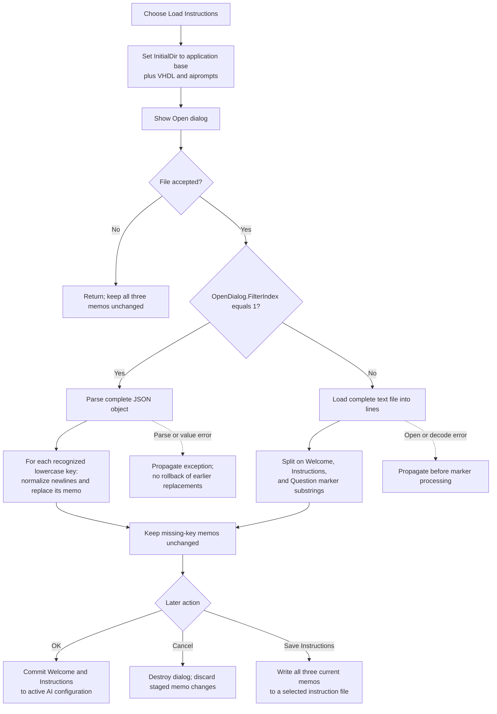

# Load Instructions...

> Analysis status: Source reviewed. The initial directory, accepted and canceled dialog paths, filter-index format choice, JSON and sectioned-text rules, three memo updates, newline normalization, partial-load behavior, Clear and Save interaction, OK and Cancel staging, and persistence limits are supported by recovered code.

## Control

| Property | Recovered value |
| --- | --- |
| Form | LLMOptions |
| Component path | LLMOptions.MainMenu1.Tools1.mnLoadInstructions |
| Control class | TMenuItem |
| Caption | Load Instructions... |
| Hint | Not present in the recovered resource. |
| Text | Not present in the recovered resource. |
| Handler name | mnLoadInstructionsClick |
| Handler address | 019da250 |
| Graph node | `resource:dfm:LLMOptions/LLMOptions.MainMenu1.Tools1.mnLoadInstructions` |
| Handler node | `function:019da250` |
| Graph layer | UI |

## What happens when clicked

`FUN_019da250` combines the recovered application base-path global with `\VHDL\aiprompts` and assigns that path as `OpenDialog.InitialDir`. It then shows the existing `TOpenDialog`.

Canceling the file dialog returns without reading a file or changing the Welcome, Instructions, or Question memos. Accepting it obtains the selected file name and the dialog's current `FilterIndex`, then calls `FUN_019da490`.

The handler does not set a file name, filter text, default extension, or filter index. The recovered DFM also contains no `Filter`, `DefaultExt`, or file-name value for this dialog. The available extensions and user-facing filter captions are therefore unknown. The loader chooses the parser from `FilterIndex`, not from the selected file's extension or contents.

## Supported file structures

| Filter index | Recovered parser | Memo effects |
| ---: | --- | --- |
| 1 | JSON object | Recognized `welcome`, `instructions`, and `question` members replace their matching memos. |
| Any other value | Sectioned text | `// Welcome`, `// Instructions`, and `// Question` markers divide file lines among the three memos. |

### JSON mode

The loader reads and parses the complete file before it iterates the root members. It compares member names exactly with lowercase `welcome`, `instructions`, and `question`. Unknown members are ignored. A missing recognized member leaves its existing memo unchanged; the loader does not clear all three controls first. If a recognized member occurs more than once in the parsed member sequence, the later occurrence replaces the earlier memo value.

For every recognized value, `FUN_019d9ee0` normalizes line endings to Windows CRLF. It temporarily protects existing CRLF sequences with `$$NL$$`, converts remaining LF to CRLF, and restores the protected CRLF sequences. The resulting string replaces the complete text of the matching memo.

### Sectioned-text mode

The loader reads the selected file into a string list and accumulates ordinary lines. It treats a line that contains one of these strings as structural text:

- `// Keep` is discarded.
- `// Welcome` is discarded as the first section heading.
- At `// Instructions`, accumulated lines replace the Welcome memo and the accumulator is cleared.
- At `// Question`, accumulated lines replace the Instructions memo and the accumulator is cleared.
- At end of file, remaining accumulated lines replace the Question memo.

The parser does not validate marker order or require every marker. For example, a file with no recognized marker leaves Welcome and Instructions unchanged and places all loaded lines in Question. A missing or reordered boundary can therefore update only some controls or assign content to a different section. The marker text is tested as a substring, not as an exact whole-line match.

## Staging, Clear, Save, OK, and Cancel

Load changes the three memo controls directly. It does not close the Options dialog and does not immediately update the active AI assistant configuration.

- **Clear Instructions** clears all three memo line collections. A later Load can replace or partially replace that cleared state.
- **Save Instructions...** reads the current three memos and, after its Save dialog is accepted, writes them immediately in the selected format. Saving after a Load therefore persists the loaded control text even before Options OK. Save owns that separate file-write boundary.
- **OK** reads Welcome and Instructions into the dialog's accepted fields and serializes them into the in-memory AI assistant configuration. The recovered OK path does not read the Question memo. Question text loaded here reaches external persistence only if the user later runs Save Instructions.
- **Cancel** has no custom click handler. It destroys the modal dialog without the OK copy-back, so all loaded memo edits are lost and Welcome and Instructions remain unchanged in the active configuration. Cancel cannot undo an instruction file already written through Save Instructions.

On the next FormShow, the dialog reloads Welcome and Instructions from the active serialized AI assistant configuration. It does not reload Question from that configuration. This confirms that Load itself is control staging, not application-settings persistence.

## Error and partial-state behavior

The click handler and loader have no catch block, error result, rollback, or handler-local message. File-open, decoding, JSON parsing, member conversion, or allocation errors propagate through the normal Delphi exception path.

In JSON mode, the complete JSON parse occurs before memo assignment. A syntax failure therefore normally occurs before the three-memo iteration. After a valid root is available, recognized members are applied in sequence. If a later value extraction fails, earlier memo replacements remain because there is no rollback.

In sectioned-text mode, the string list loads the file before marker processing starts. A file-open or initial text-decoding failure therefore occurs before memo assignment. Marker processing itself commits Welcome at the Instructions boundary, commits Instructions at the Question boundary, and always assigns the remaining accumulator to Question. A malformed but readable file can consequently leave a mixed old-and-new control state without reporting a format error.

Selecting a file whose contents do not match the current filter index sends it to the wrong parser. The handler does not inspect the extension, sniff the contents, or retry with the other parser.

## Click flow

## Handler evidence

- [Load handler `FUN_019da250`](../../../DecompiledSources/Tina16/functions/00000000019DA250__FUN_019da250.c) sets the initial directory, executes the Open dialog, and passes accepted FileName and FilterIndex values to the loader.
- [Dual-format loader `FUN_019da490`](../../../DecompiledSources/Tina16/functions/00000000019DA490__FUN_019da490.c) selects JSON only for filter index 1; otherwise it applies the recovered section-marker algorithm to text lines.
- [JSON newline normalizer `FUN_019d9ee0`](../../../DecompiledSources/Tina16/functions/00000000019D9EE0__FUN_019d9ee0.c) converts mixed CRLF and LF line endings to CRLF without doubling existing CRLF pairs.
- [Clear handler `FUN_019da1f0`](../../../DecompiledSources/Tina16/functions/00000000019DA1F0__FUN_019da1f0.c) clears the Welcome, Instructions, and Question memo line collections.
- [Save handler `FUN_019da370`](../../../DecompiledSources/Tina16/functions/00000000019DA370__FUN_019da370.c) uses the Save dialog and delegates current memo serialization to the Save-owned writer.
- [Instruction writer `FUN_019dac40`](../../../DecompiledSources/Tina16/functions/00000000019DAC40__FUN_019dac40.c) proves the JSON keys and text marker order that correspond to the two recovered load formats.
- [OK handler `FUN_019d9dd0`](../../../DecompiledSources/Tina16/functions/00000000019D9DD0__FUN_019d9dd0.c) reads Welcome and Instructions, serializes the active AI configuration, and does not read Question.
- [FormShow handler `FUN_019d9c90`](../../../DecompiledSources/Tina16/functions/00000000019D9C90__FUN_019d9c90.c) reloads Welcome and Instructions from accepted configuration fields and does not populate Question.
- [Options launcher `FUN_01a42840`](../../../DecompiledSources/Tina16/functions/0000000001A42840__FUN_01a42840.c) applies accepted options only for modal result OK and destroys the dialog afterward.
- Recovered role: Load AI assistant instruction sections into the LLM Options memos.
- Current graph summary: Handles 1 Delphi UI event: LLMOptions.MainMenu1.Tools1.mnLoadInstructions.OnClick.
- Current graph behavior: Opens in the application `VHDL\aiprompts` directory and stages JSON or marker-delimited instruction text according to the selected filter index.
- Current graph evidence: The DFM binds `mnLoadInstructionsClick` to `019da250`; the handler supplies FileName and FilterIndex to `019da490`, whose branches write the three identified memo controls.
- Complexity: complex
- Distinct outgoing calls: 6

## Direct calls

- `function:00416ba0` — Combine the base path with `\VHDL\aiprompts`.
- `function:00724420` — Assign the Open dialog's initial directory.
- `function:00724270` — Read the accepted file name.
- `function:00724300` — Read the selected filter index.
- `function:019da490` — Parse the chosen format and stage memo text.
- `function:00414480` — Finalize temporary Delphi UnicodeStrings.

## Resource evidence

- Kind: Not present in the recovered resource.
- Modal result: Not present in the recovered resource.
- Checked state: Not present in the recovered resource.
- List items: Not present in the recovered resource.
- Image reference: Not present in the recovered resource.
- Extracted glyph: None.

## Nearby label candidates

- No same-parent label candidate is available. The menu hierarchy and the three form labels provide resource context; the handler and parser establish the behavior.

## Analysis limits

- `TIARA-diz.6.7.695` owns the Clear handler annotation. This article cites it only for staged-control interaction.
- `TIARA-diz.6.7.697` owns the Save handler, writer, and encoding annotations. This article cites them only to establish format symmetry and the separate file-persistence boundary.
- Generic dialog, file, string-list, JSON, VCL memo, and Delphi runtime helpers remain evidence-only.
- No recovered DFM or handler statement supplies OpenDialog filter captions, extensions, default extension, options, or an initial file name. These values remain unknown.
- The handler does not copy the selected path into an accepted application-option field. The OpenDialog component can retain its FileName for the remaining lifetime of this modal form.
- The code serializes accepted Welcome and Instructions into an in-memory global configuration string. The later disk or registry persistence mechanism for that application configuration is outside this call path.
