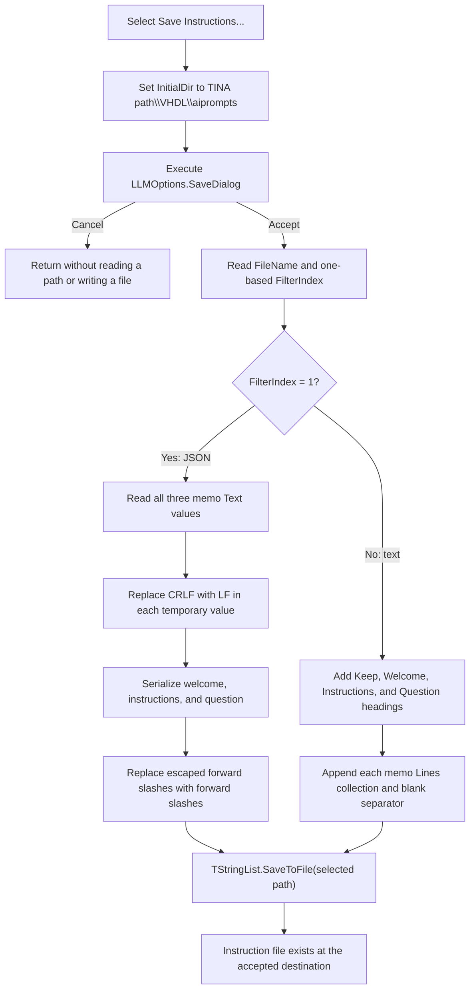

# Save Instructions...

## Control

| Property | Recovered value |
| --- | --- |
| Form | LLMOptions |
| Component path | LLMOptions.MainMenu1.Tools1.mnSaveInstructions |
| Control class | TMenuItem |
| Parent menu | Tools |
| Caption | Save Instructions... |
| Handler name | mnSaveInstructionsClick |
| Handler address | 019da370 |
| Graph node | `resource:dfm:LLMOptions/LLMOptions.MainMenu1.Tools1.mnSaveInstructions` |
| Handler node | `function:019da370` |
| Graph layer | UI |

The menu item has no hint, action, image, or glyph. The same form contains the
three memo fields labelled **Welcome message**, **Instructions**, and
**Question**, plus a `TSaveDialog`.

The binary DFM stream preserves SaveDialog values that are not in the reduced
UI evidence JSON:

- `DefaultExt = json`
- `Filter = JSON File|*.json|Text file|*.txt`

The handler uses the dialog's one-based `FilterIndex`: index `1` selects the
JSON writer path, while the other recovered choice selects the text writer
path.

## What happens when selected

`FUN_019da370` builds the initial folder from the shared TINA application path
plus `\VHDL\aiprompts`. It assigns that folder to `SaveDialog.InitialDir` and
executes the dialog.

If the user cancels the Save dialog, the handler releases its temporary strings
and returns. It does not read a filename, serialize a prompt, or open an output
file. The dialog object keeps its changed initial-directory state, but none of
the three memos or the LLM options model changes.

If the user accepts, the handler reads `SaveDialog.FileName` and
`SaveDialog.FilterIndex`, then calls `FUN_019dac40` with the live contents of
the form. The writer always exports all three prompt fields. The menu caption
uses “Instructions,” but the saved document also contains the welcome message
and question template.

## JSON format

For filter index `1`, the writer creates one JSON object with these keys:

| Key | Form source |
| --- | --- |
| `welcome` | `mWelcome.Text` |
| `instructions` | `mInstructions.Text` |
| `question` | `mQuestion.Text` |

Before each value enters the JSON object, `FUN_019da050` replaces every CRLF
pair with LF. This normalization is applied to a temporary string; it does not
rewrite the memo. After JSON serialization, `FUN_019da120` replaces every
escaped forward slash `\/` with `/`. The result remains valid JSON and is added
to a temporary string list before that list writes the selected file.

The recovered static Unicode strings prove both transformations: addresses
`019DA104` and `019DA118` hold CRLF and LF, while `019DA1D4` and `019DA1E8`
hold `\/` and `/`.

## Text format

For the second recovered filter choice, the writer creates this sectioned text
layout:

```text
// Keep the file structure
// Welcome
<all mWelcome lines>

// Instructions
<all mInstructions lines>

// Question
<all mQuestion lines>

```

The handler passes the blank-line flag as true, so the writer inserts one empty
line after each memo section. It writes the memo line collections, not the
CRLF-normalized JSON values. The recovered code does not establish the output
encoding used by the one-argument `TStringList.SaveToFile` overload.

## Staging and persistence boundary

This command reads the current memo controls when the Save dialog is accepted.
It does not wait for the main LLM Options **OK** button and does not call its
settings-apply path. Thus, edits that are still staged in the open form are
included in the exported file. A later click on the main form's **Cancel**
button cannot undo a file that this command already wrote.

The command does not change the three memos, model selection, history size,
language, interface, API key, or any other LLM option. Its persistent output is
only the selected instruction file. The main form's separate OK handler owns
the application-settings update.

The handler does not remember the accepted path in an application model. It
does leave normal `TSaveDialog` component state, such as the chosen filename or
filter, under VCL ownership for later reuse of the same form instance.

## Save flow



## Existing-file and error behavior

The recovered DFM does not store an `Options` override for this Save dialog,
and the handler does not implement its own overwrite confirmation. Any
existing-file prompt or refusal belongs to the VCL Save dialog before it
returns an accepted result.

After acceptance, the handler does not check for an empty path, create a
temporary output file, rename an existing file, or keep a backup. The JSON
builder and `SaveToFile` call have no application-level exception handler in
this path. A serialization, path, permission, disk, or write failure therefore
propagates through the normal Delphi exception path. The recovered code has no
custom error message or rollback. Because the writer uses the destination path
directly, the trace does not prove that an existing file remains intact after a
write failure.

## Evidence

- [Save menu handler](../../../DecompiledSources/Tina16/functions/00000000019DA370__FUN_019da370.c): builds the initial directory, executes `SaveDialog`, guards the filename and filter reads with the accepted result, and calls the writer with the blank-line flag set.
- [Instruction writer](../../../DecompiledSources/Tina16/functions/00000000019DAC40__FUN_019dac40.c): selects JSON only for filter index `1`; otherwise it builds the headed text layout; both paths end in the string-list file writer.
- [JSON newline normalizer](../../../DecompiledSources/Tina16/functions/00000000019DA050__FUN_019da050.c): calls the replace-all helper with the CRLF and LF static strings.
- [JSON slash normalizer](../../../DecompiledSources/Tina16/functions/00000000019DA120__FUN_019da120.c): calls the replace-all helper with the escaped-slash and slash static strings.
- [Dialog filename getter](../../../DecompiledSources/Tina16/functions/0000000000724270__FUN_00724270.c), [filter-index getter](../../../DecompiledSources/Tina16/functions/0000000000724300__FUN_00724300.c), and [initial-directory setter](../../../DecompiledSources/Tina16/functions/0000000000724420__FUN_00724420.c): expose the accepted path, active format, and starting folder.
- [Recovered DFM evidence](../../../DecompiledSources/Tina16/resources/dfm/ui-evidence.json): identifies the Tools menu command, three labelled memos, OpenDialog, SaveDialog, and event binding. A direct scan of the same embedded LLMOptions DFM stream supplies the omitted `DefaultExt` and `Filter` strings.
- [Main Options OK handler](../../../DecompiledSources/Tina16/functions/00000000019D9DD0__FUN_019d9dd0.c): uses a separate settings-apply path that this export command does not call.

## Analysis limits

- The call graph has no incoming application call edge for the event handler;
  the recovered DFM `OnClick` trigger is its entry point.
- The resource and handler prove the two filter formats, but not the exact VCL
  overwrite dialog shown for an existing destination.
- The one-argument file writer does not expose its selected text encoding in
  this recovered call site.
- The file contains prompt templates. The handler does not send them to an LLM
  or prove how another subsystem later uses the exported document.
