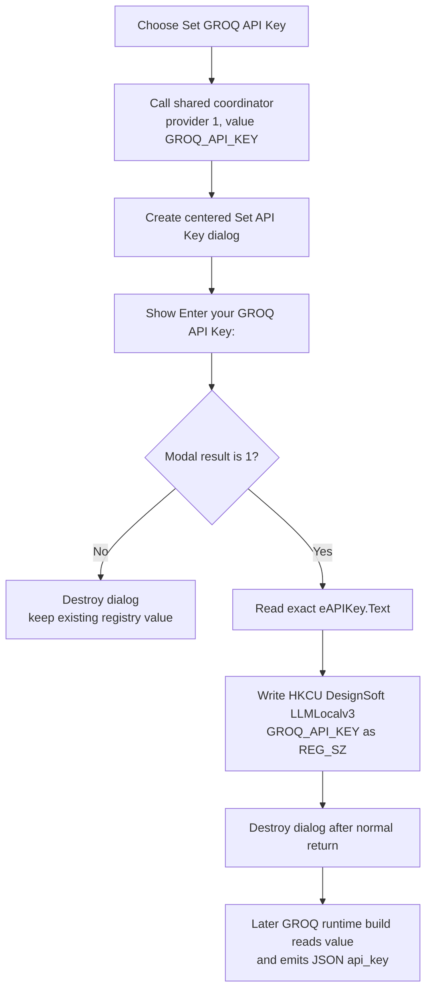

# Set the persisted GROQ API key

> Analysis status: Complete. This provider-specific wrapper opens the shared API-key dialog for GROQ and writes an accepted value directly to the current user's DesignSoft registry settings.

## Control

| Property | Recovered value |
| --- | --- |
| Form | LLMOptions |
| Component path | LLMOptions.pmSetAPIKey.mnSetGoqAPIKey |
| Control class | TMenuItem |
| Parent popup | pmSetAPIKey |
| Caption | Set GROQ API Key |
| Hint | Not present in the recovered resource. |
| Handler name | mnSetGoqAPIKeyClick |
| Handler address | 019db340 |
| Graph node | `resource:dfm:LLMOptions/LLMOptions.pmSetAPIKey.mnSetGoqAPIKey` |
| Handler node | `function:019db340` |
| Graph layer | UI |

The recovered component and handler names contain `Goq`, but the visible
caption, prompt, provider comparison, and registry value all use `GROQ`.

## Provider-specific route

`FUN_019db340` has one operation. It calls the shared API-key coordinator
`FUN_019db260` with:

- provider selector `1`; and
- registry value name `GROQ_API_KEY`.

The provider selector is not inferred from the menu caption. The shared dialog
initializer maps selector `1` to the exact label **Enter your GROQ API Key:**.
The other recovered selectors are `0` for OpenAI, `2` for OpenRouter, and `3`
for Ollama.

## Dialog and accepted value

The shared coordinator creates a modal `TSetAPIKey` form. Its recovered
resources contain:

- label `lAPIKey`;
- edit `eAPIKey` at form offset `+0x6B0`;
- a built-in `bkOK` button;
- a built-in `bkCancel` button; and
- a built-in `bkHelp` button.

Before `ShowModal`, `FUN_019d8070` stores selector `1` at dialog offset
`+0x6D8` and replaces the label at `+0x6D0` with the GROQ prompt. It does not
read the current registry value or preload `eAPIKey`. The resource also has no
initial edit text.

The result branch is exact:

- A modal result other than `1`, including `bkCancel`, skips the edit read and
  registry writer. The coordinator then destroys the dialog.
- Modal result `1` calls `FUN_019d8220`, which copies the exact current
  `eAPIKey.Text` value. The coordinator passes that string and the literal
  `GROQ_API_KEY` to the registry writer, then destroys the dialog after a
  normal return.

There is no empty-string check, whitespace trim, prefix check, key-format
validation, authentication request, or network test. Pressing OK with an empty
edit therefore writes an empty value and can replace a previously usable key.

## Credential storage and persistence

`FUN_01a513b0` creates a registry wrapper for `HKEY_CURRENT_USER`, opens or
creates the application-specific path under
`SOFTWARE\DesignSoft\...\LLMLocalv3`, and writes a value named
`GROQ_API_KEY`.

The string writer passes the UTF-16 bytes, including the terminating null, to
the registry value API with type `1`, which is `REG_SZ`. The recovered path
does not encrypt, hash, or otherwise transform the entered key. It also does
not set a process environment variable, despite the environment-style value
name.

The write occurs when the nested Set API Key dialog returns OK. It is not
staged until the outer LLM Options **OK** button. If the user accepts a GROQ
key and then cancels LLM Options, the registry value remains changed. The
provider wrapper does not update a model field, mark a document modified, or
write the other LLM Options values.

On normal completion, the temporary dialog and local Delphi strings are
released. The recovered code does not perform a secure overwrite of the edit
buffer or temporary key string. The registry value remains available for
later sessions under the current Windows user account.

## Downstream GROQ use

The runtime configuration builder `FUN_01a43260` selects the same registry
value name when the active provider string is `GROQ`. It reads
`GROQ_API_KEY` through the shared registry reader and places the result in the
generated JSON field `api_key`.

If a non-local provider has no key value, or the stored value is empty, that
later path raises the message `<provider>: please ensure the API key is set
up!`. This validation is deferred until runtime configuration generation. It
does not run when this menu item is clicked.

## UI, no-op, and error behavior

- The menu handler does not change the selected LLM provider or model. It only
  selects the GROQ prompt and registry value route.
- Cancel is a no-write path. It does not clear or restore an existing registry
  value.
- Repeated accepted clicks overwrite the same `GROQ_API_KEY` value.
- No success message is displayed after a normal write.
- The recovered resource evidence does not include a `PasswordChar` value,
  and no handler configures one. Whether the edit masks the key is not proven.
- If the registry subkey cannot be opened or created, the broad registry
  writer does not call the value writer and returns no status to this
  coordinator.
- A registry value-write error is converted to the shared registry exception
  path. There is no handler-local catch, retry, user-facing recovery, or
  rollback to the prior value.
- The coordinator has no local exception cleanup path after the registry
  writer call. Dialog destruction and temporary-key cleanup on an exception
  are not established by the recovered body.

## Click flow

## Evidence

- [GROQ wrapper `FUN_019db340`](../../../DecompiledSources/Tina16/functions/00000000019DB340__FUN_019db340.c) passes selector `1` and literal `GROQ_API_KEY` to the shared coordinator.
- [Shared API-key coordinator `FUN_019db260`](../../../DecompiledSources/Tina16/functions/00000000019DB260__FUN_019db260.c) creates the modal dialog, branches on result `1`, reads accepted text, invokes the registry writer, and destroys the dialog.
- [Provider prompt initializer `FUN_019d8070`](../../../DecompiledSources/Tina16/functions/00000000019D8070__FUN_019d8070.c) maps selector `1` to **Enter your GROQ API Key:** and records the selector in the dialog.
- [API-key edit reader `FUN_019d8220`](../../../DecompiledSources/Tina16/functions/00000000019D8220__FUN_019d8220.c) copies text from the edit at SetAPIKey offset `+0x6B0` without validation or normalization.
- [Registry string writer `FUN_01a513b0`](../../../DecompiledSources/Tina16/functions/0000000001A513B0__FUN_01a513b0.c) selects `HKEY_CURRENT_USER`, constructs the DesignSoft `LLMLocalv3` path, and writes the supplied name and string.
- [Unicode registry-value adapter `FUN_005eb630`](../../../DecompiledSources/Tina16/functions/00000000005EB630__FUN_005eb630.c) passes `(length + 1) * 2` bytes and string type `1` to [the low-level value writer `FUN_005ebd40`](../../../DecompiledSources/Tina16/functions/00000000005EBD40__FUN_005ebd40.c).
- [Runtime configuration builder `FUN_01a43260`](../../../DecompiledSources/Tina16/functions/0000000001A43260__FUN_01a43260.c) maps provider `GROQ` back to `GROQ_API_KEY`, reads it, emits `api_key`, and reports a missing key later.
- [Registry string reader `FUN_01a50fe0`](../../../DecompiledSources/Tina16/functions/0000000001A50FE0__FUN_01a50fe0.c) reads a named string value from the same application `LLMLocalv3` key.
- Recovered LLM Options and Set API Key resources: [ui-evidence.json](../../../DecompiledSources/Tina16/resources/dfm/ui-evidence.json)

## Graph and annotation ownership

- The graph places `FUN_019db340` in the **UI** layer. Its one direct call is
  the shared coordinator.
- This Bead owns unique GROQ wrapper `FUN_019db340`, shared coordinator
  `FUN_019db260`, provider prompt initializer `FUN_019d8070`, and accepted edit
  reader `FUN_019d8220`.
- The parent **Set API Key** button owns only the popup launcher. The Ollama,
  OpenAI, and OpenRouter Beads own their one-line provider wrappers and cite
  the shared fields published here.
- The broad registry writer and reader remain evidence only because other LLM
  settings also use them.
- The menu item has no recovered hint, action, image, glyph, checked state, or
  shortcut. The provider selector, prompt, registry value, and runtime
  consumer establish the specific GROQ behavior.
