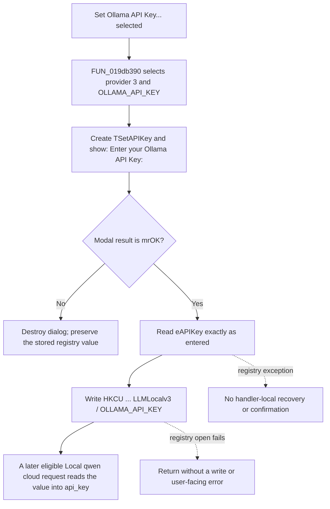

# Set Ollama API Key...

> Analysis status: Evidence-backed source review complete.

## Control

| Property | Recovered value |
| --- | --- |
| Form | LLMOptions |
| Component path | LLMOptions.pmSetAPIKey.mnSetOllamaAPIKey |
| Control class | TMenuItem |
| Caption | Set Ollama API Key... |
| Parent popup | `LLMOptions.pmSetAPIKey` |
| Handler name | mnSetOllamaAPIKeyClick |
| Handler address | 019db390 |
| Graph node | `resource:dfm:LLMOptions/LLMOptions.pmSetAPIKey.mnSetOllamaAPIKey` |
| Handler node | `function:019db390` |
| Graph layer | UI |

## What happens when clicked

`FUN_019db390` is the Ollama-specific routing wrapper. It calls the shared API-key editor `FUN_019db260` with provider selector `3` and registry value name `OLLAMA_API_KEY`. The other provider wrappers use different selectors and value names; this handler cannot write an OpenAI, GROQ, or OpenRouter key.

The shared helper creates a `TSetAPIKey` modal dialog. Selector `3` changes its label to `Enter your Ollama API Key:`. The recovered dialog has one `TEdit`, a standard `bkOK` button, and a standard `bkCancel` button. The helper does not read `OLLAMA_API_KEY` before it shows the dialog, so the edit starts from its form-defined empty state instead of displaying the stored key.

If the modal result is not `1` (`mrOK`), the helper destroys the dialog and returns without reading the edit or writing the registry. If the result is `mrOK`, it reads the edit exactly as entered and passes the text with the literal value name `OLLAMA_API_KEY` to the shared registry writer `FUN_01a513b0`.

The writer opens or creates this current-user registry branch:

`HKEY_CURRENT_USER\SOFTWARE\DesignSoft\<product>\LLMLocalv3`

It stores `OLLAMA_API_KEY` as a registry string. This is a direct write: the value is not staged in `TLLMOptions`, and the outer LLM Options **OK** or **Cancel** action does not commit or roll it back. The recovered path does not use Windows Credential Manager, encryption, hashing, or a separate protected store.

## Click flow

## Provider routing and later use

- Selector `3` is proven by the wrapper call. `FUN_019d8070` maps selector `3` to the Ollama-specific prompt. The accepted text is stored under the matching `OLLAMA_API_KEY` name.
- The later request builder chooses `OLLAMA_API_KEY` when the selected interface is `Local` and the selected model text contains both `qwen` and `cloud`. It reads the registry string through `FUN_01a50fe0` and places the result in the request JSON member `api_key`.
- The menu action does not update an already built request object and does not restart a provider. The next request-building pass that takes the eligible Ollama branch reads the persisted value.
- Other Local model paths can use the literal fallback value `ollama` without reading `OLLAMA_API_KEY`. This control therefore changes the stored Ollama key, but it does not prove that every Local or Ollama-style model consumes it.

## Staging, repetition, and failure boundaries

- Canceling the inner key dialog leaves the existing registry value unchanged. Canceling the outer LLM Options dialog after a successful inner OK does not undo the registry write.
- The shared helper does not preload or reveal the current registry value. Reopening the dialog starts with an empty edit again.
- There is no empty-value, length, format, prefix, or provider-connectivity validation. Accepting an empty edit writes an empty registry string; it does not delete the `OLLAMA_API_KEY` value.
- The registry writer returns no success value. If it cannot open or create the registry key, it silently skips the write, while the already accepted dialog still closes.
- Registry write exceptions have no local catch or rollback in the wrapper or shared helper. There is no success message, failure message, test request, or read-back verification.
- The recovered evidence does not include an edit `PasswordChar` property, and the dialog setup does not set one in code. The source is not sufficient to prove how the runtime visually masks the key.

## Handler evidence

- Ollama wrapper: [FUN_019db390](../../../DecompiledSources/Tina16/functions/00000000019DB390__FUN_019db390.c)
- Shared modal editor: [FUN_019db260](../../../DecompiledSources/Tina16/functions/00000000019DB260__FUN_019db260.c)
- Provider prompt router: [FUN_019d8070](../../../DecompiledSources/Tina16/functions/00000000019D8070__FUN_019d8070.c)
- Accepted edit reader: [FUN_019d8220](../../../DecompiledSources/Tina16/functions/00000000019D8220__FUN_019d8220.c)
- Registry writer: [FUN_01a513b0](../../../DecompiledSources/Tina16/functions/0000000001A513B0__FUN_01a513b0.c)
- Registry reader: [FUN_01a50fe0](../../../DecompiledSources/Tina16/functions/0000000001A50FE0__FUN_01a50fe0.c)
- Request provider and `api_key` routing: [FUN_01a43260](../../../DecompiledSources/Tina16/functions/0000000001A43260__FUN_01a43260.c)
- Local qwen-cloud predicate: [FUN_01a3c370](../../../DecompiledSources/Tina16/functions/0000000001A3C370__FUN_01a3c370.c)

## Resource evidence

- The recovered DFM binds `LLMOptions.pmSetAPIKey.mnSetOllamaAPIKey.OnClick` to `mnSetOllamaAPIKeyClick` at `019db390` and gives the item the caption `Set Ollama API Key...`.
- The shared `SetAPIKey` form resource contains `lAPIKey`, `eAPIKey`, `bkOK`, `bkCancel`, and `bkHelp`. Its caption is `Set API Key`.
- The menu item has no hint, image reference, embedded glyph, checked state, or nearby label. Its caption is corroborating resource evidence; the selector, prompt, registry value name, and consumer provide the behavioral proof.

## Analysis limits

- The product-name part of the registry path comes from a runtime global. It is represented as `<product>` instead of an invented constant.
- The recovered UI evidence does not preserve every possible TEdit property. It cannot establish whether the key is visually masked at runtime.
- This review proves where the value is stored and the recovered request branch that reads it. It does not prove the remote provider's authentication rules or whether an empty key is accepted by that provider.
