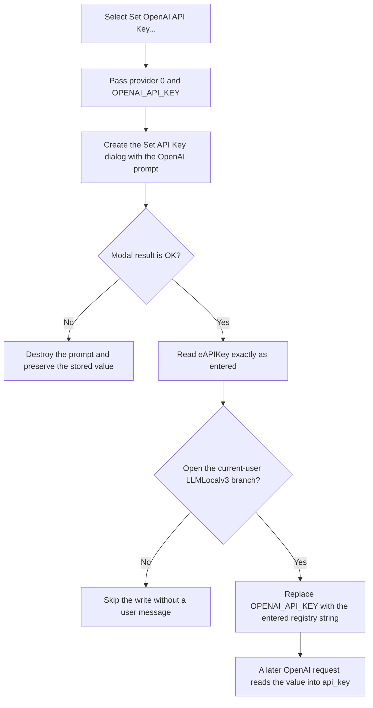

# Set OpenAI API Key...

> Analysis status: Evidence-backed source review complete.

## Control

| Property | Recovered value |
| --- | --- |
| Form | LLMOptions |
| Component path | LLMOptions.pmSetAPIKey.mnSetOpenAIApiKey |
| Control class | TMenuItem |
| Caption | Set OpenAI API Key... |
| Parent popup | `LLMOptions.pmSetAPIKey` |
| Handler name | mnSetOpenAIApiKeyClick |
| Handler address | 019db3e0 |
| Graph node | `resource:dfm:LLMOptions/LLMOptions.pmSetAPIKey.mnSetOpenAIApiKey` |
| Handler node | `function:019db3e0` |
| Graph layer | UI |

The menu item has no hint, action, image, or glyph. Its wrapper arguments, prompt mapping, registry value name, and later consumer prove the OpenAI-specific behavior.

## What happens when clicked

[FUN_019db3e0](../../../DecompiledSources/Tina16/functions/00000000019DB3E0__FUN_019db3e0.c) calls the shared API-key coordinator with provider selector `0` and the fixed value name `OPENAI_API_KEY`. It does not inspect `Sender`, the selected model, or the current provider.

[FUN_019db260](../../../DecompiledSources/Tina16/functions/00000000019DB260__FUN_019db260.c) creates a new `TSetAPIKey` form. [FUN_019d8070](../../../DecompiledSources/Tina16/functions/00000000019D8070__FUN_019d8070.c) maps selector `0` to the prompt `Enter your OpenAI API Key:`. The recovered DFM defines an empty `eAPIKey` edit and does not define `PasswordChar`. The coordinator does not load the existing registry value before it shows the dialog.

The coordinator checks the modal result:

- A result other than `1` destroys the prompt without reading the edit or changing the stored value.
- Result `1` reads the complete `eAPIKey.Text` value through [FUN_019d8220](../../../DecompiledSources/Tina16/functions/00000000019D8220__FUN_019d8220.c) and passes it to the shared registry writer.

[FUN_01a513b0](../../../DecompiledSources/Tina16/functions/0000000001A513B0__FUN_01a513b0.c) opens or creates the current-user branch `SOFTWARE\DesignSoft\<product>\LLMLocalv3` and writes `OPENAI_API_KEY` as a registry string. The write occurs immediately after the inner prompt returns OK. It is not staged for the outer LLM Options OK button, and canceling the outer form does not restore the previous key.

## Later use

[FUN_01a43260](../../../DecompiledSources/Tina16/functions/0000000001A43260__FUN_01a43260.c) selects `OPENAI_API_KEY` when the live provider string is `OpenAI`. It reads the same registry value and puts it in the request configuration as `api_key`.

The menu command does not start a request or test the credential. A later non-Local request with an empty recovered key raises the shared provider setup error. This later failure is not part of the menu click.

## Error and repetition boundaries

- There is no non-empty, length, prefix, format, or provider-connectivity check. OK with an empty edit writes an empty registry string.
- Cancel preserves the prior value. Repeating OK replaces the same value and keeps no history.
- If the registry branch cannot be opened, the writer skips the value write and returns without a user message or success value.
- The wrapper and coordinator have no local catch for allocation or registry-write exceptions. They do not show a confirmation and do not read the value back.
- The recovered path uses a registry string. It does not use Windows Credential Manager, encryption, hashing, or an environment-variable write.
- The source does not show a secure-memory clear after the local Delphi string is finalized.

## Click flow

## Evidence

- [OpenAI menu wrapper](../../../DecompiledSources/Tina16/functions/00000000019DB3E0__FUN_019db3e0.c): passes provider selector `0` and `OPENAI_API_KEY` and performs no other work.
- [Shared credential coordinator](../../../DecompiledSources/Tina16/functions/00000000019DB260__FUN_019db260.c): creates the prompt, reads the edit only after modal result `1`, writes the supplied value name, and destroys the prompt.
- [Provider prompt mapper](../../../DecompiledSources/Tina16/functions/00000000019D8070__FUN_019d8070.c): maps selector `0` to the OpenAI prompt.
- [Edit reader](../../../DecompiledSources/Tina16/functions/00000000019D8220__FUN_019d8220.c): copies the complete edit text without extra validation.
- [Registry writer](../../../DecompiledSources/Tina16/functions/0000000001A513B0__FUN_01a513b0.c): selects the current-user hive and writes the supplied value in the DesignSoft `LLMLocalv3` branch.
- [Registry reader](../../../DecompiledSources/Tina16/functions/0000000001A50FE0__FUN_01a50fe0.c) and [request builder](../../../DecompiledSources/Tina16/functions/0000000001A43260__FUN_01a43260.c): prove later selection and use of `OPENAI_API_KEY`.
- [Recovered UI evidence](../../../DecompiledSources/Tina16/resources/dfm/ui-evidence.json): binds the menu item and identifies the shared prompt controls.

## Analysis limits

- The product-name part of the registry path comes from a run-time global. The source at this call site does not expose its exact text.
- The recovered resource evidence does not preserve every possible edit property. This article records the absent DFM `PasswordChar` value but does not claim how every run-time theme displays the control.
- The source proves storage and later request consumption. It does not prove whether OpenAI accepts a specific credential.
