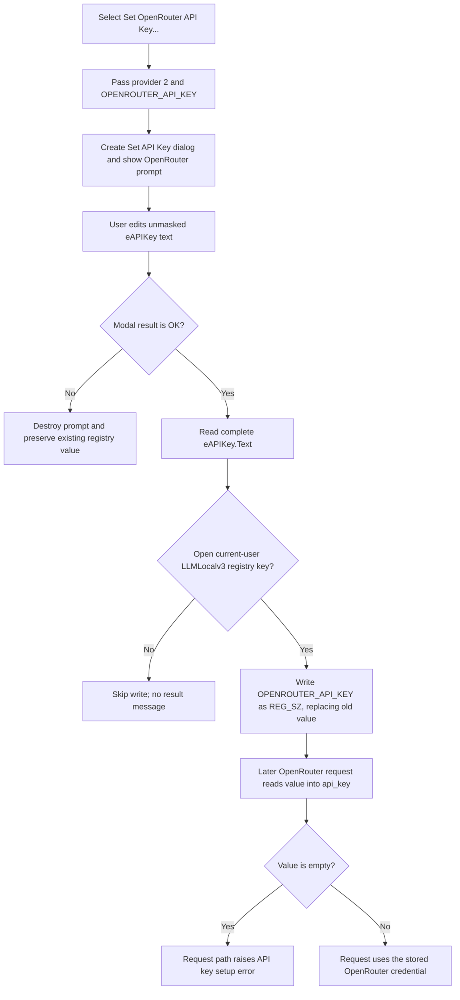

# Set OpenRouter API Key...

## Control

| Property | Recovered value |
| --- | --- |
| Form | LLMOptions |
| Component path | LLMOptions.pmSetAPIKey.mnSetOpenRouterAPIKey |
| Control class | TMenuItem |
| Caption | Set OpenRouter API Key... |
| Hint | Not present in the recovered resource. |
| Text | Not present in the recovered resource. |
| Handler name | mnSetOpenRouterAPIKeyClick |
| Handler address | 019db430 |
| Graph node | `resource:dfm:LLMOptions/LLMOptions.pmSetAPIKey.mnSetOpenRouterAPIKey` |
| Handler node | `function:019db430` |
| Graph layer | UI |

The menu item has no hint, action, image, or glyph. Its handler provides the decisive provider ID and storage value name, so the OpenRouter behavior does not depend on the caption alone.

## Menu route and provider selection

The **Set API Key** button opens the `pmSetAPIKey` popup menu at the current cursor position. This popup contains separate OpenAI, GROQ, OpenRouter, and Ollama commands. Selecting **Set OpenRouter API Key...** enters `FUN_019db430`.

The handler is a one-call wrapper. It does not inspect `Sender` or any selected model. It calls the shared credential coordinator with these exact arguments:

- the current `TLLMOptions` form;
- provider ID `2`;
- value name `OPENROUTER_API_KEY`.

The sibling wrappers establish the provider mapping: 0 is OpenAI, 1 is GROQ, 2 is OpenRouter, and 3 is Ollama. The shared prompt initializer maps provider ID 2 to the label `Enter your OpenRouter API Key:`.

## Nested credential prompt

The shared coordinator creates a separate `TSetAPIKey` form, assigns provider ID 2, and shows it modally. Its `eAPIKey` edit starts with no recovered prefill. The DFM does not set `PasswordChar`, so the entered credential is visible as ordinary edit text. The dialog has built-in `bkOK`, `bkCancel`, and `bkHelp` buttons.

The coordinator tests the modal result:

- Result 1 from **OK** causes it to read the complete `eAPIKey.Text` value and pass that value with `OPENROUTER_API_KEY` to the credential writer.
- Cancel, window close without an OK result, or any other modal result skips the read and write. The existing credential remains unchanged.

There is no nonempty check, format check, confirmation entry, or provider request in this path. Therefore, OK with an empty edit writes an empty string. The coordinator destroys the prompt form after either result.

## Persistence and later use

Accepted text is written immediately under the current user registry hive:

`HKEY_CURRENT_USER\SOFTWARE\DesignSoft\<product>\LLMLocalv3`

The value name is `OPENROUTER_API_KEY`. The registry helper writes the UTF-16 text as registry type 1, `REG_SZ`. It does not use the Windows Credential Manager, encrypt the value, or set a process or user environment variable. The environment-style name is only the registry value name.

This write is independent of the parent LLM Options dialog's **OK** and **Cancel** buttons. After the nested prompt returns OK, canceling the parent Options dialog does not roll back the registry value. The command does not update another visible LLM Options control or mark parent options as modified.

When a later LLM request uses a model whose provider name is `OpenRouter`, the request builder selects `OPENROUTER_API_KEY`, reads the same current-user registry value, and inserts it as the request's `api_key` field. If that read produces an empty value, the request path raises the provider-specific setup error `<provider>: please ensure the API key is set up!`. The menu click itself does not start a request and does not test whether OpenRouter accepts the key.

## Error and repeated-use boundaries

- If the registry key cannot be opened for writing, the credential writer skips the value write and returns without a success or failure result. The coordinator shows no confirmation or error message.
- The recovered wrapper and coordinator have no local catch for registry or allocation exceptions. They do run Delphi cleanup for the local string and prompt object on the normal recovered path.
- Repeating the command and accepting replaces the same `OPENROUTER_API_KEY` registry value. It does not keep credential history.
- Accepting an empty edit replaces the prior value with an empty `REG_SZ`; Cancel preserves the prior value.
- The prompt displays the key without masking, and the registry stores it as plain text. The recovered code does not show secure-memory clearing after the local string is finalized.
- No form field caches the new key in this path. The later request builder reads the registry again, so the next OpenRouter request observes the accepted value without requiring parent Options OK.

## Click flow

## Evidence

- [OpenRouter menu handler](../../../DecompiledSources/Tina16/functions/00000000019DB430__FUN_019db430.c): passes provider ID 2 and `OPENROUTER_API_KEY` to the shared coordinator and performs no other work.
- [.704-owned credential coordinator](../../../DecompiledSources/Tina16/functions/00000000019DB260__FUN_019db260.c): creates and shows the modal prompt, reads text only for result 1, writes the selected value name, and destroys the prompt.
- [.704-owned prompt initializer](../../../DecompiledSources/Tina16/functions/00000000019D8070__FUN_019d8070.c): maps provider ID 2 to `Enter your OpenRouter API Key:`.
- [.704-owned prompt reader](../../../DecompiledSources/Tina16/functions/00000000019D8220__FUN_019d8220.c): reads `eAPIKey.Text` without additional validation.
- [Credential writer](../../../DecompiledSources/Tina16/functions/0000000001A513B0__FUN_01a513b0.c): selects the current-user hive, opens the DesignSoft product `LLMLocalv3` key for writing, and writes the supplied name and value.
- [Registry Unicode-string writer](../../../DecompiledSources/Tina16/functions/00000000005EB630__FUN_005eb630.c): writes the UTF-16 buffer, terminator, and registry type 1.
- [Credential reader](../../../DecompiledSources/Tina16/functions/0000000001A50FE0__FUN_01a50fe0.c) and [request builder](../../../DecompiledSources/Tina16/functions/0000000001A43260__FUN_01a43260.c): prove that OpenRouter requests select the same registry value and put it in `api_key`.
- [.699-owned popup launcher](../../../DecompiledSources/Tina16/functions/00000000019DB210__FUN_019db210.c): opens `pmSetAPIKey`; it does not choose the provider or write a credential.
- [OpenAI](../../../DecompiledSources/Tina16/functions/00000000019DB3E0__FUN_019db3e0.c), [GROQ](../../../DecompiledSources/Tina16/functions/00000000019DB340__FUN_019db340.c), and [Ollama](../../../DecompiledSources/Tina16/functions/00000000019DB390__FUN_019db390.c) wrappers: establish the four provider-ID and value-name mappings.

## Limits

- The product-name segment in the registry path comes from a global runtime string. The recovered source does not expose its value at this call site.
- The request builder proves the next-use read and empty-key error, but this handler does not verify network connectivity, provider account state, or credential permissions.
- Shared prompt, registry, popup, and request-builder helpers have wider ownership. This fragment assigns only the OpenRouter wrapper's specific arguments and responsibility.
