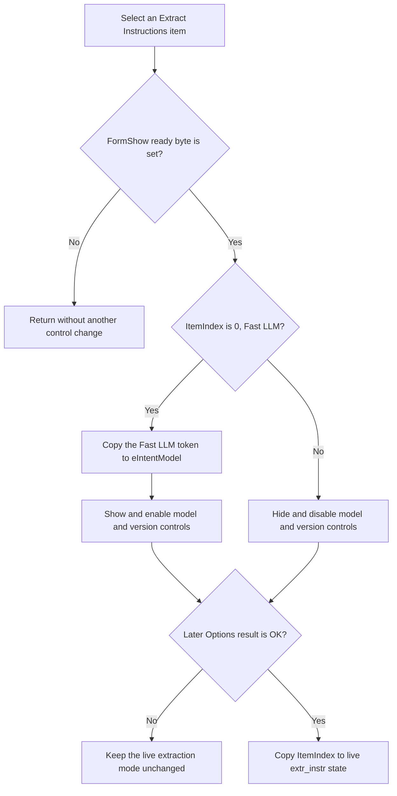

# Select the extract-instruction mode

> Analysis status: Evidence-backed source review complete.

## Control

| Property | Recovered value |
| --- | --- |
| Form | LLMOptions |
| Component path | LLMOptions.rgExtrInstructions |
| Control class | TRadioGroup |
| Caption | Extract Instructions |
| Items | Fast LLM; Selected LLM; Without LLM |
| Handler name | rgExtrInstructionsClick |
| Handler address | 019dba30 |
| Graph node | `resource:dfm:LLMOptions/LLMOptions.rgExtrInstructions` |
| Handler node | `function:019dba30` |
| Graph layer | UI |

The ordered resource items establish the meanings of item indexes `0`, `1`, and `2`. The recovered handler and its shared helper prove the immediate control-state changes.

## What happens when clicked

[FUN_019dba30](../../../DecompiledSources/Tina16/functions/00000000019DBA30__FUN_019dba30.c) delegates all work to [FUN_019db970](../../../DecompiledSources/Tina16/functions/00000000019DB970__FUN_019db970.c).

The helper first checks the form-ready byte at offset `+0x810`. `FormCreate` clears this byte, and `FormShow` sets it. If the byte is clear, the handler returns without changing another control.

When the form is ready, the helper tests `rgExtrInstructions.ItemIndex == 0`:

| Selected item | Immediate result |
| --- | --- |
| 0, Fast LLM | Copy the prebuilt Fast LLM token to the read-only `eIntentModel` edit. Show and enable `eIntentModel`, `cbTinaLLM`, `Label8`, and `Label10`. |
| 1, Selected LLM | Hide and disable the extract-model edit and Tina-version combo, and hide both labels. Keep their stored text and selection. |
| 2, Without LLM | Apply the same hidden and disabled presentation as item 1. Keep the hidden values unchanged. |

The shared helper treats every nonzero or forced out-of-range index like item `1` or `2` for presentation. It does not change the radio selection itself.

The click does not copy the selected mode to the staged configuration object. The later OK handler reads `rgExtrInstructions.ItemIndex` and stores it at staged offset `+0xA0`. The modal caller copies that value to the live LLM configuration only after modal result `1`. Cancel leaves the live extraction mode unchanged.

[FUN_01a43260](../../../DecompiledSources/Tina16/functions/0000000001A43260__FUN_01a43260.c) later writes the live value to request configuration field `extr_instr`. The radio click does not build or send a request.

## State and error boundaries

- The handler changes dialog presentation only. It does not change the main model, provider, API key, voice, interface, port, history size, or durable settings.
- Switching away from Fast LLM hides the model and version controls. It does not clear `eIntentModel.Text` or reset `cbTinaLLM.ItemIndex`.
- Switching back to Fast LLM refreshes `eIntentModel.Text` from the current prebuilt token and shows the controls again.
- Repeating item `0` repeats the same text and state requests. The VCL text and visibility helpers suppress work when their current values already match.
- The handler has no local catch or rollback. A control setter or string-allocation error can leave part of the presentation updated, while the live configuration remains unchanged.

## Click flow

## Evidence

- [Radio-group click wrapper](../../../DecompiledSources/Tina16/functions/00000000019DBA30__FUN_019dba30.c): contains only the call to the shared presentation helper.
- [Presentation helper](../../../DecompiledSources/Tina16/functions/00000000019DB970__FUN_019db970.c): proves the ready guard, item-zero test, text update, enabled state, and visibility changes.
- [Form creation](../../../DecompiledSources/Tina16/functions/00000000019D9C60__FUN_019d9c60.c) and [form show](../../../DecompiledSources/Tina16/functions/00000000019D9C90__FUN_019d9c90.c): prove the ready-byte lifecycle and the initial presentation synchronization.
- [Initial token builder](../../../DecompiledSources/Tina16/functions/0000000001A42710__FUN_01a42710.c): builds the Fast LLM, Selected LLM, and Without LLM token strings before the dialog opens.
- [OK staged copy](../../../DecompiledSources/Tina16/functions/00000000019D9A50__FUN_019d9a50.c), [modal coordinator](../../../DecompiledSources/Tina16/functions/0000000001A42840__FUN_01a42840.c), and [live configuration copy](../../../DecompiledSources/Tina16/functions/0000000001A421F0__FUN_01a421f0.c): prove the later OK-only copy of item index `+0xA0`.
- [Request builder](../../../DecompiledSources/Tina16/functions/0000000001A43260__FUN_01a43260.c): uses the accepted live value as `extr_instr` during later request construction.
- [Recovered UI evidence](../../../DecompiledSources/Tina16/resources/dfm/ui-evidence.json): binds the handler and supplies the ordered radio items and related controls.

## Analysis limits

- The wrapper's decompiled prototype omits the implicit form receiver, but its resolved UI binding and the called helper's form-field accesses establish the control route.
- The handler does not identify how a remote provider interprets the three `extr_instr` values. This article documents only the recovered local state and request field.
- The VCL setter at virtual slot `0x128` is established as `SetEnabled` by repeated control paths in the recovered graph. The visibility path uses the shared VCL visibility helper.
