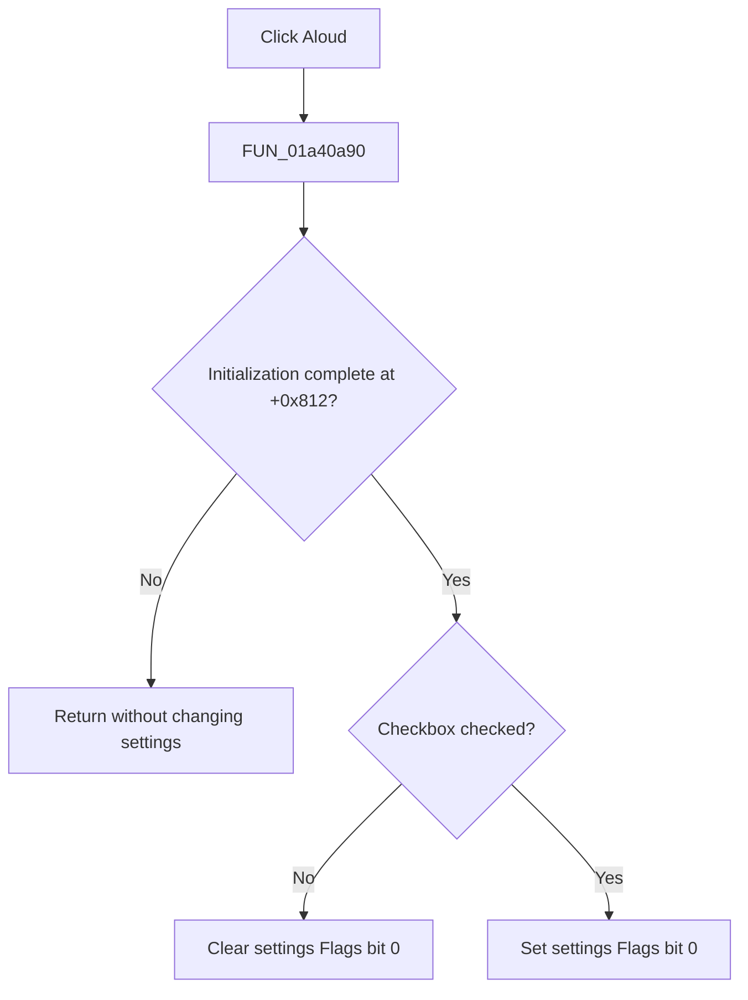

# Aloud

> Analysis status: Complete. The recovered handler and settings load path establish the in-memory aloud flag update and initialization guard.

## Control

| Property | Recovered value |
| --- | --- |
| Form | LocalLLMForm |
| Component path | LocalLLMForm.cbAloud |
| Control class | TCheckBox |
| Caption | Aloud |
| Hint | Not present in the recovered resource. |
| Text | Not present in the recovered resource. |
| Handler name | cbAloudClick |
| Handler address | 01a40a90 |
| Graph node | `resource:dfm:LocalLLMForm/LocalLLMForm.cbAloud` |
| Handler node | `function:01a40a90` |
| Graph layer | UI |

## What happens when clicked

`FUN_01a40a90` first checks form byte `+0x812`. The form initializer keeps this byte clear while controls are populated and sets it only after initialization. When the byte is clear, the click is a no-op. This prevents programmatic checkbox setup from changing settings.

After initialization, the handler reads the checkbox state and updates only bit 0 of the settings flags at `settings +0x50`. A cleared checkbox clears the bit. A checked checkbox sets it. Other flag bits are preserved. The settings loader later maps the same bit back to this checkbox and stores the complete flags value under the `Flags` key. This click handler does not start speech, save the settings file, show a message, or report an error.

## Click flow

## Handler evidence

- Source: [DecompiledSources/Tina16/functions/0000000001A40A90__FUN_01a40a90.c](../../../DecompiledSources/Tina16/functions/0000000001A40A90__FUN_01a40a90.c)
- Recovered role: Local-LLM aloud-mode checkbox handler.
- Current graph summary: Handles 1 Delphi UI event: LocalLLMForm.cbAloud.OnClick.
- Current graph behavior: Not present in the recovered resource.
- Current graph evidence: Not present in the recovered resource.
- Complexity: simple
- Distinct outgoing calls: 0

## Direct calls

- No direct call edge is present in the recovered graph.

## Resource evidence

- Kind: Not present in the recovered resource.
- Modal result: Not present in the recovered resource.
- Checked state: Not present in the recovered resource.
- List items: Not present in the recovered resource.
- Image reference: Not present in the recovered resource.
- Extracted glyph: None.

## Nearby label candidates

Nearby labels are layout candidates only. They are not proof of behavior.

- Rank 1: Chat:  at distance 472.
- Rank 2: User: at distance 893.

## Analysis limits

- The source proves a settings-flag change. It does not identify the later speech consumer or prove immediate audio output.
- The distant nearby labels are not used as behavior evidence.
