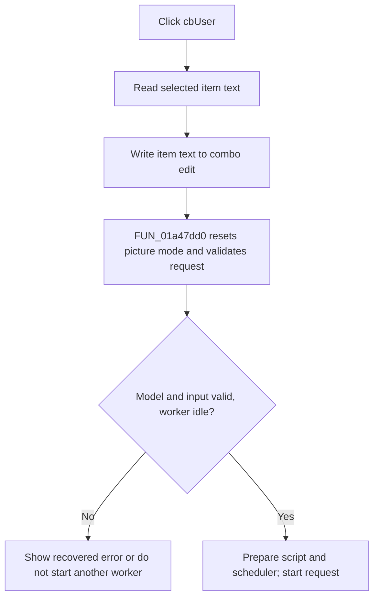

# cbUser

> Analysis status: Complete. The recovered selected-item read, control-text write, and request-pipeline call establish the click effect.

## Control

| Property | Recovered value |
| --- | --- |
| Form | LocalLLMForm |
| Component path | LocalLLMForm.cbUser |
| Control class | TComboBox |
| Caption | Not present in the recovered resource. |
| Hint | Not present in the recovered resource. |
| Text | Not present in the recovered resource. |
| Handler name | cbUserClick |
| Handler address | 01a52f60 |
| Graph node | `resource:dfm:LocalLLMForm/LocalLLMForm.cbUser` |
| Handler node | `function:01a52f60` |
| Graph layer | UI |

## What happens when clicked

`FUN_01a52f60` reads the combo box's current item index, retrieves that item from the combo's item list, and writes the retrieved text back to the combo's edit text. It then calls `FUN_01a47dd0` with the original `Sender` and a forced pre-processing flag of `1`.

The callee is the local-LLM request pipeline. The forced flag first clears the external-picture mode, resets request UI state, and then validates model availability and question or picture input. A missing model can open model management and show an error. An empty question with no picture request raises the recovered `The question field is empty. Please specify a question!` error. A valid, idle request prepares the chat Python script and scheduler, marks the worker active, and starts processing. Active-request and answer-marker state can defer or suppress a new launch.

The handler does not validate the selected index before it asks the item list for text; normal VCL combo state supplies it. The source proves that an OnClick can start the same request pipeline as a process command. It is not only a passive user-name selection.

## Click flow

## Handler evidence

- Source: [DecompiledSources/Tina16/functions/0000000001A52F60__FUN_01a52f60.c](../../../DecompiledSources/Tina16/functions/0000000001A52F60__FUN_01a52f60.c)
- Recovered role: Applies the selected user entry and invokes local-LLM request processing.
- Current graph summary: Handles 1 Delphi UI event: LocalLLMForm.cbUser.OnClick.
- Current graph behavior: Not present in the recovered resource.
- Current graph evidence: Not present in the recovered resource.
- Complexity: complex
- Distinct outgoing calls: 3

## Direct calls

- `function:00414480` — Delphi UnicodeString clear and finalization helper
- `function:0064de00` — VCL control text setter with change suppression
- `function:01a47dd0` — FUN_01a47dd0

## Resource evidence

- Kind: Not present in the recovered resource.
- Modal result: Not present in the recovered resource.
- Checked state: Not present in the recovered resource.
- List items: Not present in the recovered resource.
- Image reference: Not present in the recovered resource.
- Extracted glyph: None.

## Nearby label candidates

Nearby labels are layout candidates only. They are not proof of behavior.

- Rank 1: User: at distance 22.
- Rank 2: Chat:  at distance 443.

## Analysis limits

- The nearby `User:` label supports the combo identity. The direct calls establish the text and request effects.
- The item-list contents, the semantic meaning of each user entry, and all model-provider error details are not present in the DFM.
