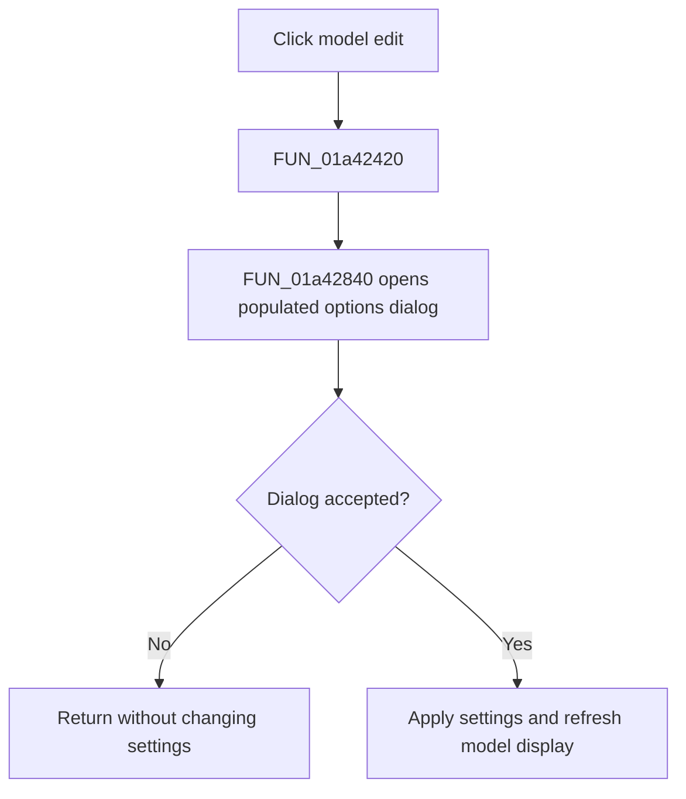

# eModel

> Analysis status: Complete. The edit-click wrapper and shared options handler establish that the model field opens local-LLM settings rather than editing the text directly.

## Control

| Property | Recovered value |
| --- | --- |
| Form | LocalLLMForm |
| Component path | LocalLLMForm.Panel1.eModel |
| Control class | TEdit |
| Caption | Not present in the recovered resource. |
| Hint | Not present in the recovered resource. |
| Text | Not present in the recovered resource. |
| Handler name | eModelClick |
| Handler address | 01a42420 |
| Graph node | `resource:dfm:LocalLLMForm/LocalLLMForm.Panel1.eModel` |
| Handler node | `function:01a42420` |
| Graph layer | UI |

## What happens when clicked

`FUN_01a42420` delegates directly to `FUN_01a42840`, the same options handler used by the menu item and toolbar button. The handler does not read or modify the edit text itself. It opens a populated modal options dialog for the local-LLM settings.

Canceling the dialog leaves the active settings unchanged. Accepting it copies the edited settings back. When the framework choice changes, the shared handler can stop the prior framework, prepare models, refresh the model list, and update the displayed model. The nearby `Model:` label supports the field identity, but the direct call proves the click action.

## Click flow

## Handler evidence

- Source: [DecompiledSources/Tina16/functions/0000000001A42420__FUN_01a42420.c](../../../DecompiledSources/Tina16/functions/0000000001A42420__FUN_01a42420.c)
- Recovered role: Model-field options command wrapper.
- Current graph summary: Handles 1 Delphi UI event: LocalLLMForm.Panel1.eModel.OnClick.
- Current graph behavior: Not present in the recovered resource.
- Current graph evidence: Not present in the recovered resource.
- Complexity: simple
- Distinct outgoing calls: 1

## Direct calls

- `function:01a42840` — Handles 1 Delphi UI event: LocalLLMForm.Panel1.sbOptions.OnClick.

## Resource evidence

- Kind: Not present in the recovered resource.
- Modal result: Not present in the recovered resource.
- Checked state: Not present in the recovered resource.
- List items: Not present in the recovered resource.
- Image reference: Not present in the recovered resource.
- Extracted glyph: None.

## Nearby label candidates

Nearby labels are layout candidates only. They are not proof of behavior.

- Rank 1: Model: at distance 54.

## Analysis limits

- The source proves an options command, not direct model-text editing.
- The exact exception behavior of framework startup and model refresh operations is not recovered.
