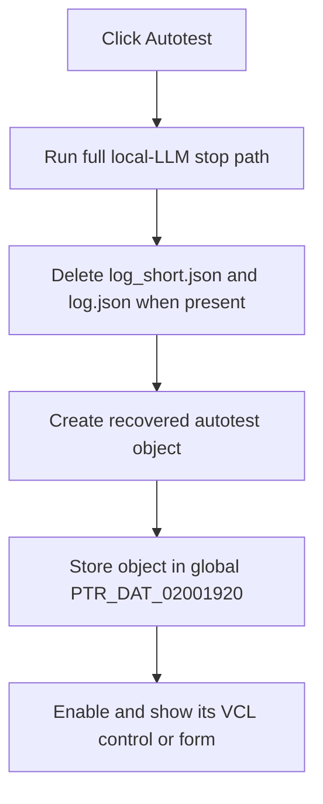

# Autotest

> Analysis status: Complete. The recovered stop call, log cleanup, object creation, and VCL display helper establish the autotest launch sequence.

## Control

| Property | Recovered value |
| --- | --- |
| Form | LocalLLMForm |
| Component path | LocalLLMForm.MainMenu1.mnTools.mnAutoTest |
| Control class | TMenuItem |
| Caption | Autotest |
| Hint | Not present in the recovered resource. |
| Text | Not present in the recovered resource. |
| Handler name | mnAutoTestClick |
| Handler address | 01a58f90 |
| Graph node | `resource:dfm:LocalLLMForm/LocalLLMForm.MainMenu1.mnTools.mnAutoTest` |
| Handler node | `function:01a58f90` |
| Graph layer | UI |

## What happens when clicked

`FUN_01a58f90` first invokes the same full-stop wrapper as the Stop speed button. It then constructs `log_short.json` and `log.json` paths under the local-LLM temporary directory and deletes each file only when it exists. Delete return values are not checked.

The handler next creates an object from recovered class metadata, stores it in global `PTR_DAT_02001920`, and passes it to `FUN_008059a0`. That helper enables the object and shows its VCL control or form. The recovered call site does not expose the class name, test list, inputs, or completion result. There is no confirmation, modal-result check, success message, or local exception handler. If no worker is active and neither log exists, the stop and deletion parts are no-ops, but the new object is still created and shown.

## Click flow

## Handler evidence

- Source: [DecompiledSources/Tina16/functions/0000000001A58F90__FUN_01a58f90.c](../../../DecompiledSources/Tina16/functions/0000000001A58F90__FUN_01a58f90.c)
- Recovered role: Stops local-LLM work, clears prior logs, and launches the recovered autotest UI object.
- Current graph summary: Handles 1 Delphi UI event: LocalLLMForm.MainMenu1.mnTools.mnAutoTest.OnClick.
- Current graph behavior: Not present in the recovered resource.
- Current graph evidence: Not present in the recovered resource.
- Complexity: complex
- Distinct outgoing calls: 7

## Direct calls

- `function:00414560` — Delphi UnicodeString array finalization helper
- `function:00416cd0` — FUN_00416cd0
- `function:00440a20` — FUN_00440a20
- `function:004412f0` — FUN_004412f0
- `function:007fc180` — FUN_007fc180
- `function:008059a0` — FUN_008059a0
- `function:01a43000` — Handles 1 Delphi UI event: LocalLLMForm.Panel1.sbStop.OnClick.

## Resource evidence

- Kind: Not present in the recovered resource.
- Modal result: Not present in the recovered resource.
- Checked state: Not present in the recovered resource.
- List items: Not present in the recovered resource.
- Image reference: Not present in the recovered resource.
- Extracted glyph: None.

## Nearby label candidates

Nearby labels are layout candidates only. They are not proof of behavior.

- No same-parent label candidate is available.

## Analysis limits

- The menu caption supports the object purpose, but the class name and test behavior are not resolved at this call site.
- The handler proves launch preparation only. It does not prove which tests run or how results are reported.
