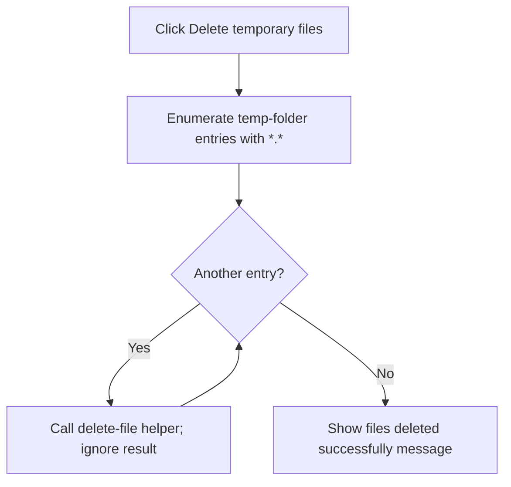

# Delete temporary files

> Analysis status: Complete. The recovered enumeration helper and unconditional message establish the temporary-file deletion behavior and its error-reporting limit.

## Control

| Property | Recovered value |
| --- | --- |
| Form | LocalLLMForm |
| Component path | LocalLLMForm.MainMenu1.mnTools.mnDeleteTempFiles |
| Control class | TMenuItem |
| Caption | Delete temporary files |
| Hint | Not present in the recovered resource. |
| Text | Not present in the recovered resource. |
| Handler name | mnDeleteTempFilesClick |
| Handler address | 01a530e0 |
| Graph node | `resource:dfm:LocalLLMForm/LocalLLMForm.MainMenu1.mnTools.mnDeleteTempFiles` |
| Handler node | `function:01a530e0` |
| Graph layer | UI |

## What happens when clicked

`FUN_01a530e0` passes the form's local-LLM temporary directory at `+0x2ba0` to `FUN_01b1e2f0`. That helper enumerates `\*.*`, builds a full path for each returned entry, and calls the recovered delete-file helper. It then closes the enumeration.

The delete helper returns a success value, but the enumeration routine ignores it. After the helper returns, the click handler always shows `AI temporary files deleted successfully`. An empty directory therefore produces the same message. A failed individual deletion is not reported and does not stop later entries. There is no confirmation prompt, directory removal call, retry, or local exception handler.

## Click flow

## Handler evidence

- Source: [DecompiledSources/Tina16/functions/0000000001A530E0__FUN_01a530e0.c](../../../DecompiledSources/Tina16/functions/0000000001A530E0__FUN_01a530e0.c)
- Recovered role: Deletes enumerated local-LLM temporary files and reports completion.
- Current graph summary: Handles 1 Delphi UI event: LocalLLMForm.MainMenu1.mnTools.mnDeleteTempFiles.OnClick.
- Current graph behavior: Not present in the recovered resource.
- Current graph evidence: Not present in the recovered resource.
- Complexity: moderate
- Distinct outgoing calls: 2

## Direct calls

- `function:0072d440` — FUN_0072d440
- `function:01b1e2f0` — FUN_01b1e2f0

## Resource evidence

- Kind: Not present in the recovered resource.
- Modal result: Not present in the recovered resource.
- Checked state: Not present in the recovered resource.
- List items: Not present in the recovered resource.
- Image reference: Not present in the recovered resource.
- Extracted glyph: None.

## Nearby label candidates

Nearby labels are layout candidates only. They are not proof of behavior.

- No same-parent label candidate is available.

## Analysis limits

- The enumeration attributes and helper call prove file deletion attempts. The source does not prove that every entry was removed.
- The exact handling of subdirectory entries depends on the recovered runtime enumeration and delete helpers; no recursive directory traversal is present.
