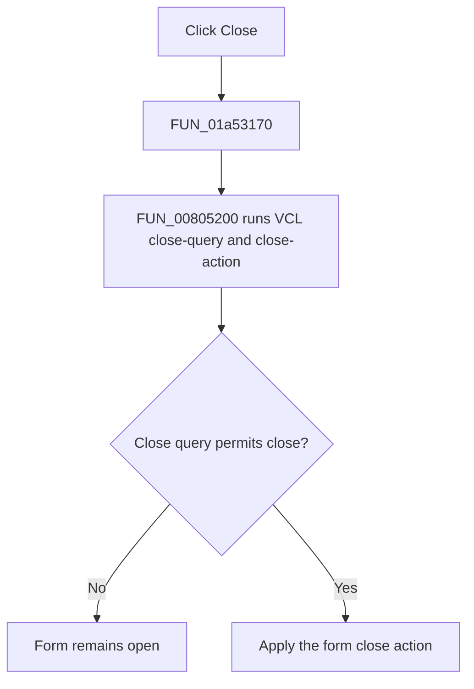

# Close

> Analysis status: Complete. The recovered handler and VCL close helper establish the form-close request.

## Control

| Property | Recovered value |
| --- | --- |
| Form | LocalLLMForm |
| Component path | LocalLLMForm.MainMenu1.File1.mnExit |
| Control class | TMenuItem |
| Caption | Close |
| Hint | Not present in the recovered resource. |
| Text | Not present in the recovered resource. |
| Handler name | mnExitClick |
| Handler address | 01a53170 |
| Graph node | `resource:dfm:LocalLLMForm/LocalLLMForm.MainMenu1.File1.mnExit` |
| Handler node | `function:01a53170` |
| Graph layer | UI |

## What happens when clicked

`FUN_01a53170` makes one call to `FUN_00805200`, the recovered VCL form close pipeline. That helper runs the form's close-query and close-action processing. The menu handler does not force destruction, set a modal result, or bypass a close veto.

The handler has no input-dependent branch, message, local exception handler, or alternate no-op path. Whether the form closes depends on the VCL close-query result and the form's close action.

## Click flow

## Handler evidence

- Source: [DecompiledSources/Tina16/functions/0000000001A53170__FUN_01a53170.c](../../../DecompiledSources/Tina16/functions/0000000001A53170__FUN_01a53170.c)
- Recovered role: LocalLLM form close command handler.
- Current graph summary: Handles 1 Delphi UI event: LocalLLMForm.MainMenu1.File1.mnExit.OnClick.
- Current graph behavior: Not present in the recovered resource.
- Current graph evidence: Not present in the recovered resource.
- Complexity: simple
- Distinct outgoing calls: 1

## Direct calls

- `function:00805200` — Runs the VCL form close-query and close-action pipeline.

## Resource evidence

- Kind: Not present in the recovered resource.
- Modal result: Not present in the recovered resource.
- Checked state: Not present in the recovered resource.
- List items: Not present in the recovered resource.
- Image reference: Not present in the recovered resource.
- Extracted glyph: None.

## Nearby label candidates

Nearby labels are layout candidates only. They are not proof of behavior.

- No same-parent label candidate is available.

## Analysis limits

- The handler requests the standard VCL close pipeline. The recovered code does not establish the final close action or whether another form event vetoes the request.
