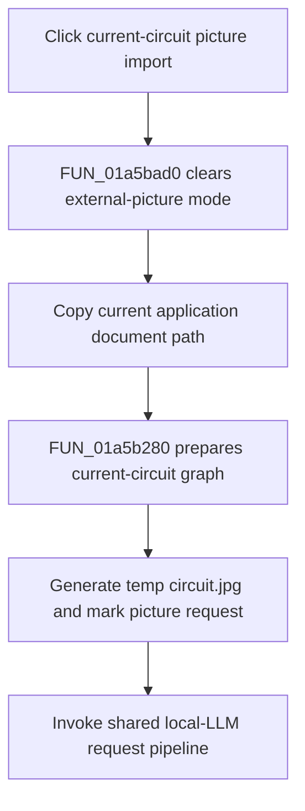

# Import from picture (current circuit)...

> Analysis status: Complete. The recovered current-document path, image-request setup, and shared request pipeline establish current-circuit picture import.

## Control

| Property | Recovered value |
| --- | --- |
| Form | LocalLLMForm |
| Component path | LocalLLMForm.MainMenu1.mnTools.mnImportFromPicture |
| Control class | TMenuItem |
| Caption | Import from picture (current circuit)... |
| Hint | Not present in the recovered resource. |
| Text | Not present in the recovered resource. |
| Handler name | mnImportFromPictureClick |
| Handler address | 01a5bad0 |
| Graph node | `resource:dfm:LocalLLMForm/LocalLLMForm.MainMenu1.mnTools.mnImportFromPicture` |
| Handler node | `function:01a5bad0` |
| Graph layer | UI |

## What happens when clicked

`FUN_01a5bad0` clears external-picture mode at `+0x293c`, copies the current application document path from global state into form field `+0x890`, and calls `FUN_01a5b280` without an external netlist or picture path. A normal menu click supplies a nonzero `Sender`, so the handler also clears mode byte `+0x2ae8`. The RunAll helper is the separate caller that passes a null second argument and sets that byte.

The shared picture-import routine marks image processing busy, prepares a graph for the current circuit, generates `circuit.jpg` in the local-LLM temporary directory, stores picture-request state, and calls the local-LLM request pipeline. It checks whether the configured model supports image recognition and can display recovered model-compatibility messages. Those messages do not return from the function; processing continues into the request path.

This command does not show a file-selection dialog. Its input is the current application circuit/document and the generated image. Request validation, model download prompts, and worker start behavior come from the shared `FUN_01a47dd0` pipeline.

## Click flow

## Handler evidence

- Source: [DecompiledSources/Tina16/functions/0000000001A5BAD0__FUN_01a5bad0.c](../../../DecompiledSources/Tina16/functions/0000000001A5BAD0__FUN_01a5bad0.c)
- Recovered role: Starts local-LLM picture recognition for the current circuit.
- Current graph summary: Handles 1 Delphi UI event: LocalLLMForm.MainMenu1.mnTools.mnImportFromPicture.OnClick.
- Current graph behavior: Not present in the recovered resource.
- Current graph evidence: Not present in the recovered resource.
- Complexity: complex
- Distinct outgoing calls: 5

## Direct calls

- `function:00414480` — Delphi UnicodeString clear and finalization helper
- `function:00414ad0` — Delphi UnicodeString assignment helper
- `function:0043e1a0` — FUN_0043e1a0
- `function:01a5b280` — FUN_01a5b280
- `function:01a5bac0` — FUN_01a5bac0

## Resource evidence

- Kind: Not present in the recovered resource.
- Modal result: Not present in the recovered resource.
- Checked state: Not present in the recovered resource.
- List items: Not present in the recovered resource.
- Image reference: Not present in the recovered resource.
- Extracted glyph: None.

## Nearby label candidates

Nearby labels are layout candidates only. They are not proof of behavior.

- No same-parent label candidate is available.

## Analysis limits

- The current-document source is recovered as a global field without a Delphi name.
- Model compatibility messages do not abort this routine. Later request startup can still fail or display another error.
