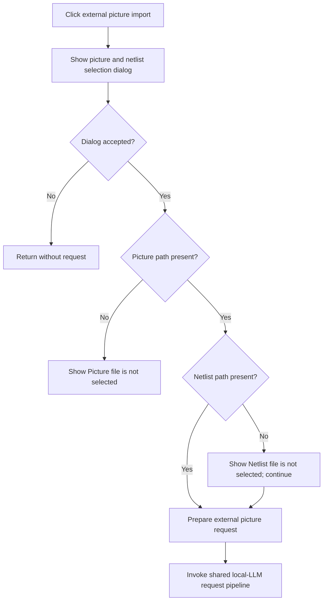

# Import from picture (external)...

> Analysis status: Complete. The recovered modal selection, required-picture branch, optional-netlist warning, and shared image-request path establish external picture import.

## Control

| Property | Recovered value |
| --- | --- |
| Form | LocalLLMForm |
| Component path | LocalLLMForm.MainMenu1.mnTools.mnImportFromPictureExt |
| Control class | TMenuItem |
| Caption | Import from picture (external)... |
| Hint | Not present in the recovered resource. |
| Text | Not present in the recovered resource. |
| Handler name | mnImportFromPictureExtClick |
| Handler address | 01a5bb80 |
| Graph node | `resource:dfm:LocalLLMForm/LocalLLMForm.MainMenu1.mnTools.mnImportFromPictureExt` |
| Handler node | `function:01a5bb80` |
| Graph layer | UI |

## What happens when clicked

`FUN_01a5bb80` creates and shows a modal external-picture selection dialog. If the user cancels, the handler destroys the dialog and makes no request. If accepted, it checks the two returned paths.

An empty picture path shows `Picture file is not selected!` and stops without changing the form's picture state. A nonempty picture with an empty netlist shows `Netlist file is not selected!` but continues. The handler sets external-picture mode at `+0x293c`, stores the selected picture path in form field `+0x890`, and calls `FUN_01a5b280` with the optional netlist and required picture.

The shared routine loads graph data from the selected netlist session when a netlist is present, stores the supplied picture path, marks a picture request, checks model compatibility, and invokes the local-LLM request pipeline. Compatibility messages do not abort processing. The click handler has no local exception handler or success message.

## Click flow

## Handler evidence

- Source: [DecompiledSources/Tina16/functions/0000000001A5BB80__FUN_01a5bb80.c](../../../DecompiledSources/Tina16/functions/0000000001A5BB80__FUN_01a5bb80.c)
- Recovered role: Selects an external picture and optional netlist, then starts local-LLM picture recognition.
- Current graph summary: Handles 1 Delphi UI event: LocalLLMForm.MainMenu1.mnTools.mnImportFromPictureExt.OnClick.
- Current graph behavior: Not present in the recovered resource.
- Current graph evidence: Not present in the recovered resource.
- Complexity: complex
- Distinct outgoing calls: 7

## Direct calls

- `function:00410f20` — Nil-safe Delphi object destruction helper
- `function:00414480` — Delphi UnicodeString clear and finalization helper
- `function:00414ad0` — Delphi UnicodeString assignment helper
- `function:0043e1a0` — FUN_0043e1a0
- `function:0072d440` — FUN_0072d440
- `function:007fc180` — FUN_007fc180
- `function:01a5b280` — FUN_01a5b280

## Resource evidence

- Kind: Not present in the recovered resource.
- Modal result: Not present in the recovered resource.
- Checked state: Not present in the recovered resource.
- List items: Not present in the recovered resource.
- Image reference: Not present in the recovered resource.
- Extracted glyph: None.

## Nearby label candidates

Nearby labels are layout candidates only. They are not proof of behavior.

- No same-parent label candidate is available.

## Analysis limits

- The modal dialog's recovered class name and its internal path-validation behavior are not resolved at this call site.
- An absent netlist is explicitly allowed by this handler, although the selected model can later report that it cannot recognize images without one.
