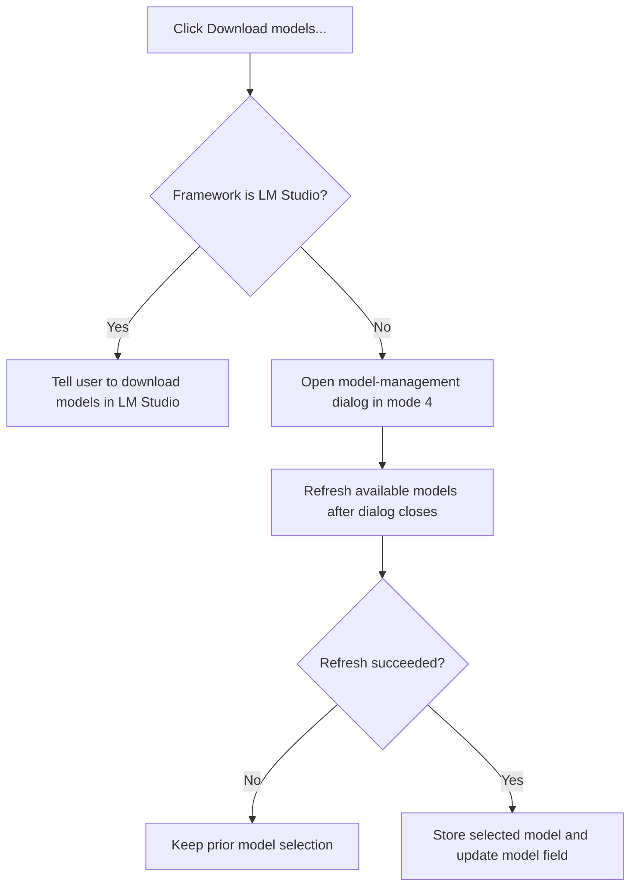

# Download models...

> Analysis status: Complete. The framework branch, modal downloader path, and post-dialog model refresh are supported by recovered code.

## Control

| Property | Recovered value |
| --- | --- |
| Form | LocalLLMForm |
| Component path | LocalLLMForm.MainMenu1.mnTools.mnModelDownloader |
| Control class | TMenuItem |
| Caption | Download models... |
| Hint | Not present in the recovered resource. |
| Text | Not present in the recovered resource. |
| Handler name | mnModelDownloaderClick |
| Handler address | 01a47b10 |
| Graph node | `resource:dfm:LocalLLMForm/LocalLLMForm.MainMenu1.mnTools.mnModelDownloader` |
| Handler node | `function:01a47b10` |
| Graph layer | UI |

## What happens when clicked

`FUN_01a47b10` reads the configured local-LLM framework at settings offset `+0x5c`. When the value is `1`, the handler identifies the interface as LM Studio and shows a message that models must be downloaded manually in LM Studio. It does not open Tina's downloader or refresh the model list in this branch.

For other framework values, the handler creates the recovered model-management dialog, assigns this form as its owner, sets mode `4`, shows it modally, and destroys it after return. Dialog cancellation and acceptance lead to the same post-dialog refresh because the modal result is not tested here. The handler refreshes available models. If that refresh reports success, it reads the current model-list selection, stores the selected model text in settings, and updates the model field. A failed refresh leaves the prior selection without a message in this handler.

## Click flow

## Handler evidence

- Source: [DecompiledSources/Tina16/functions/0000000001A47B10__FUN_01a47b10.c](../../../DecompiledSources/Tina16/functions/0000000001A47B10__FUN_01a47b10.c)
- Recovered role: Opens local model management or explains LM Studio's manual download path.
- Current graph summary: Handles 1 Delphi UI event: LocalLLMForm.MainMenu1.mnTools.mnModelDownloader.OnClick.
- Current graph behavior: Not present in the recovered resource.
- Current graph evidence: Not present in the recovered resource.
- Complexity: complex
- Distinct outgoing calls: 7

## Direct calls

- `function:00410f20` — Nil-safe Delphi object destruction helper
- `function:00414480` — Delphi UnicodeString clear and finalization helper
- `function:00414ad0` — Delphi UnicodeString assignment helper
- `function:0072d440` — FUN_0072d440
- `function:007fc180` — FUN_007fc180
- `function:01a2f520` — FUN_01a2f520
- `function:01a3f000` — FUN_01a3f000

## Resource evidence

- Kind: Not present in the recovered resource.
- Modal result: Not present in the recovered resource.
- Checked state: Not present in the recovered resource.
- List items: Not present in the recovered resource.
- Image reference: Not present in the recovered resource.
- Extracted glyph: None.

## Nearby label candidates

Nearby labels are layout candidates only. They are not proof of behavior.

- No same-parent label candidate is available.

## Analysis limits

- The exact class name and internal actions of the modal model-management dialog are not recovered from this call site.
- The caller does not distinguish dialog cancellation from acceptance before refreshing models.
