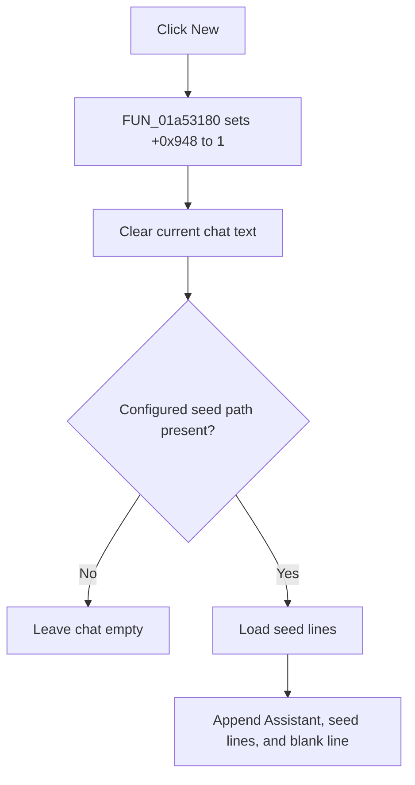

# New

> Analysis status: Complete. The recovered handler and chat-reset callee establish the new-chat reset and optional seed-text reload.

## Control

| Property | Recovered value |
| --- | --- |
| Form | LocalLLMForm |
| Component path | LocalLLMForm.MainMenu1.File1.mnNew |
| Control class | TMenuItem |
| Caption | New |
| Hint | Not present in the recovered resource. |
| Text | Not present in the recovered resource. |
| Handler name | mnNewClick |
| Handler address | 01a53180 |
| Graph node | `resource:dfm:LocalLLMForm/LocalLLMForm.MainMenu1.File1.mnNew` |
| Handler node | `function:01a53180` |
| Graph layer | UI |

## What happens when clicked

`FUN_01a53180` writes `1` to form state offset `+0x948`, clears the current chat text through its string-list interface, and calls `FUN_01a474e0`. The callee checks a configured chat/template path at local-LLM state offset `+0x10`.

If that path is empty, the cleared chat remains empty. If it is present, the callee normalizes the path, loads its lines, appends `Assistant:`, appends every loaded line, and adds a final blank line. The source has no confirmation prompt. File-load failures are not handled in the click handler and the earlier clear is not rolled back.

## Click flow

## Handler evidence

- Source: [DecompiledSources/Tina16/functions/0000000001A53180__FUN_01a53180.c](../../../DecompiledSources/Tina16/functions/0000000001A53180__FUN_01a53180.c)
- Recovered role: Starts a new local-LLM chat and restores optional seed text.
- Current graph summary: Handles 1 Delphi UI event: LocalLLMForm.MainMenu1.File1.mnNew.OnClick.
- Current graph behavior: Not present in the recovered resource.
- Current graph evidence: Not present in the recovered resource.
- Complexity: simple
- Distinct outgoing calls: 1

## Direct calls

- `function:01a474e0` — FUN_01a474e0

## Resource evidence

- Kind: Not present in the recovered resource.
- Modal result: Not present in the recovered resource.
- Checked state: Not present in the recovered resource.
- List items: Not present in the recovered resource.
- Image reference: Not present in the recovered resource.
- Extracted glyph: None.

## Nearby label candidates

Nearby labels are layout candidates only. They are not proof of behavior.

- No same-parent label candidate is available.

## Analysis limits

- The recovered code does not give a Delphi name or complete semantic meaning for state offset `+0x948`.
- The exact path substitutions and file-load exception behavior are not recovered.
