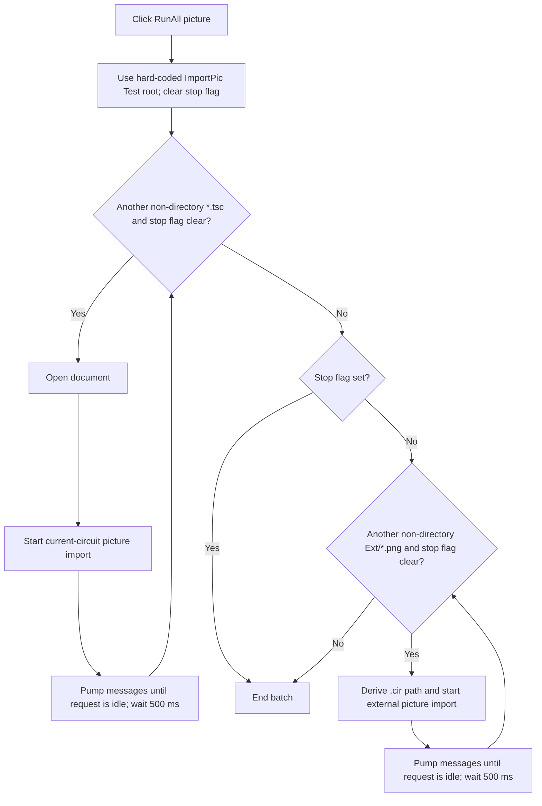

# RunAll (picture)...

> Analysis status: Complete. The recovered hard-coded paths, two file-enumeration loops, import calls, busy waits, and stop flag establish the developer batch workflow.

## Control

| Property | Recovered value |
| --- | --- |
| Form | LocalLLMForm |
| Component path | LocalLLMForm.MainMenu1.mnTools.mnRunAll |
| Control class | TMenuItem |
| Caption | RunAll (picture)... |
| Hint | Not present in the recovered resource. |
| Text | Not present in the recovered resource. |
| Handler name | mnRunAllClick |
| Handler address | 01a5bd40 |
| Graph node | `resource:dfm:LocalLLMForm/LocalLLMForm.MainMenu1.mnTools.mnRunAll` |
| Handler node | `function:01a5bd40` |
| Graph layer | UI |

## What happens when clicked

`FUN_01a5bd40` is a batch test workflow, not a general folder picker. It hard-codes `c:\Attila\Devel Files\Other\ImportPic Test\`, clears stop byte `+0x810`, and runs two sequential enumerations.

The first loop enumerates non-directory `*.tsc` files. For each file it builds the full path, calls the application document-open dispatcher, and invokes `FUN_01a5bad0` with a null second argument. That special call sets mode byte `+0x2ae8`, prepares a current-circuit picture request, and starts local-LLM processing. The loop pumps application messages while busy byte `+0x811` is set and then waits 500 ms.

If the stop byte remains clear, the second loop enumerates non-directory `Ext\*.png` files. For each image it derives a sibling `.cir` path, enables external-picture mode, stores the image path, sets mode byte `+0x2ae8`, and calls `FUN_01a5b280` with the derived circuit and image paths. It again pumps messages until the request is no longer busy and waits 500 ms.

Both loops stop when `+0x810` becomes nonzero. Missing or empty search results simply skip their loop. The handler does not ask for confirmation, let the user select a root, validate the hard-coded root, report completion, inspect individual import success, or provide a local exception handler.

## Click flow

## Handler evidence

- Source: [DecompiledSources/Tina16/functions/0000000001A5BD40__FUN_01a5bd40.c](../../../DecompiledSources/Tina16/functions/0000000001A5BD40__FUN_01a5bd40.c)
- Recovered role: Runs hard-coded current-circuit and external-picture import batches for developer test files.
- Current graph summary: Handles 1 Delphi UI event: LocalLLMForm.MainMenu1.mnTools.mnRunAll.OnClick.
- Current graph behavior: Not present in the recovered resource.
- Current graph evidence: Not present in the recovered resource.
- Complexity: complex
- Distinct outgoing calls: 16

## Direct calls

- `function:00414560` — Delphi UnicodeString array finalization helper
- `function:00414ad0` — Delphi UnicodeString assignment helper
- `function:00414b50` — FUN_00414b50
- `function:00416ba0` — FUN_00416ba0
- `function:00416cd0` — FUN_00416cd0
- `function:00417580` — FUN_00417580
- `function:00417740` — FUN_00417740
- `function:0043e1a0` — FUN_0043e1a0
- `function:00441230` — FUN_00441230
- `function:00441290` — FUN_00441290
- `function:004412c0` — FUN_004412c0
- `function:004414c0` — FUN_004414c0
- `function:0080cc70` — FUN_0080cc70
- `function:01a5b280` — FUN_01a5b280
- `function:01a5bad0` — Handles 1 Delphi UI event: LocalLLMForm.MainMenu1.mnTools.mnImportFromPicture.OnClick.
- `function:01c681b0` — FUN_01c681b0

## Resource evidence

- Kind: Not present in the recovered resource.
- Modal result: Not present in the recovered resource.
- Checked state: Not present in the recovered resource.
- List items: Not present in the recovered resource.
- Image reference: Not present in the recovered resource.
- Extracted glyph: None.

## Nearby label candidates

Nearby labels are layout candidates only. They are not proof of behavior.

- No same-parent label candidate is available.

## Analysis limits

- The hard-coded path and loop data flow establish a developer test workflow. The source does not identify a supported end-user configuration for this path.
- The application document-open callee is large. This article uses only the proven filename input and open-dispatch call site.
- Busy-wait loops pump UI messages, so other events can set the stop byte. The exact control that sets it is not established here.
